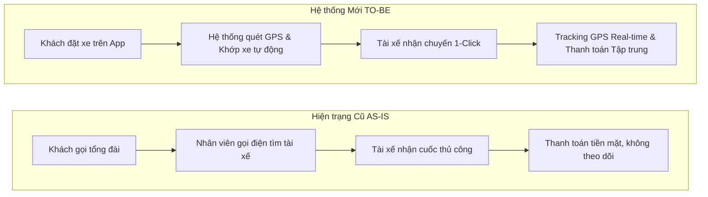
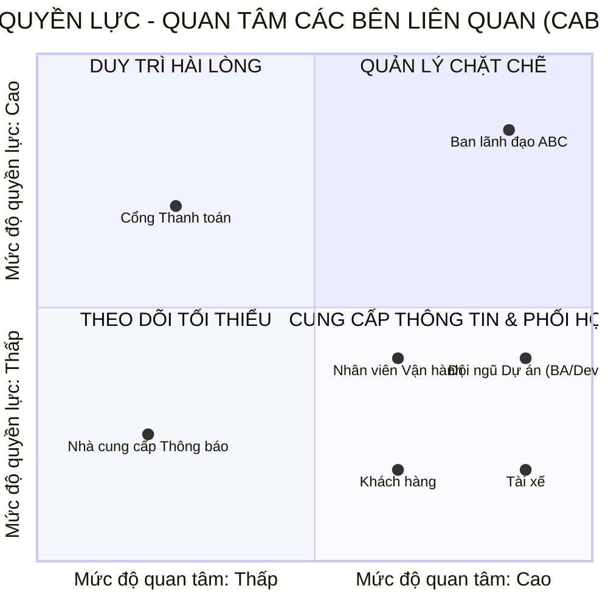
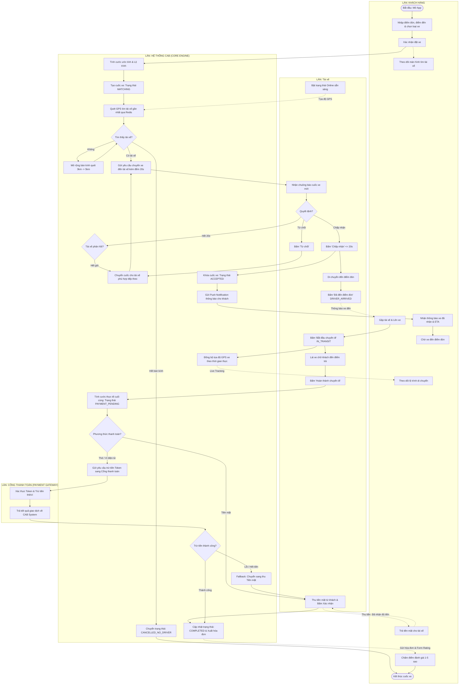
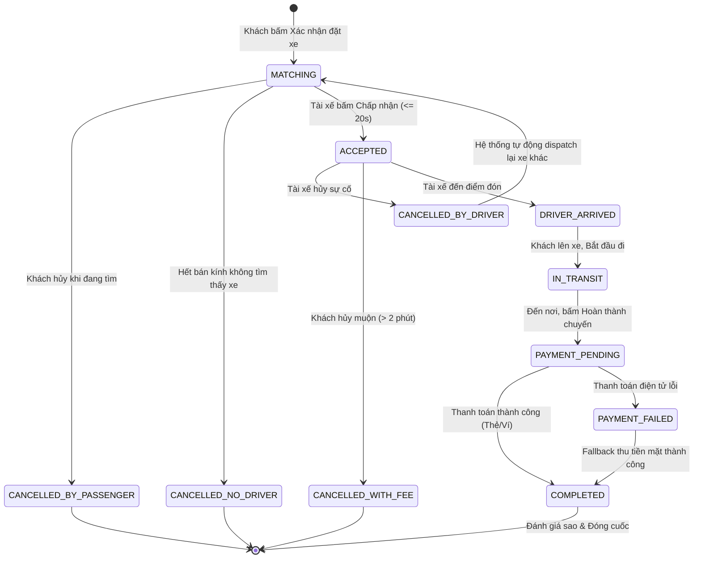

# TÀI LIỆU ĐẶC TẢ YÊU CẦU PHẦN MỀM (SRS) & PHÂN TÍCH HỆ THỐNG - CAB SYSTEM

- **Họ tên**: Nguyễn Hữu Lộc

- **MSSV**: 23635401

- **Đề tài**: Nền tảng Đặt xe Trực tuyến & Điều phối Thông minh (CAB System)

- **Khung thời gian triển khai**: 7 tuần (Giai đoạn MVP)

---

## 1. BỐI CẢNH & PHÂN TÍCH HIỆN TRẠNG (INTRODUCTION & CURRENT SYSTEM ANALYSIS)

### 1.1. Bối cảnh dự án (Project Context)

Công ty Cổ phần Vận tải ABC là đơn vị kinh doanh dịch vụ vận tải hành khách đô thị. Hiện nay, ABC tiếp nhận chuyến thông qua tổng đài thoại thủ công kết hợp ứng dụng đặt xe sơ khai. Mô hình này bộc lộ các điểm nghẽn nghiêm trọng: điều phối thủ công chậm trễ, khó theo dõi trạng thái lộ trình, thanh toán phân tán và rủi ro sập toàn hệ thống khi mở rộng dịch vụ. 

Dự án **CAB System** được xây dựng nhằm tự động hóa quy trình phân công chuyến xe, giám sát hành trình thời gian thực, quản lý thanh toán tập trung và thiết lập nền tảng kiến trúc Microservices có khả năng mở rộng độc lập trong vòng 7 tuần.

### 1.2. Phân loại yêu cầu và quy ước tài liệu

* **Khách hàng Requirement**: Yêu cầu nghiệp vụ bắt buộc từ đề tài của Công ty ABC.

* **BA Interpretation**: Phân rã logic của Business Analyst để mô hình hóa Use Case, State Machine và kiến trúc hệ thống.

* **MVP Assumption (Giả định đề xuất)**: Các tham số vận hành chuẩn ngành (công thức cước, bán kính quét, timeout) dùng để triển khai prototype kỹ thuật trong 7 tuần, có cấu hình động (Configurable) để cập nhật ngay khi khách hàng chốt phương án.

* **Open Questions**: Danh sách câu hỏi nghiệp vụ cần BA phỏng vấn và chốt chính thức với ban lãnh đạo.

### 1.3. Bảng đối chiếu hiện trạng: AS-IS vs. TO-BE (Gap Analysis)

| STT | Tiêu chí so sánh | Hệ thống Cũ (AS-IS) | Hệ thống Mới (TO-BE - CAB System) | Giá trị gia tăng |
| :--- | :--- | :--- | :--- | :--- |
| **1** | **Điều phối & Ghép xe** | Khách gọi tổng đài / App sơ khai; điều phối viên gọi điện thoại/nhắn tin thủ công cho tài xế (3–5 phút/cuốc). | Điều phối tự động: Thuật toán quét tọa độ GPS và ghép tài xế gần nhất qua Redis Geospatial trong < 5 giây. | Giảm thời gian chờ xe; loại bỏ chi phí vận hành điều phối trung gian. |
| **2** | **Giám sát Chuyến đi** | Khách không nắm được vị trí xe; không có thời gian dự kiến đón (ETA). | Real-time Tracking: Đồng bộ vị trí xe di chuyển liên tục qua WebSocket; cập nhật trạng thái và ETA tức thì. | Tăng độ minh bạch, giảm tỷ lệ khách hủy cuốc do sốt ruột. |
| **3** | **Quản lý Thanh toán** | Thu tiền mặt phân tán, tài xế tự thu, khó đối soát doanh thu cuối ngày. | Thanh toán tập trung: Hỗ trợ tiền mặt và tích hợp Cổng thanh toán số ngoài qua Tokenization (Tuyệt đối không lưu thẻ nhạy cảm). | Tuân thủ PCI-DSS; kiểm soát dòng tiền tự động, chống thất thoát. |
| **4** | **Kiến trúc Kỹ thuật** | Monolith nguyên khối, lỗi module phụ (thanh toán/thông báo) dễ kéo sập toàn bộ hệ sinh thái đặt xe. | Microservices & Event-Driven: Phân tách 5 service độc lập; các service giao tiếp qua Message Queue (bất đồng bộ). | Khả năng chịu lỗi cao (Fault-tolerant); dễ mở rộng quy mô độc lập. |
| **5** | **Báo cáo & Vận hành** | Dữ liệu phân tán; tổng hợp báo cáo thủ công trễ từ 1 đến 2 ngày. | Quản trị viên Portal & Live Monitor: Giám sát cuốc xe trực tiếp trên bản đồ số; báo cáo KPI doanh thu/hiệu suất tức thời. | Ra quyết định kinh doanh dựa trên dữ liệu thời gian thực (Data-driven). |

---

## 2. PHÂN TÍCH CÁC BÊN LIÊN QUAN (STAKEHOLDERS)

### 2.1. Danh sách và vai trò 7 Bên liên quan

| STT | Bên liên quan | Phân loại | Quyền hạn & Trách nhiệm chính | Mức độ tác động |
| :--- | :--- | :--- | :--- | :--- |
| **1** | Ban lãnh đạo ABC | Chủ sở hữu | Định hướng chiến lược, phê duyệt biểu phí cước, xem báo cáo KPI doanh thu và tỷ lệ hoàn thành cuốc. | Quyết định cao nhất. |
| **2** | Khách hàng | Người dùng cuối | Đăng ký, đăng nhập, đặt xe, theo dõi vị trí tài xế, thanh toán chuyến đi và đánh giá chất lượng. | Trực tiếp tạo doanh thu. |
| **3** | Tài xế đối tác | Người dùng cuối | Cập nhật hồ sơ/phương tiện, bật trạng thái Online, tiếp nhận/từ chối chuyến, cập nhật tiến trình di chuyển. | Trực tiếp cung cấp dịch vụ. |
| **4** | Nhân viên Vận hành | Người dùng nội bộ | Giám sát cuốc xe trực tiếp, duyệt hồ sơ tài xế mới, can thiệp xử lý các cuốc xe phát sinh sự cố. | Đảm bảo vận hành liên tục. |
| **5** | Đội ngũ Dự án (BA/Dev/QA) | Bên triển khai | Phân tích yêu cầu, thiết kế kiến trúc, lập trình Microservices và kiểm thử hệ thống trong 7 tuần. | Thực thi kỹ thuật. |
| **6** | Cổng Thanh toán | Đối tác bên ngoài | Xử lý giao dịch trừ tiền trực tuyến bảo mật qua cơ chế Tokenization. | Phụ thuộc dịch vụ ngoài. |
| **7** | Nhà cung cấp Thông báo | Đối tác bên ngoài | Cung cấp hạ tầng gửi tin nhắn SMS OTP và đẩy thông báo Push thời gian thực. | Phụ thuộc dịch vụ ngoài. |

### 2.2. Ma trận Quyền lực & Quan tâm

---

### 2.3. Cơ sở Đánh giá & Chiến lược Quản lý các Bên liên quan

| Nhóm Chiến lược | Bên liên quan | Đánh giá Quyền lực | Đánh giá Quan tâm | Chiến lược Quản lý & Tương tác |
| :--- | :--- | :--- | :--- | :--- |
| **Quản lý chặt chẽ** | **Ban lãnh đạo ABC** | **Rất cao:** Nắm ngân sách, duyệt phạm vi dự án, biểu phí và nghiệm thu sản phẩm. | **Rất cao:** Trực tiếp giám sát hiệu quả kinh doanh, doanh thu và các chỉ số KPI vận hành. | Tham vấn định kỳ, báo cáo tiến độ tuần và trình phê duyệt các thay đổi phạm vi nghiệp vụ cốt lõi. |
| **Duy trì hài lòng** | **Cổng Thanh toán** | **Cao:** Áp đặt các tiêu chuẩn kỹ thuật bảo mật bắt buộc (Tokenization, PCI-DSS) và có quyền ngắt kết nối API. | **Thấp:** Cung cấp dịch vụ B2B diện rộng, chỉ quan tâm đến tính hợp lệ của gói tin giao dịch gửi sang. | Tuân thủ tuyệt đối các chuẩn bảo mật API, không can thiệp vào quy trình tài chính nội bộ của đối tác. |
| **Theo dõi tối thiểu** | **Nhà cung cấp Thông báo** | **Thấp:** Đóng vai trò dịch vụ tiện ích hạ tầng, không can thiệp vào logic nghiệp vụ. | **Thấp:** Vận hành theo cơ chế tính phí theo lưu lượng truyền dẫn tin nhắn/thông báo. | Giám sát chất lượng kết nối mạng, hạn mức API (Quota) và thời gian phản hồi định kỳ. |
| **Cung cấp thông tin & Phối hợp** | **Khách hàng** | **Thấp:** Không có quyền quyết định thay đổi cấu trúc hay tính năng của hệ thống. | **Cao:** Trực tiếp trải nghiệm đặt xe, theo dõi vị trí và chịu tác động trực tiếp bởi cước phí dịch vụ. | Thu thập phản hồi qua đánh giá sao/review để cải tiến giao diện và tối ưu trải nghiệm người dùng. |
| | **Tài xế** | **Thấp:** Phải tuân thủ các quy tắc điều phối và chính sách phạt hủy do doanh nghiệp ban hành. | **Rất cao:** Chịu ảnh hưởng trực tiếp đến thu nhập, tỷ lệ nhận cuốc và công cụ điều hướng hàng ngày. | Cung cấp ứng dụng trực quan, thông báo rõ ràng về quyền lợi và hướng dẫn sử dụng chi tiết. |
| | **Nhân viên Vận hành** | **Trung bình:** Có quyền can thiệp vào cuốc xe lỗi nhưng trong giới hạn phân quyền quản trị. | **Cao:** Sử dụng trang Trang quản trị Web hàng ngày để giám sát, duyệt hồ sơ và xử lý sự cố vận hành. | Đào tạo quy trình thao tác trang quản trị và tiếp nhận góp ý để tối ưu hóa công cụ xử lý sự cố. |
| | **Đội ngũ Dự án (BA/Dev/QA)** | **Trung bình:** Là bên thực thi kỹ thuật, không có quyền quyết định chính sách nghiệp vụ. | **Rất cao:** Trực tiếp phân tích, viết mã nguồn, kiểm thử và chịu trách nhiệm bàn giao hệ thống trong 7 tuần. | Họp điều phối kỹ thuật hàng ngày (Daily Standup), bám sát yêu cầu từ BA và cập nhật tiến độ theo Sprint. |

---

## 3. MỤC TIÊU KINH DOANH (BUSINESS GOALS)

| Mã | Mục tiêu nghiệp vụ (Business Goals) | Mô tả chi tiết |
| :--- | :--- | :--- |
| **BG01** | Tự động hóa điều phối | Giảm thiểu can thiệp thủ công bằng cơ chế tự động ghép cuốc xe dựa trên vị trí GPS và trạng thái tài xế. |
| **BG02** | Nâng cao trải nghiệm số | Cung cấp ứng dụng trực quan cho phép khách đặt xe dễ dàng, theo dõi vị trí xe di chuyển và nhận ETA chính xác. |
| **BG03** | Quản lý vận hành tập trung | Hợp nhất quản lý khách hàng, tài xế, phương tiện và giám sát vòng đời chuyến đi trên một trang quản trị. |
| **BG04** | Chuẩn hóa thanh toán & Chống thất thoát | Tự động hóa tính cước; hỗ trợ song song tiền mặt và cổng thanh toán số; bảo vệ an toàn dữ liệu tài chính. |
| **BG05** | Hỗ trợ quyết định qua dữ liệu | Cung cấp báo cáo trực quan về doanh thu, tỷ lệ hoàn thành cuốc, tỷ lệ hủy và hiệu suất làm việc của đối tác tài xế. |
| **BG06** | Kiến trúc bền vững & Chịu tải | Xây dựng hệ thống theo mô hình Microservices, đảm bảo mở rộng tải độc lập và chịu lỗi cục bộ cho từng dịch vụ. |
| **BG07** | Khả năng mở rộng trong tương lai | Cấu trúc module hóa linh hoạt cho phép tích hợp thêm dịch vụ mới (Food, Express) hoặc đổi đối tác mà không cần viết lại mã nguồn. |

---

## 4. PHẠM VI DỰ ÁN MVP 7 TUẦN (PROJECT SCOPE & MICROSERVICES MAPPING)

### 4.1. Bảng 5 Phân hệ Nghiệp vụ Cốt lõi (In-Scope Subsystems)

| STT | Phân hệ Nghiệp vụ (Khối chức năng) | Phạm vi Nghiệp vụ Chi tiết | Đối tượng Thụ hưởng |
| :--- | :--- | :--- | :--- |
| **1** | Quản lý Tài khoản & Người dùng | Đăng ký, đăng nhập xác thực (JWT/OTP), quản lý hồ sơ cá nhân của khách hàng và hồ sơ phương tiện của tài xế. | Khách hàng, Tài xế, Quản trị viên |
| **2** | Điều phối & Quản lý Chuyến đi | Tạo yêu cầu đặt xe, tự động ghép cuốc xe gần nhất, cập nhật vòng đời chuyến đi và tracking vị trí GPS thời gian thực. | Khách hàng, Tài xế, Quản trị viên |
| **3** | Tính cước & Thanh toán | Tính cước tự động (ước tính và chốt thực tế), xử lý thanh toán tiền mặt và tích hợp Cổng thanh toán điện tử (Sandbox). | Khách hàng, Tài xế |
| **4** | Quản lý Thông báo | Tiếp nhận sự kiện nghiệp vụ bất đồng bộ để gửi mã xác thực SMS OTP và thông báo đẩy (Push Notifications). | Khách hàng, Tài xế |
| **5** | Quản trị, Đánh giá & Báo cáo | Quản lý người dùng, duyệt hồ sơ tài xế, can thiệp sự cố cuốc xe, quản lý đánh giá sao và xuất báo cáo KPI thống kê. | Nhân viên Vận hành, Ban lãnh đạo |

### 4.2. Bảng Phân định Ranh giới Loại trừ (Out-of-Scope Table)

| Hạng mục Loại trừ | Mô tả chi tiết | Lý do kỹ thuật & Quản trị dự án trong 7 tuần |
| :--- | :--- | :--- |
| **Dịch vụ mở rộng** | Giao đồ ăn (Food Delivery), Giao bưu kiện (Express), Đặt xe liên tỉnh. | Tập trung hoàn thiện 100% dịch vụ gọi xe chở khách đô thị cốt lõi. |
| **Đặt xe hẹn giờ** | Đặt xe theo lịch hẹn trước nhiều ngày (Scheduled Rides), Đi chung xe (Carpooling). | Độ phức tạp cao trong thuật toán điều phối; chưa cần thiết cho giai đoạn MVP. |
| **Ví điện tử nội bộ** | Xây dựng hệ thống Ví lưu ký giữ tiền (In-app Closed-loop Wallet). | Đòi hỏi thủ tục cấp phép ngân hàng phức tạp; thay thế bằng kết nối Cổng thanh toán ngoài. |
| **Thuật toán Giá AI** | Tính giá động thời gian thực bằng Machine Learning dựa trên thời tiết/nhu cầu. | Thay thế bằng bảng cấu hình hệ số khung giờ cao điểm do Quản trị viên thiết lập sẵn. |

### 4.3. Bảng Ánh xạ Nghiệp vụ sang 5 Microservices (Bounded Contexts)

| Phân hệ Nghiệp vụ (BA Subsystem) | Bounded Context (Microservice) | Cơ sở dữ liệu & Công nghệ đề xuất | Trách nhiệm kỹ thuật chính khi lập trình |
| :--- | :--- | :--- | :--- |
| **1. Quản lý Tài khoản & Người dùng** | Auth & User Service | PostgreSQL / MongoDB (UserDB) | Xác thực JWT, cấp Refresh Token, phân quyền RBAC, quản lý hồ sơ và xe. |
| **2. Điều phối & Quản lý Chuyến đi** | Ride & Dispatch Service (Core Engine) | PostgreSQL (RideDB) + Redis Geospatial | Quản lý trạng thái cuốc, tìm xe gần nhất (GEORADIUS), WebSocket realtime tracking. |
| **3. Tính cước & Thanh toán** | Fare & Payment Service | PostgreSQL (PaymentDB) | Module tính cước, kết nối cổng thanh toán qua Webhook/Tokenization, đối soát. |
| **4. Quản lý Thông báo** | Notification Service | Không có DB riêng / Log DB | Worker chạy ngầm tiêu thụ message từ Redis Pub/Sub hoặc RabbitMQ để gửi Push/SMS. |
| **5. Quản trị, Đánh giá & Báo cáo** | Quản trị viên & Analytics Service | PostgreSQL Read-Replica (AdminDB) | Xử lý truy vấn tổng hợp (Aggregated queries), API quản trị, duyệt hồ sơ và review. |

### 4.4. Kế hoạch triển khai MVP trong 7 tuần (7-Week Sprint Plan)

* **Tuần 1 (Analysis & Setup)**: Chốt tài liệu SRS, thiết kế Database Schemas, quy chuẩn REST API/WebSocket Contracts, dựng khung hạ tầng Docker Compose & API Gateway.

* **Tuần 2 (Auth & User Service)**: Lập trình Auth & User Service (Đăng ký, Đăng nhập, cấp phát JWT Token, phân quyền, quản lý phương tiện).

* **Tuần 3 (Ride Engine & Realtime Matching)**: Xây dựng Ride & Dispatch Service, tích hợp Redis Geospatial để quét tài xế và WebSocket xử lý nhận/từ chối cuốc.

* **Tuần 4 (Trip Lifecycle & GPS Tracking)**: Hoàn thiện máy trạng thái chuyến đi (`DRIVER_ARRIVED` $\rightarrow$ `IN_TRANSIT` $\rightarrow$ `COMPLETED`) và đồng bộ lộ trình xe theo thời gian thực.

* **Tuần 5 (Fare, Payment & Notifications)**: Lập trình Fare & Payment Service (tính cước, kết nối Sandbox cổng thanh toán) và dựng Notification Service lắng nghe Message Queue.

* **Tuần 6 (Quản trị viên Portal & Incident Management)**: Xây dựng giao diện Quản trị Trang quản trị Web (Live monitor theo dõi chuyến xe, duyệt tài xế, xem báo cáo KPI doanh thu).

* **Tuần 7 (E2E Integration, Fault Testing & Demo)**: Kiểm thử tích hợp toàn bộ luồng nghiệp vụ từ đầu đến cuối; kiểm thử cô lập lỗi (tắt thử payment/notification); đóng gói và demo nghiệm thu.

---

## 5. YÊU CẦU NGHIỆP VỤ CỐT LÕI (BUSINESS REQUIREMENTS)

| Mã | Tên yêu cầu nghiệp vụ | Nội dung mô tả nghiệp vụ |
| :--- | :--- | :--- |
| **BR01** | Tự động hóa điều phối | Doanh nghiệp cần cơ chế tự động tìm kiếm, lựa chọn và phân công chuyến xe cho tài xế phù hợp gần nhất mà không cần tổng đài can thiệp. |
| **BR02** | Trải nghiệm khách hàng số | Cung cấp công cụ cho phép khách hàng đặt xe thuận tiện, theo dõi trạng thái di chuyển trực quan và nhận thông báo cập nhật liên tục. |
| **BR03** | Quản trị vận hành tập trung | Xây dựng cổng thông tin quản trị duy nhất để quản lý thông tin khách hàng, tài xế, phương tiện và giải quyết sự cố phát sinh. |
| **BR04** | Kiểm soát tính cước & Thanh toán | Hệ thống phải tự động tính toán chi phí minh bạch, hỗ trợ đa dạng hình thức thanh toán và bảo vệ an toàn thông tin thẻ của người dùng. |
| **BR05** | Giám sát hiệu quả kinh doanh | Cung cấp các chỉ số đo lường hiệu quả hoạt động: doanh thu, tổng số cuốc, tỷ lệ hủy, tỷ lệ hoàn thành và thời gian hoạt động của tài xế. |
| **BR06** | Khả năng chịu tải & Ổn định | Hệ thống phải vận hành ổn định trong các khung giờ cao điểm; lỗi tại một thành phần phụ không được làm sập luồng đặt xe chính. |
| **BR07** | Kiến trúc module linh hoạt | Cho phép bổ sung loại hình dịch vụ mới, cổng thanh toán hoặc đối tác thông báo trong tương lai mà không cần tái cấu trúc toàn bộ ứng dụng. |
| **BR08** | An toàn thông tin & Kiểm toán | Bắt buộc xác thực người dùng, bảo vệ dữ liệu PII và lưu vết nhật ký toàn bộ các thao tác can thiệp quản trị quan trọng. |

---

## 6. YÊU CẦU CHỨC NĂNG PHÂN RÃ (FUNCTIONAL REQUIREMENTS)

| Phân hệ | ID | Chi tiết Yêu cầu chức năng |
| :--- | :--- | :--- |
| **1. Quản lý Tài khoản & Người dùng** | FR01 | Cho phép Khách hàng đăng ký tài khoản mới bằng Số điện thoại và mã xác thực SMS OTP. |
| | FR02 | Xác thực đăng nhập cho Khách hàng, Tài xế, Nhân viên vận hành và Ban lãnh đạo qua JWT Token. |
| | FR03 | Phân quyền truy cập tài nguyên hệ thống theo vai trò: Khách hàng, Tài xế, Nhân viên Vận hành, Quản trị viên. |
| | FR04 | Cho phép người dùng xem và chỉnh sửa thông tin hồ sơ cá nhân, đổi mật khẩu. |
| | FR05 | Cho phép Đối tác Tài xế khai báo thông tin cá nhân, giấy phép lái xe, loại xe và biển số phương tiện. |
| **2. Điều phối & Quản lý Chuyến đi** | FR06 | Cho phép Khách hàng nhập Điểm đón, Điểm đến và lựa chọn loại dịch vụ phương tiện. |
| | FR07 | Tự động tính toán và hiển thị cước phí ước tính (Estimate Fare) cùng lộ trình dự kiến trước khi đặt xe. |
| | FR08 | Cho phép Tài xế chuyển đổi trạng thái làm việc giữa Sẵn sàng nhận chuyến (Online) và Ngừng hoạt động (Offline). |
| | FR09 | Tiếp nhận tọa độ định vị GPS định kỳ từ thiết bị tài xế và cập nhật tức thì vào bộ nhớ đệm cache Redis. |
| | FR10 | Tự động quét và xếp hạng danh sách tài xế Online trong bán kính phù hợp gần điểm đón nhất. |
| | FR11 | Gửi tín hiệu mời nhận chuyến đến tài xế ưu tiên với bộ đếm ngược thời gian phản hồi (Timeout). |
| | FR12 | Cho phép Tài xế bấm Chấp nhận hoặc Từ chối yêu cầu chuyến đi được gửi đến. |
| | FR13 | Tự động chuyển tiếp yêu cầu sang tài xế phù hợp tiếp theo nếu tài xế trước đó từ chối hoặc hết thời gian timeout. |
| | FR14 | Thông báo rõ ràng cho Khách hàng khi đã quét hết phạm vi mà không tìm thấy tài xế nhận chuyến. |
| | FR15 | Cho phép Khách hàng hủy yêu cầu đặt xe (hủy miễn phí hoặc áp dụng phí phạt theo điều kiện trạng thái). |
| | FR16 | Cho phép Tài xế cập nhật trạng thái di chuyển: Đã đến điểm đón $\rightarrow$ Bắt đầu chuyến đi $\rightarrow$ Hoàn thành chuyến đi. |
| | FR17 | Truyền tải tọa độ GPS di chuyển của tài xế lên giao diện bản đồ của khách hàng theo thời gian thực (WebSocket). |
| | FR18 | Lưu trữ và cho phép người dùng tra cứu danh sách lịch sử các chuyến đi đã thực hiện hoặc đã hủy. |
| **3. Tính cước & Thanh toán** | FR19 | Tự động chốt số tiền cước thực tế (Final Fare) dựa trên cự ly GPS và thời gian di chuyển sau khi chuyến xe hoàn tất. |
| | FR20 | Hỗ trợ phương thức thanh toán tiền mặt trực tiếp giữa khách hàng và tài xế. |
| | FR21 | Tích hợp cổng thanh toán số ngoài để tự động trừ tiền qua Tokenization (không lưu trữ số thẻ nhạy cảm). |
| | FR22 | Ghi nhận kết quả giao dịch; tự động kích hoạt cơ chế Fallback (chuyển sang tiền mặt) khi thanh toán điện tử thất bại. |
| **4. Quản lý Thông báo** | FR23 | Gửi mã xác thực OTP qua tin nhắn SMS khi người dùng đăng ký hoặc khôi phục mật khẩu. |
| | FR24 | Tự động gửi thông báo đẩy (Push Notification) thông báo các sự kiện: tìm thấy xe, tài xế đến nơi, cuốc hoàn thành, thanh toán xong. |
| **5. Quản trị, Đánh giá & Báo cáo** | FR25 | Cho phép Khách hàng chấm điểm sao (1-5★) và gửi đánh giá nhận xét chất lượng phục vụ của tài xế. |
| | FR26 | Cho phép Nhân viên vận hành xem danh sách, tra cứu và kích hoạt/khóa tài khoản người dùng. |
| | FR27 | Cho phép Nhân viên vận hành kiểm tra thông tin và phê duyệt hồ sơ đối tác tài xế mới đăng ký. |
| | FR28 | Cho phép Nhân viên vận hành giám sát các cuốc xe đang hoạt động trực tiếp trên bản đồ số (Live Monitor). |
| | FR29 | Cho phép Nhân viên vận hành can thiệp xử lý các cuốc xe bị treo trạng thái hoặc phát sinh sự cố khẩn cấp. |
| | FR30 | Tự động ghi vết nhật ký kiểm toán (Audit Log) cho toàn bộ các thao tác can thiệp hệ thống của nhân viên quản trị. |
| | FR31 | Cung cấp báo cáo thống kê trực quan về tổng doanh thu, số lượng chuyến, tỷ lệ hoàn thành và tỷ lệ hủy chuyến. |
| | FR32 | Cung cấp báo cáo đo lường hiệu suất làm việc và điểm đánh giá trung bình của từng tài xế. |

---

## 7. MÔ HÌNH CA SỬ DỤNG CHUẨN HÓA (USE CASE MODEL)

### 7.1. Danh sách Actors hệ thống

| Actor | Phân loại | Mô tả vai trò và trách nhiệm |
| :--- | :--- | :--- |
| **Khách hàng** | Primary Actor | Người trực tiếp đặt chuyến xe, theo dõi lộ trình di chuyển, thực hiện thanh toán và đánh giá tài xế. |
| **Tài xế** | Primary Actor | Đối tác vận chuyển, đăng ký xe, bật trạng thái sẵn sàng, tiếp nhận/từ chối cuốc và cập nhật tiến trình di chuyển. |
| **Nhân viên Vận hành** | Primary Actor | Đội ngũ quản lý, duyệt hồ sơ tài xế, giám sát cuốc xe trực tiếp và can thiệp xử lý sự cố phát sinh. |
| **Ban lãnh đạo** | Primary Actor | Người sử dụng hệ thống để theo dõi các chỉ số KPI báo cáo tài chính và hiệu quả vận hành doanh nghiệp. |
| **Nhà cung cấp Thanh toán** | Secondary Actor | Hệ thống đối tác tài chính bên ngoài tiếp nhận yêu cầu thanh toán và phản hồi kết quả trừ tiền. |
| **Nhà cung cấp Thông báo** | Secondary Actor | Hạ tầng đám mây bên ngoài (FCM/SMS) hỗ trợ truyền dẫn thông điệp thông báo đẩy và tin nhắn OTP. |

### 7.2. Bảng Phân bổ 14 Use Cases Cốt lõi

| Phân hệ Nghiệp vụ | Mã UC | Tên Use Case Nghiệp vụ | Actor chính | Functional Requirements |
| :--- | :--- | :--- | :--- | :--- |
| **1. Quản lý Tài khoản & Định danh** | UC01 | Đăng ký tài khoản | Khách hàng | FR01, FR23 |
| | UC02 | Đăng nhập hệ thống | Khách hàng, Tài xế, Vận hành, Lãnh đạo | FR02, FR03 |
| | UC03 | Cập nhật thông tin cá nhân | Khách hàng, Tài xế, Vận hành, Lãnh đạo | FR04 |
| | UC04 | Đăng ký hồ sơ & phương tiện | Tài xế | FR05 |
| **2. Điều phối & Vòng đời Chuyến đi** | UC05 | Đặt xe | Khách hàng | FR06, FR07, FR10, FR11, FR14, FR24 |
| | UC06 | Hủy yêu cầu đặt xe | Khách hàng | FR15 |
| | UC07 | Tiếp nhận & Phản hồi chuyến xe | Tài xế | FR08, FR09, FR11, FR12, FR13, FR24 |
| | UC08 | Cập nhật tiến trình chuyến đi | Tài xế | FR16, FR19, FR24 |
| | UC09 | Theo dõi chuyến đi | Khách hàng | FR17 |
| | UC10 | Xem lịch sử chuyến đi | Khách hàng, Tài xế | FR18 |
| **3. Tính cước & Thanh toán** | UC11 | Thanh toán chuyến đi | Khách hàng, Tài xế, Cổng Thanh toán | FR20, FR21, FR22, FR24 |
| **4. Quản trị, Đánh giá & Báo cáo** | UC12 | Đánh giá & Phản hồi tài xế | Khách hàng | FR25 |
| | UC13 | Quản lý tài khoản & Duyệt tài xế | Nhân viên Vận hành | FR26, FR27 |
| | UC14 | Giám sát vận hành & Báo cáo thống kê | Nhân viên Vận hành, Ban lãnh đạo | FR28, FR29, FR30, FR31, FR32 |

### 7.3. Sơ đồ Use Case Tổng thể (Use Case Diagram)

```mermaid
flowchart LR
    %% ==========================================
    %% 1. ACTORS BÊN TRÁI (NGƯỜI DÙNG DI ĐỘNG)
    %% ==========================================
    KH[" Khách hàng"]
    TX[" Tài xế"]

    %% ==========================================
    %% 2. SYSTEM BOUNDARY (HỆ THỐNG CAB SYSTEM)
    %% ==========================================
    subgraph SYSTEM ["HỆ THỐNG ĐẶT XE TRỰC TUYẾN - CAB SYSTEM"]
        %% Tâm hệ thống - Xác thực
        DN((UC02: Đăng nhập))

        %% Use Cases phía Khách hàng
        UC_DK_KH((UC01: Đăng ký tài khoản))
        UC_QLTT((UC03: Cập nhật thông tin cá nhân))
        UC_DATXE((UC05: Đặt xe))
        UC_HUYXE((UC06: Hủy yêu cầu đặt xe))
        UC_TRACK((UC09: Theo dõi chuyến đi))
        UC_PAY((UC11: Thanh toán chuyến đi))
        UC_RATE((UC12: Đánh giá tài xế))
        UC_LS((UC10: Xem lịch sử chuyến đi))

        %% Use Cases phía Tài xế
        UC_DK_TX((UC04: Đăng ký hồ sơ & xe))
        UC_NHAN_CUOC((UC07: Tiếp nhận & Phản hồi chuyến xe))
        UC_TIENDO((UC08: Cập nhật tiến trình chuyến))

        %% Use Cases Quản trị & Vận hành
        UC_QL_USER((UC13: Quản lý tài khoản & Duyệt tài xế))
        UC_OPERATIONS((UC14: Giám sát vận hành & Báo cáo))

        %% Điểm mở rộng
        DX((Đăng xuất<br/><i>extension point: Logout</i>))
    end

    %% ==========================================
    %% 3. ACTORS BÊN PHẢI (QUẢN TRỊ & ĐỐI TÁC)
    %% ==========================================
    NV[" Nhân viên vận hành"]
    BL[" Ban lãnh đạo"]
    PP[" Cổng thanh toán"]

    %% ==========================================
    %% 4. TƯƠNG TÁC ACTOR -> USE CASE (NÉT LIỀN)
    %% ==========================================
    %% Khách hàng
    KH --- UC_DK_KH
    KH --- UC_QLTT
    KH --- UC_DATXE
    KH --- UC_HUYXE
    KH --- UC_TRACK
    KH --- UC_PAY
    KH --- UC_RATE
    KH --- UC_LS

    %% Tài xế
    TX --- UC_DK_TX
    TX --- UC_QLTT
    TX --- UC_NHAN_CUOC
    TX --- UC_TIENDO
    TX --- UC_PAY
    TX --- UC_LS

    %% Nhân viên vận hành
    NV --- UC_QLTT
    NV --- UC_QL_USER
    NV --- UC_OPERATIONS

    %% Ban lãnh đạo
    BL --- UC_QLTT
    BL --- UC_OPERATIONS

    %% Cổng thanh toán (Secondary Actor)
    PP --- UC_PAY

    %% ==========================================
    %% 5. QUAN HỆ <<INCLUDE>> VÀO ĐĂNG NHẬP
    %% ==========================================
    UC_QLTT -.->|<<include>>| DN
    UC_DATXE -.->|<<include>>| DN
    UC_HUYXE -.->|<<include>>| DN
    UC_TRACK -.->|<<include>>| DN
    UC_LS -.->|<<include>>| DN
    UC_RATE -.->|<<include>>| DN
    UC_NHAN_CUOC -.->|<<include>>| DN
    UC_TIENDO -.->|<<include>>| DN
    UC_PAY -.->|<<include>>| DN
    UC_QL_USER -.->|<<include>>| DN
    UC_OPERATIONS -.->|<<include>>| DN

    %% Quan hệ <<extend>> Đăng xuất
    DX -.->|<<extend>>| DN
```

---

## 8. ĐẶC TẢ CHI TIẾT USE CASE (USE CASE SPECIFICATIONS)

### 1. Đặc tả use case "Đăng ký tài khoản" (UC01)

<table border="1" style="width:100%; border-collapse: collapse; text-align: left;">
    <tr>
        <th colspan="2" style="padding: 8px; font-size: 16px;">Đăng ký tài khoản (UC01)</th>
    </tr>
    <tr>
        <td style="width: 30%; font-weight: bold; padding: 8px;">Tiền điều kiện</td>
        <td style="padding: 8px;">Khách hàng chưa có tài khoản trên hệ thống và thiết bị di động có kết nối Internet.</td>
    </tr>
    <tr>
        <td style="font-weight: bold; padding: 8px;">Hậu điều kiện</td>
        <td style="padding: 8px;">Tài khoản Khách hàng mới được khởi tạo ở trạng thái ACTIVE trong cơ sở dữ liệu và tự động đăng nhập vào ứng dụng.</td>
    </tr>
    <tr>
        <td style="font-weight: bold; padding: 8px;">Actor chính</td>
        <td style="padding: 8px;">Khách hàng</td>
    </tr>
    <tr>
        <td style="font-weight: bold; padding: 8px;">Actor phụ</td>
        <td style="padding: 8px;">Nhà cung cấp Thông báo (Cổng SMS Gateway)</td>
    </tr>
    <tr>
        <td colspan="2" style="font-weight: bold; padding: 8px;">Basic flow</td>
    </tr>
    <tr>
        <td style="font-weight: bold; padding: 8px;">Khách hàng</td>
        <td style="font-weight: bold; padding: 8px;">Hệ thống</td>
    </tr>
    <tr>
        <td style="padding: 8px;">1. Mở ứng dụng CAB System trên điện thoại và chọn chức năng "Đăng ký tài khoản"</td>
        <td style="padding: 8px;">2. Kiểm tra trạng thái ứng dụng. Hiển thị biểu mẫu đăng ký yêu cầu nhập các thông tin: Họ và tên, Số điện thoại, Email (tùy chọn), Mật khẩu và Xác nhận mật khẩu</td>
    </tr>
    <tr>
        <td style="padding: 8px;">3. Nhập đầy đủ thông tin đăng ký theo yêu cầu trên biểu mẫu</td>
        <td style="padding: 8px;"></td>
    </tr>
    <tr>
        <td style="padding: 8px;">4. Nhấn nút "Tiếp tục" để gửi thông tin đăng ký</td>
        <td style="padding: 8px;">5. Kiểm tra tính hợp lệ của dữ liệu: định dạng số điện thoại chuẩn, tra cứu CSDL đảm bảo Số điện thoại chưa được đăng ký trước đó, mật khẩu khớp với xác nhận và đạt độ dài an toàn (≥ 8 ký tự)</td>
    </tr>
    <tr>
        <td style="padding: 8px;"></td>
        <td style="padding: 8px;">6. Gọi API sang Nhà cung cấp Thông báo (SMS Gateway) để gửi mã xác thực OTP (6 chữ số) đến số điện thoại vừa đăng ký</td>
    </tr>
    <tr>
        <td style="padding: 8px;"></td>
        <td style="padding: 8px;">7. Hiển thị màn hình nhập mã OTP kèm bộ đếm ngược thời gian hiệu lực 120 giây</td>
    </tr>
    <tr>
        <td style="padding: 8px;">8. Nhập mã OTP nhận được từ tin nhắn SMS và nhấn nút "Xác nhận kích hoạt"</td>
        <td style="padding: 8px;">9. Kiểm tra tính chính xác và thời hạn hiệu lực của mã OTP đối chiếu với dữ liệu trên hệ thống</td>
    </tr>
    <tr>
        <td style="padding: 8px;"></td>
        <td style="padding: 8px;">10. Tiến hành băm mật khẩu (bcrypt), tạo bản ghi tài khoản người dùng mới vào Database với trạng thái "Hoạt động" (ACTIVE) và phân quyền vai trò Khách hàng</td>
    </tr>
    <tr>
        <td style="padding: 8px;"></td>
        <td style="padding: 8px;">11. Tự động khởi tạo phiên đăng nhập (sinh cặp JWT Token), hiển thị thông báo đăng ký thành công và điều hướng khách hàng vào màn hình chính đặt xe</td>
    </tr>
    <tr>
        <td colspan="2" style="font-weight: bold; padding: 8px;">Alternative flow</td>
    </tr>
    <tr>
        <td colspan="2" style="padding: 8px;">
            
<strong>4.1. Số điện thoại đã tồn tại trong hệ thống</strong>

            

                1. Hệ thống phát hiện Số điện thoại đã tồn tại trong CSDL của một tài khoản khác. 
                2. Dừng luồng đăng ký, hiển thị thông báo lỗi: "Số điện thoại này đã được sử dụng. Vui lòng đăng nhập hoặc dùng số khác." 
                3. Quay lại bước 3 của Basic flow để khách hàng nhập lại số điện thoại hoặc chọn chuyển sang Đăng nhập.
            

            
<strong>8.1. Khách hàng yêu cầu gửi lại mã OTP</strong>

            

                1. Khách hàng chưa nhận được mã SMS hoặc mã OTP đã quá hạn 120 giây, nhấn nút "Gửi lại mã OTP". 
                2. Hệ thống tạo mã OTP ngẫu nhiên mới và gọi API Cổng SMS gửi lại đến số điện thoại khách hàng. 
                3. Thiết lập lại bộ đếm ngược 120 giây trên màn hình và quay lại bước 8 của Basic flow.
            

        </td>
    </tr>
    <tr>
        <td colspan="2" style="font-weight: bold; padding: 8px;">Exception flow</td>
    </tr>
    <tr>
        <td colspan="2" style="padding: 8px;">
            
<strong>5.1. Dữ liệu đăng ký không hợp lệ hoặc thiếu thông tin bắt buộc</strong>

            

                1. Hệ thống phát hiện số điện thoại sai định dạng hoặc mật khẩu dưới 8 ký tự hoặc mật khẩu xác nhận không khớp. 
                2. Hệ thống dừng quy trình, bôi đỏ các trường dữ liệu không hợp lệ kèm thông báo lỗi chi tiết tương ứng. 
                3. Quay lại bước 3 của Basic flow.
            

            
<strong>6.1. Lỗi kết nối Cổng tin nhắn SMS</strong>

            

                1. Hệ thống không thể kết nối tới máy chủ SMS Gateway do lỗi đường truyền hoặc nhà mạng quá tải. 
                2. Hệ thống hiển thị cảnh báo: "Dịch vụ gửi mã xác thực đang gặp sự cố. Vui lòng thử lại sau ít phút." 
                3. Giữ nguyên thông tin trên biểu mẫu để khách hàng không phải nhập lại từ đầu.
            

        </td>
    </tr>
</table>

 

### 2. Đặc tả use case "Đăng nhập hệ thống" (UC02)

<table border="1" style="width:100%; border-collapse: collapse; text-align: left;">
    <tr>
        <th colspan="2" style="padding: 8px; font-size: 16px;">Đăng nhập hệ thống (UC02)</th>
    </tr>
    <tr>
        <td style="width: 30%; font-weight: bold; padding: 8px;">Tiền điều kiện</td>
        <td style="padding: 8px;">Người dùng đã có tài khoản tồn tại trong cơ sở dữ liệu hệ thống.</td>
    </tr>
    <tr>
        <td style="font-weight: bold; padding: 8px;">Hậu điều kiện</td>
        <td style="padding: 8px;">Hệ thống cấp phát cặp Token xác thực (JWT), ghi log đăng nhập và điều hướng người dùng đến giao diện phân quyền tương ứng.</td>
    </tr>
    <tr>
        <td style="font-weight: bold; padding: 8px;">Actor chính</td>
        <td style="padding: 8px;">Khách hàng, Tài xế, Nhân viên Vận hành, Ban lãnh đạo</td>
    </tr>
    <tr>
        <td style="font-weight: bold; padding: 8px;">Actor phụ</td>
        <td style="padding: 8px;">Không</td>
    </tr>
    <tr>
        <td colspan="2" style="font-weight: bold; padding: 8px;">Basic flow</td>
    </tr>
    <tr>
        <td style="font-weight: bold; padding: 8px;">Người dùng</td>
        <td style="font-weight: bold; padding: 8px;">Hệ thống</td>
    </tr>
    <tr>
        <td style="padding: 8px;">1. Mở ứng dụng di động hoặc truy cập Cổng thông tin Quản trị Web và chọn chức năng "Đăng nhập"</td>
        <td style="padding: 8px;">2. Hiển thị biểu mẫu đăng nhập yêu cầu cung cấp Số điện thoại (hoặc Tên đăng nhập) và Mật khẩu</td>
    </tr>
    <tr>
        <td style="padding: 8px;">3. Nhập Số điện thoại và Mật khẩu vào các trường tương ứng trên biểu mẫu</td>
        <td style="padding: 8px;"></td>
    </tr>
    <tr>
        <td style="padding: 8px;">4. Nhấn nút "Đăng nhập"</td>
        <td style="padding: 8px;">5. Kiểm tra và đối chiếu thông tin đăng nhập: tra cứu số điện thoại trong cơ sở dữ liệu và kiểm tra tính trùng khớp của mật khẩu đã được mã hóa</td>
    </tr>
    <tr>
        <td style="padding: 8px;"></td>
        <td style="padding: 8px;">6. Kiểm tra trạng thái hoạt động của tài khoản: đảm bảo tài khoản đang ở trạng thái ACTIVE (không bị khóa hay tạm ngừng)</td>
    </tr>
    <tr>
        <td style="padding: 8px;"></td>
        <td style="padding: 8px;">7. Tạo phiên làm việc mới, phát sinh cặp JWT Token (Access Token chứa vai trò người dùng và Refresh Token) lưu vào phiên bảo mật</td>
    </tr>
    <tr>
        <td style="padding: 8px;"></td>
        <td style="padding: 8px;">8. Ghi nhận thời gian đăng nhập vào bảng nhật ký (Audit Log), hiển thị thông báo thành công và điều hướng người dùng đến màn hình tương ứng theo vai trò (Khách hàng vào Bản đồ đặt xe; Tài xế vào Bảng điều khiển nhận cuốc; Vận hành / Lãnh đạo vào Giao diện Quản trị Web)</td>
    </tr>
    <tr>
        <td colspan="2" style="font-weight: bold; padding: 8px;">Alternative flow</td>
    </tr>
    <tr>
        <td colspan="2" style="padding: 8px;">
            
<strong>3.1. Người dùng chọn chức năng "Quên mật khẩu"</strong>

            

                1. Người dùng nhấn nút "Quên mật khẩu" trên biểu mẫu đăng nhập. 
                2. Hệ thống hiển thị form yêu cầu nhập Số điện thoại đã đăng ký. 
                3. Người dùng nhập số điện thoại và xác nhận gửi OTP. 
                4. Hệ thống kiểm tra, gửi mã OTP qua SMS; sau khi xác thực OTP thành công, cho phép người dùng thiết lập mật khẩu mới. 
                5. Quay lại bước 1 của Basic flow để đăng nhập bằng mật khẩu mới.
            

        </td>
    </tr>
    <tr>
        <td colspan="2" style="font-weight: bold; padding: 8px;">Exception flow</td>
    </tr>
    <tr>
        <td colspan="2" style="padding: 8px;">
            
<strong>5.1. Sai số điện thoại hoặc mật khẩu không chính xác</strong>

            

                1. Hệ thống không tìm thấy số điện thoại trong CSDL hoặc mật khẩu không khớp với bản băm bcrypt. 
                2. Hệ thống dừng đăng nhập, hiển thị thông báo: "Số điện thoại hoặc mật khẩu không chính xác. Vui lòng kiểm tra lại." 
                3. Quay lại bước 3 của Basic flow để người dùng nhập lại.
            

            
<strong>6.1. Tài khoản đang trong trạng thái bị khóa (LOCKED / SUSPENDED)</strong>

            

                1. Hệ thống phát hiện tài khoản có trạng thái là LOCKED do vi phạm chính sách vận hành. 
                2. Hệ thống từ chối đăng nhập và hiển thị thông báo: "Tài khoản của bạn đã bị tạm khóa. Vui lòng liên hệ bộ phận hỗ trợ để được giải quyết."
            

        </td>
    </tr>
</table>

 

### 3. Đặc tả use case "Cập nhật thông tin cá nhân" (UC03)

<table border="1" style="width:100%; border-collapse: collapse; text-align: left;">
    <tr>
        <th colspan="2" style="padding: 8px; font-size: 16px;">Cập nhật thông tin cá nhân (UC03)</th>
    </tr>
    <tr>
        <td style="width: 30%; font-weight: bold; padding: 8px;">Tiền điều kiện</td>
        <td style="padding: 8px;">Người dùng đã đăng nhập thành công vào hệ thống.</td>
    </tr>
    <tr>
        <td style="font-weight: bold; padding: 8px;">Hậu điều kiện</td>
        <td style="padding: 8px;">Dữ liệu hồ sơ người dùng được cập nhật mới vào cơ sở dữ liệu.</td>
    </tr>
    <tr>
        <td style="font-weight: bold; padding: 8px;">Actor chính</td>
        <td style="padding: 8px;">Khách hàng, Tài xế, Nhân viên Vận hành, Ban lãnh đạo</td>
    </tr>
    <tr>
        <td style="font-weight: bold; padding: 8px;">Actor phụ</td>
        <td style="padding: 8px;">Không</td>
    </tr>
    <tr>
        <td colspan="2" style="font-weight: bold; padding: 8px;">Basic flow</td>
    </tr>
    <tr>
        <td style="font-weight: bold; padding: 8px;">Người dùng</td>
        <td style="font-weight: bold; padding: 8px;">Hệ thống</td>
    </tr>
    <tr>
        <td style="padding: 8px;">1. Chọn mục "Tài khoản" trên thanh điều hướng và bấm vào chức năng "Thông tin cá nhân"</td>
        <td style="padding: 8px;">2. Truy vấn cơ sở dữ liệu và hiển thị chi tiết hồ sơ hiện tại của người dùng gồm: Ảnh đại diện, Họ và tên, Số điện thoại (chỉ xem, không được tự ý sửa), Địa chỉ Email và Ngày tham gia</td>
    </tr>
    <tr>
        <td style="padding: 8px;">3. Chỉnh sửa Họ tên, Email hoặc chọn tải lên ảnh đại diện mới từ thiết bị</td>
        <td style="padding: 8px;"></td>
    </tr>
    <tr>
        <td style="padding: 8px;">4. Nhấn nút "Lưu thay đổi"</td>
        <td style="padding: 8px;">5. Kiểm tra và đánh giá tính hợp lệ của dữ liệu: đảm bảo Họ tên không rỗng, định dạng Email đúng chuẩn, Email mới (nếu sửa) chưa được dùng bởi tài khoản khác, và tệp ảnh đại diện có dung lượng ≤ 5MB</td>
    </tr>
    <tr>
        <td style="padding: 8px;"></td>
        <td style="padding: 8px;">6. Thực hiện lệnh cập nhật (UPDATE) thông tin người dùng vào cơ sở dữ liệu</td>
    </tr>
    <tr>
        <td style="padding: 8px;"></td>
        <td style="padding: 8px;">7. Hiển thị thông báo "Cập nhật hồ sơ cá nhân thành công" và làm mới giao diện với thông tin mới nhất</td>
    </tr>
    <tr>
        <td colspan="2" style="font-weight: bold; padding: 8px;">Alternative flow</td>
    </tr>
    <tr>
        <td colspan="2" style="padding: 8px;">
            
<strong>1.1. Người dùng thực hiện Đổi mật khẩu tài khoản</strong>

            

                1. Tại màn hình Tài khoản, người dùng nhấn chọn chức năng "Đổi mật khẩu". 
                2. Hệ thống hiển thị biểu mẫu yêu cầu: Mật khẩu hiện tại, Mật khẩu mới và Xác nhận mật khẩu mới. 
                3. Người dùng nhập đầy đủ thông tin và bấm "Xác nhận đổi mật khẩu". 
                4. Hệ thống kiểm tra: mật khẩu hiện tại đúng, mật khẩu mới khác mật khẩu cũ, mật khẩu mới khớp xác nhận và ≥ 8 ký tự. 
                5. Hệ thống cập nhật mật khẩu mới đã mã hóa vào CSDL và thông báo đổi mật khẩu thành công.
            

        </td>
    </tr>
    <tr>
        <td colspan="2" style="font-weight: bold; padding: 8px;">Exception flow</td>
    </tr>
    <tr>
        <td colspan="2" style="padding: 8px;">
            
<strong>5.1. Định dạng Email không hợp lệ hoặc bị trùng lặp</strong>

            

                1. Hệ thống phát hiện Email nhập vào không đúng cấu trúc hoặc đã được liên kết với một tài khoản khác. 
                2. Hệ thống dừng lưu, bôi đỏ ô Email và hiển thị cảnh báo "Địa chỉ Email không hợp lệ hoặc đã được sử dụng". 
                3. Quay lại bước 3 của Basic flow.
            

            
<strong>5.2. Tệp ảnh tải lên vượt quá dung lượng quy định hoặc sai định dạng</strong>

            

                1. Người dùng chọn tệp không phải đuôi .jpg/.png hoặc dung lượng tệp > 5MB. 
                2. Hệ thống từ chối tải lên và hiển thị thông báo: "Vui lòng chọn tệp hình ảnh (.jpg, .png) có dung lượng dưới 5MB".
            

        </td>
    </tr>
</table>

 

### 4. Đặc tả use case "Đăng ký hồ sơ & phương tiện" (UC04)

<table border="1" style="width:100%; border-collapse: collapse; text-align: left;">
    <tr>
        <th colspan="2" style="padding: 8px; font-size: 16px;">Đăng ký hồ sơ & phương tiện (UC04)</th>
    </tr>
    <tr>
        <td style="width: 30%; font-weight: bold; padding: 8px;">Tiền điều kiện</td>
        <td style="padding: 8px;">Tài xế đã đăng nhập vào ứng dụng tài xế (CAB Driver) với tài khoản ở trạng thái PENDING_PROFILE.</td>
    </tr>
    <tr>
        <td style="font-weight: bold; padding: 8px;">Hậu điều kiện</td>
        <td style="padding: 8px;">Hồ sơ cá nhân và thông tin phương tiện của tài xế được lưu vào CSDL với trạng thái PENDING_APPROVAL và gửi thông báo đến bộ phận Vận hành.</td>
    </tr>
    <tr>
        <td style="font-weight: bold; padding: 8px;">Actor chính</td>
        <td style="padding: 8px;">Tài xế</td>
    </tr>
    <tr>
        <td style="font-weight: bold; padding: 8px;">Actor phụ</td>
        <td style="padding: 8px;">Không</td>
    </tr>
    <tr>
        <td colspan="2" style="font-weight: bold; padding: 8px;">Basic flow</td>
    </tr>
    <tr>
        <td style="font-weight: bold; padding: 8px;">Tài xế</td>
        <td style="font-weight: bold; padding: 8px;">Hệ thống</td>
    </tr>
    <tr>
        <td style="padding: 8px;">1. Mở ứng dụng CAB Driver và chọn chức năng "Đăng ký hồ sơ đối tác tài xế"</td>
        <td style="padding: 8px;">2. Hiển thị biểu mẫu hướng dẫn gồm 2 phần: Thông tin giấy tờ cá nhân (Số CCCD, Số GPLX) và Thông tin phương tiện (Loại xe, Hãng xe, Biển số xe, Màu xe)</td>
    </tr>
    <tr>
        <td style="padding: 8px;">3. Nhập đầy đủ thông tin vào các trường trên biểu mẫu</td>
        <td style="padding: 8px;"></td>
    </tr>
    <tr>
        <td style="padding: 8px;">4. Chọn tải lên hình ảnh chụp thực tế của các chứng từ bắt buộc: Mặt trước/sau CCCD, Bằng lái xe và Giấy đăng ký xe (Cà vẹt xe)</td>
        <td style="padding: 8px;"></td>
    </tr>
    <tr>
        <td style="padding: 8px;">5. Nhấn nút "Gửi hồ sơ xét duyệt"</td>
        <td style="padding: 8px;">6. Đánh giá tính hợp lệ của dữ liệu: kiểm tra đầy đủ các trường thông tin bắt buộc, cấu trúc Biển số xe đúng định dạng chuẩn, số GPLX đúng số lượng chữ số và các tệp hình ảnh chứng từ đã được đính kèm đầy đủ</td>
    </tr>
    <tr>
        <td style="padding: 8px;"></td>
        <td style="padding: 8px;">7. Lưu thông tin phương tiện vào bảng vehicles và cập nhật trạng thái tài khoản tài xế sang PENDING_APPROVAL trong cơ sở dữ liệu</td>
    </tr>
    <tr>
        <td style="padding: 8px;"></td>
        <td style="padding: 8px;">8. Gửi thông báo đến hàng đợi xét duyệt hồ sơ của Ban Vận hành (UC13), đồng thời hiển thị thông báo gửi hồ sơ thành công và màn hình chờ duyệt cho tài xế</td>
    </tr>
    <tr>
        <td colspan="2" style="font-weight: bold; padding: 8px;">Alternative flow</td>
    </tr>
    <tr>
        <td colspan="2" style="padding: 8px;">
            
<strong>5.1. Nộp lại hồ sơ sau khi bị nhân viên vận hành yêu cầu bổ sung/sửa đổi</strong>

            

                1. Tài xế mở màn hình thông báo từ chối kèm lý do chi tiết từ nhân viên vận hành. 
                2. Tài xế tiến hành chụp lại giấy tờ rõ nét hoặc chỉnh sửa thông tin sai sót. 
                3. Tài xế bấm "Gửi lại hồ sơ". 
                4. Hệ thống cập nhật lại trạng thái thành PENDING_APPROVAL và chuyển sang bước 8 của Basic flow.
            

        </td>
    </tr>
    <tr>
        <td colspan="2" style="font-weight: bold; padding: 8px;">Exception flow</td>
    </tr>
    <tr>
        <td colspan="2" style="padding: 8px;">
            
<strong>6.1. Biển số xe hoặc số GPLX đã tồn tại trên hệ thống (Trùng lặp)</strong>

            

                1. Hệ thống phát hiện Biển số xe hoặc Số Giấy phép lái xe đã được đăng ký bởi một tài xế khác trong CSDL. 
                2. Hệ thống dừng quy trình lưu, cảnh báo lỗi trùng lặp dữ liệu và hướng dẫn liên hệ tổng đài nếu có nhầm lẫn. 
                3. Quay lại bước 3 của Basic flow.
            

            
<strong>6.2. Thiếu thông tin bắt buộc hoặc chưa tải đủ ảnh chứng từ</strong>

            

                1. Hệ thống phát hiện còn ô thông tin để trống hoặc thiếu ảnh chụp một trong các loại giấy tờ bắt buộc. 
                2. Hệ thống bôi đỏ mục còn thiếu và thông báo: "Vui lòng cung cấp đầy đủ thông tin và hình ảnh chứng từ theo yêu cầu." 
                3. Quay lại bước 3 của Basic flow.
            

        </td>
    </tr>
</table>

 

### 5. Đặc tả use case "Đặt xe" (UC05)

<table border="1" style="width:100%; border-collapse: collapse; text-align: left;">
    <tr>
        <th colspan="2" style="padding: 8px; font-size: 16px;">Đặt xe (UC05)</th>
    </tr>
    <tr>
        <td style="width: 30%; font-weight: bold; padding: 8px;">Tiền điều kiện</td>
        <td style="padding: 8px;">Khách hàng đã đăng nhập vào ứng dụng CAB System, thiết bị đã bật định vị GPS và kết nối Internet.</td>
    </tr>
    <tr>
        <td style="font-weight: bold; padding: 8px;">Hậu điều kiện</td>
        <td style="padding: 8px;">Bản ghi chuyến đi mới được tạo trong CSDL ở trạng thái MATCHING và hệ thống kích hoạt bộ điều phối tìm kiếm tài xế.</td>
    </tr>
    <tr>
        <td style="font-weight: bold; padding: 8px;">Actor chính</td>
        <td style="padding: 8px;">Khách hàng</td>
    </tr>
    <tr>
        <td style="font-weight: bold; padding: 8px;">Actor phụ</td>
        <td style="padding: 8px;">Không</td>
    </tr>
    <tr>
        <td colspan="2" style="font-weight: bold; padding: 8px;">Basic flow</td>
    </tr>
    <tr>
        <td style="font-weight: bold; padding: 8px;">Khách hàng</td>
        <td style="font-weight: bold; padding: 8px;">Hệ thống</td>
    </tr>
    <tr>
        <td style="padding: 8px;">1. Mở ứng dụng CAB System, giao diện bản đồ tự động định vị vị trí hiện tại của khách hàng</td>
        <td style="padding: 8px;">2. Điền tọa độ GPS hiện tại vào ô Điểm đón; hiển thị thanh tìm kiếm địa chỉ Điểm đến và các địa điểm gợi ý gần đây</td>
    </tr>
    <tr>
        <td style="padding: 8px;">3. Nhập địa chỉ Điểm đến mong muốn vào thanh tìm kiếm (hoặc chọn ghim trực tiếp trên bản đồ)</td>
        <td style="padding: 8px;">4. Gọi Map API tính toán lộ trình đường đi tối ưu, cự ly (km), thời gian di chuyển dự kiến (ETA) và hiển thị danh mục các loại dịch vụ xe kèm giá cước ước tính tương ứng: CabBike, CabCar 4 chỗ, CabCar 7 chỗ</td>
    </tr>
    <tr>
        <td style="padding: 8px;">5. Chọn loại phương tiện mong muốn (ví dụ: CabCar 4 chỗ) và chọn phương thức thanh toán (Thẻ liên kết hoặc Tiền mặt)</td>
        <td style="padding: 8px;"></td>
    </tr>
    <tr>
        <td style="padding: 8px;">6. Nhấn nút "Xác nhận đặt xe"</td>
        <td style="padding: 8px;">7. Tiến hành kiểm tra và xác nhận tính hợp lệ: đảm bảo tài khoản khách hàng ở trạng thái ACTIVE, Điểm đón và Điểm đến khác nhau, và cước phí ước tính đã được tính toán hợp lệ</td>
    </tr>
    <tr>
        <td style="padding: 8px;"></td>
        <td style="padding: 8px;">8. Khởi tạo bản ghi chuyến đi (Trip) trong CSDL với trạng thái MATCHING, lưu thông tin khách hàng, lộ trình và giá cước ước tính</td>
    </tr>
    <tr>
        <td style="padding: 8px;"></td>
        <td style="padding: 8px;">9. Kích hoạt thuật toán điều phối: truy vấn Redis Geospatial quét tìm danh sách các tài xế ONLINE trong bán kính 3 km phù hợp với loại dịch vụ yêu cầu, sắp xếp theo khoảng cách gần nhất</td>
    </tr>
    <tr>
        <td style="padding: 8px;"></td>
        <td style="padding: 8px;">10. Hiển thị màn hình radar tìm kiếm tài xế trên ứng dụng của khách hàng kèm hiệu ứng trực quan và đồng thời phát tín hiệu mời nhận chuyến đến tài xế ưu tiên số 1 (UC07)</td>
    </tr>
    <tr>
        <td colspan="2" style="font-weight: bold; padding: 8px;">Alternative flow</td>
    </tr>
    <tr>
        <td colspan="2" style="padding: 8px;">
            
<strong>9.1. Tự động mở rộng bán kính quét tìm xe từ 3 km lên 5 km khi chưa có tài xế nhận</strong>

            

                1. Hệ thống quét trong bán kính 3 km không tìm thấy tài xế khả dụng hoặc toàn bộ tài xế từ chối. 
                2. Hệ thống tự động mở rộng phạm vi tìm kiếm lên bán kính 5 km. 
                3. Tiếp tục gửi tín hiệu mời chuyến cho các tài xế trong vùng 5 km.
            

        </td>
    </tr>
    <tr>
        <td colspan="2" style="font-weight: bold; padding: 8px;">Exception flow</td>
    </tr>
    <tr>
        <td colspan="2" style="padding: 8px;">
            
<strong>7.1. Điểm đón và Điểm đến bị trùng vị trí</strong>

            

                1. Hệ thống phát hiện tọa độ Điểm đón và Điểm đến có khoảng cách < 50 mét. 
                2. Hệ thống hiển thị cảnh báo: "Điểm đến không được trùng với điểm đón. Vui lòng chọn lại điểm đến." 
                3. Khách hàng quay lại bước 3 của Basic flow để chọn lại địa chỉ.
            

            
<strong>9.2. Hết phạm vi quét mở rộng mà không có tài xế nào khả dụng (CANCELLED_NO_DRIVER)</strong>

            

                1. Hệ thống đã quét hết bán kính tối đa 5 km nhưng không có tài xế nào tiếp nhận chuyến đi. 
                2. Hệ thống tự động cập nhật trạng thái Trip thành CANCELLED_NO_DRIVER. 
                3. Hiển thị thông báo xin lỗi khách hàng: "Rất tiếc, hiện tại tất cả các tài xế gần khu vực của bạn đều đang bận. Quý khách vui lòng thử lại sau ít phút."
            

        </td>
    </tr>
</table>

 

### 6. Đặc tả use case "Hủy yêu cầu đặt xe" (UC06)

<table border="1" style="width:100%; border-collapse: collapse; text-align: left;">
    <tr>
        <th colspan="2" style="padding: 8px; font-size: 16px;">Hủy yêu cầu đặt xe (UC06)</th>
    </tr>
    <tr>
        <td style="width: 30%; font-weight: bold; padding: 8px;">Tiền điều kiện</td>
        <td style="padding: 8px;">Khách hàng đang có chuyến đi ở trạng thái MATCHING (đang tìm tài xế) hoặc ACCEPTED (tài xế đã nhận cuốc).</td>
    </tr>
    <tr>
        <td style="font-weight: bold; padding: 8px;">Hậu điều kiện</td>
        <td style="padding: 8px;">Chuyến đi chuyển sang trạng thái CANCELLED_BY_PASSENGER (hoặc CANCELLED_WITH_FEE), tài xế (nếu có) được giải phóng về trạng thái ONLINE.</td>
    </tr>
    <tr>
        <td style="font-weight: bold; padding: 8px;">Actor chính</td>
        <td style="padding: 8px;">Khách hàng</td>
    </tr>
    <tr>
        <td style="font-weight: bold; padding: 8px;">Actor phụ</td>
        <td style="padding: 8px;">Không</td>
    </tr>
    <tr>
        <td colspan="2" style="font-weight: bold; padding: 8px;">Basic flow</td>
    </tr>
    <tr>
        <td style="font-weight: bold; padding: 8px;">Khách hàng</td>
        <td style="font-weight: bold; padding: 8px;">Hệ thống</td>
    </tr>
    <tr>
        <td style="padding: 8px;">1. Nhấn nút "Hủy chuyến đi" trên màn hình radar tìm xe hoặc màn hình theo dõi đón xe</td>
        <td style="padding: 8px;">2. Hiển thị hộp thoại xác nhận hủy chuyến kèm danh sách các lý do hủy để khách hàng lựa chọn (ví dụ: "Đổi ý", "Thời gian chờ quá lâu", "Đặt nhầm địa chỉ")</td>
    </tr>
    <tr>
        <td style="padding: 8px;">3. Chọn lý do hủy chuyến và nhấn nút "Xác nhận hủy"</td>
        <td style="padding: 8px;">4. Kiểm tra trạng thái hiện tại của chuyến đi: xác nhận chuyến xe đang ở trạng thái MATCHING (chưa có tài xế nhận)</td>
    </tr>
    <tr>
        <td style="padding: 8px;"></td>
        <td style="padding: 8px;">5. Cập nhật trạng thái chuyến xe trong cơ sở dữ liệu thành CANCELLED_BY_PASSENGER và lưu lý do hủy (không áp dụng phí phạt)</td>
    </tr>
    <tr>
        <td style="padding: 8px;"></td>
        <td style="padding: 8px;">6. Dừng quy trình điều phối quét tìm tài xế, hiển thị thông báo hủy thành công và điều hướng khách hàng quay trở lại màn hình bản đồ chính</td>
    </tr>
    <tr>
        <td colspan="2" style="font-weight: bold; padding: 8px;">Alternative flow</td>
    </tr>
    <tr>
        <td colspan="2" style="padding: 8px;">
            
<strong>4.1. Khách hàng hủy chuyến trong vòng 2 phút sau khi tài xế bấm nhận (Miễn phí hủy)</strong>

            

                1. Hệ thống kiểm tra: chuyến đang ở trạng thái ACCEPTED, thời gian trôi qua ≤ 120 giây (2 phút). 
                2. Hệ thống áp dụng chính sách miễn phí phạt: cập nhật trạng thái CANCELLED_BY_PASSENGER. 
                3. Gửi thông báo đến tài xế: "Khách hàng đã hủy chuyến đi", giải phóng tài xế về ONLINE.
            

            
<strong>4.2. Khách hàng hủy chuyến sau 2 phút kể từ khi có tài xế nhận (Áp dụng phí phạt hủy 10.000 VNĐ)</strong>

            

                1. Hệ thống kiểm tra: chuyến đang ở trạng thái ACCEPTED và thời gian trôi qua > 2 phút. 
                2. Hiển thị cảnh báo áp dụng phí phạt 10.000 VNĐ để bồi thường chi phí di chuyển cho đối tác tài xế. 
                3. Khách hàng nhấn "Đồng ý hủy". 
                4. Cập nhật trạng thái CANCELLED_WITH_FEE, ghi nhận khoản phí phạt 10.000 VNĐ vào hóa đơn của khách, cộng tiền bồi thường vào ví tài xế và giải phóng tài xế về ONLINE.
            

        </td>
    </tr>
    <tr>
        <td colspan="2" style="font-weight: bold; padding: 8px;">Exception flow</td>
    </tr>
    <tr>
        <td colspan="2" style="padding: 8px;">
            
<strong>3.1. Khách hàng đổi ý bấm "Giữ lại chuyến đi" tại hộp thoại xác nhận</strong>

            

                1. Khách hàng nhấn nút "Giữ lại chuyến đi". 
                2. Hệ thống đóng hộp thoại hủy, chuyến đi tiếp tục quy trình tìm xe hoặc đón xe bình thường.
            

        </td>
    </tr>
</table>

 

### 7. Đặc tả use case "Tiếp nhận & Phản hồi chuyến xe" (UC07)

<table border="1" style="width:100%; border-collapse: collapse; text-align: left;">
    <tr>
        <th colspan="2" style="padding: 8px; font-size: 16px;">Tiếp nhận & Phản hồi chuyến xe (UC07)</th>
    </tr>
    <tr>
        <td style="width: 30%; font-weight: bold; padding: 8px;">Tiền điều kiện</td>
        <td style="padding: 8px;">Tài xế đã đăng nhập vào ứng dụng CAB Driver, tài khoản ở trạng thái ACTIVE, số dư ví ký quỹ ≥ 50.000 VNĐ và đã bật GPS.</td>
    </tr>
    <tr>
        <td style="font-weight: bold; padding: 8px;">Hậu điều kiện</td>
        <td style="padding: 8px;">Chuyến xe được gán cho tài xế với trạng thái ACCEPTED (nếu nhận) hoặc được chuyển tiếp cho tài xế phù hợp kế tiếp (nếu từ chối/timeout).</td>
    </tr>
    <tr>
        <td style="font-weight: bold; padding: 8px;">Actor chính</td>
        <td style="padding: 8px;">Tài xế</td>
    </tr>
    <tr>
        <td style="font-weight: bold; padding: 8px;">Actor phụ</td>
        <td style="padding: 8px;">Nhà cung cấp Thông báo (FCM Push Service)</td>
    </tr>
    <tr>
        <td colspan="2" style="font-weight: bold; padding: 8px;">Basic flow</td>
    </tr>
    <tr>
        <td style="font-weight: bold; padding: 8px;">Tài xế</td>
        <td style="font-weight: bold; padding: 8px;">Hệ thống</td>
    </tr>
    <tr>
        <td style="padding: 8px;">1. Gạt nút công tắc trên màn hình chính của ứng dụng CAB Driver sang trạng thái "ONLINE"</td>
        <td style="padding: 8px;">2. Kiểm tra điều kiện hoạt động (số dư ví ký quỹ ≥ 50.000 VNĐ và quyền truy cập GPS). Ghi nhận tọa độ GPS của tài xế vào Redis Cache, kích hoạt dịch vụ phát tọa độ nền và đưa tài xế vào hàng đợi sẵn sàng nhận cuốc</td>
    </tr>
    <tr>
        <td style="padding: 8px;"></td>
        <td style="padding: 8px;">3. Khi có chuyến xe mới phù hợp gần nhất (từ UC05), hệ thống phát tín hiệu mời nhận chuyến: thiết bị rung chuông cảnh báo và bật màn hình chi tiết cuốc xe (Điểm đón, Điểm trả, Quãng đường, Loại xe, Cước ước tính) kèm thanh đếm ngược 20 giây</td>
    </tr>
    <tr>
        <td style="padding: 8px;">4. Quan sát thông tin cuốc xe trên màn hình và nhấn nút "Chấp nhận" trong vòng 20 giây</td>
        <td style="padding: 8px;">5. Áp dụng cơ chế Khóa phân tán (Distributed Lock), kiểm tra xác nhận chuyến xe này vẫn đang ở trạng thái MATCHING (chưa bị tài xế khác nhận hoặc khách hủy)</td>
    </tr>
    <tr>
        <td style="padding: 8px;"></td>
        <td style="padding: 8px;">6. Cập nhật trạng thái chuyến đi sang ACCEPTED, gán định danh tài xế (driver_id) và phương tiện vào bản ghi chuyến đi trong CSDL</td>
    </tr>
    <tr>
        <td style="padding: 8px;"></td>
        <td style="padding: 8px;">7. Cập nhật trạng thái tài xế sang BUSY (đang bận trong chuyến) và xóa tạm thời khỏi danh sách điều phối tìm xe</td>
    </tr>
    <tr>
        <td style="padding: 8px;"></td>
        <td style="padding: 8px;">8. Gửi thông báo Push đến ứng dụng Khách hàng: "Đã tìm thấy tài xế đón bạn!" kèm hình ảnh, họ tên tài xế, biển số xe và định vị xe theo thời gian thực</td>
    </tr>
    <tr>
        <td style="padding: 8px;"></td>
        <td style="padding: 8px;">9. Chuyển màn hình ứng dụng tài xế sang giao diện bản đồ điều hướng chỉ đường đến vị trí Điểm đón của khách hàng</td>
    </tr>
    <tr>
        <td colspan="2" style="font-weight: bold; padding: 8px;">Alternative flow</td>
    </tr>
    <tr>
        <td colspan="2" style="padding: 8px;">
            
<strong>4.1. Tài xế chủ động nhấn nút "Từ chối" chuyến xe</strong>

            

                1. Tài xế nhấn nút "Từ chối" trên màn hình nhận chuyến. 
                2. Hệ thống đóng màn hình lời mời, giữ tài xế ở trạng thái ONLINE, ghi nhận 1 lần từ chối cuốc vào thống kê. 
                3. Hệ thống ngay lập tức chuyển tiếp cuốc xe sang tài xế khả dụng kế tiếp trong danh sách điều phối.
            

            
<strong>4.2. Hết thời gian đếm ngược 20 giây tài xế không phản hồi (Timeout)</strong>

            

                1. Tài xế không thực hiện bất kỳ thao tác nào trong suốt 20 giây đếm ngược. 
                2. Khi hết thời gian, hệ thống tự động đóng màn hình lời mời, ghi nhận 1 lần bỏ qua cuốc (Timeout). 
                3. Hệ thống tự động thu hồi cuốc và chuyển tiếp cho tài xế phù hợp tiếp theo.
            

            
<strong>1.1. Tài xế gạt nút chuyển về trạng thái Ngoại tuyến (OFFLINE) khi kết thúc ca làm việc</strong>

            

                1. Tài xế gạt công tắc trên màn hình về OFFLINE khi muốn nghỉ ngơi hoặc kết thúc ca. 
                2. Hệ thống xóa tài xế khỏi danh sách điều phối trong Redis Cache và ngắt luồng truyền tọa độ liên tục.
            

        </td>
    </tr>
    <tr>
        <td colspan="2" style="font-weight: bold; padding: 8px;">Exception flow</td>
    </tr>
    <tr>
        <td colspan="2" style="padding: 8px;">
            
<strong>2.1. Tài xế không đủ điều kiện bật ONLINE</strong>

            

                1. Tài xế gạt bật ONLINE nhưng số dư ví ký quỹ dưới 50.000 VNĐ hoặc thiết bị chưa cấp quyền truy cập vị trí GPS. 
                2. Hệ thống dừng thao tác, hiển thị cảnh báo yêu cầu nạp thêm tiền hoặc bật GPS trong phần cài đặt thiết bị. 
                3. Nút công tắc tự động gạt về trạng thái OFFLINE.
            

            
<strong>5.1. Khách hàng đã hủy chuyến trong lúc tài xế đang đếm ngược phản hồi</strong>

            

                1. Khách hàng bấm hủy cuốc khi tài xế đang quan sát màn hình nhận chuyến. 
                2. Hệ thống lập tức đóng màn hình lời mời và hiển thị thông báo: "Khách hàng đã hủy chuyến xe này". 
                3. Tài xế tiếp tục giữ trạng thái ONLINE sẵn sàng cho các cuốc tiếp theo.
            

        </td>
    </tr>
</table>

 

### 8. Đặc tả use case "Cập nhật tiến trình chuyến đi" (UC08)

<table border="1" style="width:100%; border-collapse: collapse; text-align: left;">
    <tr>
        <th colspan="2" style="padding: 8px; font-size: 16px;">Cập nhật tiến trình chuyến đi (UC08)</th>
    </tr>
    <tr>
        <td style="width: 30%; font-weight: bold; padding: 8px;">Tiền điều kiện</td>
        <td style="padding: 8px;">Chuyến đi đang ở trạng thái ACCEPTED và tài xế đang mở màn hình chuyến đi trên ứng dụng CAB Driver.</td>
    </tr>
    <tr>
        <td style="font-weight: bold; padding: 8px;">Hậu điều kiện</td>
        <td style="padding: 8px;">Chuyến đi được hoàn thành tại điểm đến và chuyển sang trạng thái PAYMENT_PENDING để kích hoạt thanh toán.</td>
    </tr>
    <tr>
        <td style="font-weight: bold; padding: 8px;">Actor chính</td>
        <td style="padding: 8px;">Tài xế</td>
    </tr>
    <tr>
        <td style="font-weight: bold; padding: 8px;">Actor phụ</td>
        <td style="padding: 8px;">Nhà cung cấp Thông báo</td>
    </tr>
    <tr>
        <td colspan="2" style="font-weight: bold; padding: 8px;">Basic flow</td>
    </tr>
    <tr>
        <td style="font-weight: bold; padding: 8px;">Tài xế</td>
        <td style="font-weight: bold; padding: 8px;">Hệ thống</td>
    </tr>
    <tr>
        <td style="padding: 8px;">1. Di chuyển xe đến vị trí Điểm đón của khách hàng và nhấn nút "Đã đến điểm đón"</td>
        <td style="padding: 8px;">2. Đối chiếu tọa độ GPS thực tế của xe với tọa độ Điểm đón (sai số ≤ 50m). Cập nhật trạng thái chuyến đi thành DRIVER_ARRIVED, gửi thông báo đẩy đến khách hàng ra điểm hẹn và kích hoạt đồng hồ đếm thời gian chờ khách</td>
    </tr>
    <tr>
        <td style="padding: 8px;">3. Khách hàng đã lên xe an toàn, tài xế nhấn nút "Bắt đầu chuyến đi"</td>
        <td style="padding: 8px;">4. Cập nhật trạng thái chuyến đi thành IN_TRANSIT. Kích hoạt bộ đếm thời gian di chuyển, bắt đầu ghi nhận vệt tọa độ GPS thực tế theo thời gian thực và mở bản đồ dẫn đường đến Điểm đến</td>
    </tr>
    <tr>
        <td style="padding: 8px;">5. Lái xe chở khách đến vị trí Điểm đến an toàn và nhấn nút "Hoàn thành chuyến đi"</td>
        <td style="padding: 8px;">6. Khóa tọa độ GPS kết thúc chuyến: tổng hợp cự ly di chuyển GPS thực tế và tổng thời gian lăn bánh để tính toán chốt số tiền cước phí thực tế cuối cùng (Final Fare)</td>
    </tr>
    <tr>
        <td style="padding: 8px;"></td>
        <td style="padding: 8px;">7. Cập nhật trạng thái chuyến đi thành PAYMENT_PENDING, lưu cước phí thực tế vào CSDL và tự động kích hoạt chuyển tiếp sang quy trình thanh toán chuyến đi (UC11)</td>
    </tr>
    <tr>
        <td colspan="2" style="font-weight: bold; padding: 8px;">Alternative flow</td>
    </tr>
    <tr>
        <td colspan="2" style="padding: 8px;">
            
<strong>2.1. Khách hàng không có mặt tại điểm đón sau 10 phút chờ đợi (No-show)</strong>

            

                1. Tài xế đã nhấn "Đã đến điểm đón" và đồng hồ đếm ngược chờ khách vượt quá 10 phút. 
                2. Nút "Hủy chuyến — Khách không đến" sáng lên trên màn hình ứng dụng. 
                3. Tài xế nhấn nút hủy: hệ thống cập nhật chuyến thành CANCELLED_NO_SHOW, áp dụng phí bồi thường cho tài xế và giải phóng tài xế về trạng thái ONLINE.
            

        </td>
    </tr>
    <tr>
        <td colspan="2" style="font-weight: bold; padding: 8px;">Exception flow</td>
    </tr>
    <tr>
        <td colspan="2" style="padding: 8px;">
            
<strong>1.1. Tài xế bấm "Đã đến điểm đón" khi vị trí GPS còn cách quá xa (> 50m)</strong>

            

                1. Hệ thống phát hiện khoảng cách giữa xe và điểm đón lớn hơn 50 mét. 
                2. Hệ thống dừng cập nhật, hiển thị cảnh báo: "Bạn chưa đến điểm đón khách. Vui lòng di chuyển lại gần hơn." 
                3. Tài xế tiếp tục lái xe đến điểm đón và thực hiện lại bước 1.
            

            
<strong>4.1. Mất tín hiệu mạng di động 4G giữa lộ trình di chuyển (Lưu đệm GPS ngoại tuyến)</strong>

            

                1. Thiết bị của tài xế mất sóng mạng 4G khi đang chở khách. 
                2. Ứng dụng tự động chuyển sang cơ chế lưu đệm tọa độ GPS cục bộ vào bộ nhớ SQLite máy (tối đa 50 điểm). 
                3. Khi có kết nối mạng trở lại, ứng dụng tự động đồng bộ bù (Batch sync) toàn bộ dữ liệu tọa độ lên máy chủ.
            

        </td>
    </tr>
</table>

 

### 9. Đặc tả use case "Theo dõi chuyến đi" (UC09)

<table border="1" style="width:100%; border-collapse: collapse; text-align: left;">
    <tr>
        <th colspan="2" style="padding: 8px; font-size: 16px;">Theo dõi chuyến đi (UC09)</th>
    </tr>
    <tr>
        <td style="width: 30%; font-weight: bold; padding: 8px;">Tiền điều kiện</td>
        <td style="padding: 8px;">Khách hàng có chuyến đi đang ở trạng thái ACCEPTED hoặc IN_TRANSIT.</td>
    </tr>
    <tr>
        <td style="font-weight: bold; padding: 8px;">Hậu điều kiện</td>
        <td style="padding: 8px;">Lộ trình di chuyển và vị trí của xe được hiển thị trực quan, liên tục theo thời gian thực trên màn hình ứng dụng khách hàng.</td>
    </tr>
    <tr>
        <td style="font-weight: bold; padding: 8px;">Actor chính</td>
        <td style="padding: 8px;">Khách hàng</td>
    </tr>
    <tr>
        <td style="font-weight: bold; padding: 8px;">Actor phụ</td>
        <td style="padding: 8px;">Không</td>
    </tr>
    <tr>
        <td colspan="2" style="font-weight: bold; padding: 8px;">Basic flow</td>
    </tr>
    <tr>
        <td style="font-weight: bold; padding: 8px;">Khách hàng</td>
        <td style="font-weight: bold; padding: 8px;">Hệ thống</td>
    </tr>
    <tr>
        <td style="padding: 8px;">1. Mở màn hình chuyến đi đang diễn ra trên ứng dụng CAB System</td>
        <td style="padding: 8px;">2. Thiết lập kênh kết nối hai chiều thời gian thực (WebSocket) với máy chủ điều phối và hiển thị bản đồ lộ trình di chuyển</td>
    </tr>
    <tr>
        <td style="padding: 8px;"></td>
        <td style="padding: 8px;">3. Lắng nghe luồng dữ liệu tọa độ GPS định kỳ (3 - 5 giây/lần) được truyền về từ thiết bị của tài xế</td>
    </tr>
    <tr>
        <td style="padding: 8px;"></td>
        <td style="padding: 8px;">4. Cập nhật chuyển động mượt mà của biểu tượng xe trên bản đồ men theo tuyến đường thực tế; tự động xoay hướng mũi xe theo góc di chuyển</td>
    </tr>
    <tr>
        <td style="padding: 8px;"></td>
        <td style="padding: 8px;">5. Tự động tính toán lại và hiển thị thời gian dự kiến xe đến nơi (ETA) và khoảng cách còn lại căn cứ theo tình hình giao thông thực tế</td>
    </tr>
    <tr>
        <td style="padding: 8px;">6. Quan sát vị trí xe di chuyển trên bản đồ và chủ động đón xe tại điểm đón hoặc chuẩn bị xuống xe tại điểm trả</td>
        <td style="padding: 8px;"></td>
    </tr>
    <tr>
        <td colspan="2" style="font-weight: bold; padding: 8px;">Alternative flow</td>
    </tr>
    <tr>
        <td colspan="2" style="padding: 8px;">
            
<strong>4.1. Xe di chuyển vào phạm vi 100m gần điểm đón</strong>

            

                1. Hệ thống phát hiện khoảng cách giữa xe và điểm đón ≤ 100m. 
                2. Ứng dụng tự động rung nhẹ và hiển thị thông báo: "Tài xế đang đến rất gần. Vui lòng chuẩn bị ra điểm đón!"
            

        </td>
    </tr>
    <tr>
        <td colspan="2" style="font-weight: bold; padding: 8px;">Exception flow</td>
    </tr>
    <tr>
        <td colspan="2" style="padding: 8px;">
            
<strong>2.1. Mất kết nối mạng Internet tạm thời trên thiết bị khách hàng (Auto-reconnect WebSocket)</strong>

            

                1. Thiết bị của khách hàng bị gián đoạn mạng di động/WiFi. 
                2. Ứng dụng hiển thị thanh cảnh báo màu vàng: "Đang kết nối lại..." trên đầu bản đồ. 
                3. Khi có mạng trở lại, ứng dụng tự động kết nối lại WebSocket và cập nhật tọa độ xe mới nhất.
            

        </td>
    </tr>
</table>

 

### 10. Đặc tả use case "Xem lịch sử chuyến đi" (UC10)

<table border="1" style="width:100%; border-collapse: collapse; text-align: left;">
    <tr>
        <th colspan="2" style="padding: 8px; font-size: 16px;">Xem lịch sử chuyến đi (UC10)</th>
    </tr>
    <tr>
        <td style="width: 30%; font-weight: bold; padding: 8px;">Tiền điều kiện</td>
        <td style="padding: 8px;">Người dùng (Khách hàng hoặc Tài xế) đã đăng nhập thành công vào hệ thống.</td>
    </tr>
    <tr>
        <td style="font-weight: bold; padding: 8px;">Hậu điều kiện</td>
        <td style="padding: 8px;">Danh sách lịch sử các chuyến đi và thông tin chi tiết từng chuyến được truy xuất và hiển thị trực quan.</td>
    </tr>
    <tr>
        <td style="font-weight: bold; padding: 8px;">Actor chính</td>
        <td style="padding: 8px;">Khách hàng, Tài xế</td>
    </tr>
    <tr>
        <td style="font-weight: bold; padding: 8px;">Actor phụ</td>
        <td style="padding: 8px;">Không</td>
    </tr>
    <tr>
        <td colspan="2" style="font-weight: bold; padding: 8px;">Basic flow</td>
    </tr>
    <tr>
        <td style="font-weight: bold; padding: 8px;">Người dùng</td>
        <td style="font-weight: bold; padding: 8px;">Hệ thống</td>
    </tr>
    <tr>
        <td style="padding: 8px;">1. Mở menu cá nhân trên ứng dụng và chọn mục "Lịch sử chuyến đi"</td>
        <td style="padding: 8px;">2. Truy vấn cơ sở dữ liệu và hiển thị danh sách các chuyến đi của người dùng theo thứ tự thời gian mới nhất (phân trang 10 chuyến/trang), gồm: Ngày giờ thực hiện, Điểm đón, Điểm trả, Giá cước và Trạng thái chuyến đi (Hoàn thành / Đã hủy)</td>
    </tr>
    <tr>
        <td style="padding: 8px;">3. Nhấn chọn vào một chuyến đi cụ thể trong danh sách để xem chi tiết</td>
        <td style="padding: 8px;">4. Hiển thị toàn bộ thông tin chi tiết của chuyến đi: Bản đồ lộ trình di chuyển, Họ tên và biển số xe của tài xế (hoặc tên khách), Bảng bóc tách chi tiết cước phí (Cước cơ bản, phụ phí, giảm giá), Phương thức thanh toán đã sử dụng và đánh giá số sao (nếu có)</td>
    </tr>
    <tr>
        <td style="padding: 8px;">5. Quan sát thông tin chuyến đi và chọn "Đóng" hoặc nhấn nút "Tải hóa đơn điện tử"</td>
        <td style="padding: 8px;">6. Tạo tệp tin hóa đơn điện tử định dạng PDF có mã tra cứu hóa đơn và tự động tải xuống thiết bị của người dùng</td>
    </tr>
    <tr>
        <td colspan="2" style="font-weight: bold; padding: 8px;">Alternative flow</td>
    </tr>
    <tr>
        <td colspan="2" style="padding: 8px;">
            
<strong>2.1. Tìm kiếm và lọc chuyến đi theo khoảng thời gian hoặc theo trạng thái chuyến</strong>

            

                1. Người dùng bấm vào nút Lọc trên thanh tìm kiếm lịch sử. 
                2. Chọn khoảng thời gian (Tuần này, Tháng này) hoặc chọn trạng thái (Hoàn thành / Đã hủy). 
                3. Hệ thống lọc và cập nhật danh sách chuyến đi tương ứng. 
                4. Quay lại bước 3 của Basic flow.
            

        </td>
    </tr>
    <tr>
        <td colspan="2" style="font-weight: bold; padding: 8px;">Exception flow</td>
    </tr>
    <tr>
        <td colspan="2" style="padding: 8px;">
            
<strong>2.2. Tài khoản người dùng chưa phát sinh chuyến đi nào trong hệ thống (Trạng thái rỗng - Empty State)</strong>

            

                1. Truy vấn cơ sở dữ liệu trả về 0 bản ghi. 
                2. Hệ thống hiển thị hình ảnh minh họa trạng thái trống kèm thông báo: "Bạn chưa có chuyến đi nào cùng CAB System. Hãy đặt chuyến đầu tiên ngay hôm nay!"
            

        </td>
    </tr>
</table>

 

### 11. Đặc tả use case "Thanh toán chuyến đi" (UC11)

<table border="1" style="width:100%; border-collapse: collapse; text-align: left;">
    <tr>
        <th colspan="2" style="padding: 8px; font-size: 16px;">Thanh toán chuyến đi (UC11)</th>
    </tr>
    <tr>
        <td style="width: 30%; font-weight: bold; padding: 8px;">Tiền điều kiện</td>
        <td style="padding: 8px;">Chuyến đi vừa hoàn thành tại điểm đến, đang ở trạng thái PAYMENT_PENDING và hệ thống đã chốt số tiền cước phí thực tế cuối cùng.</td>
    </tr>
    <tr>
        <td style="font-weight: bold; padding: 8px;">Hậu điều kiện</td>
        <td style="padding: 8px;">Giao dịch thanh toán được ghi nhận thành công trong CSDL, trạng thái chuyến đi chuyển sang COMPLETED, hóa đơn điện tử được xuất và ví tài xế được cộng doanh thu sau chiết khấu.</td>
    </tr>
    <tr>
        <td style="font-weight: bold; padding: 8px;">Actor chính</td>
        <td style="padding: 8px;">Khách hàng, Tài xế</td>
    </tr>
    <tr>
        <td style="font-weight: bold; padding: 8px;">Actor phụ</td>
        <td style="padding: 8px;">Nhà cung cấp Thanh toán (Payment Gateway)</td>
    </tr>
    <tr>
        <td colspan="2" style="font-weight: bold; padding: 8px;">Basic flow</td>
    </tr>
    <tr>
        <td style="font-weight: bold; padding: 8px;">Khách hàng</td>
        <td style="font-weight: bold; padding: 8px;">Hệ thống</td>
    </tr>
    <tr>
        <td style="padding: 8px;">1. Quan sát màn hình thông báo hoàn tất chuyến đi, kiểm tra bảng kê chi tiết cước phí thực tế (Quãng đường GPS, Thời gian, Cước phí, Phụ phí) và phương thức thanh toán điện tử đã chọn (Thẻ liên kết / Ví điện tử)</td>
        <td style="padding: 8px;">2. Hiển thị giao diện thanh toán với đầy đủ thông tin hóa đơn bóc tách, mã chuyến đi và phương thức thanh toán mặc định</td>
    </tr>
    <tr>
        <td style="padding: 8px;">3. Nhấn nút "Xác nhận thanh toán" (hoặc hệ thống tự động kích hoạt sau 10 giây nếu khách hàng không thay đổi thao tác)</td>
        <td style="padding: 8px;">4. Kiểm tra tính hợp lệ của giao dịch, xác nhận chuyến đi đang ở trạng thái PAYMENT_PENDING và gửi yêu cầu thanh toán (Charge Request) kèm mã định danh Token của thẻ (tuân thủ PCI-DSS, không truyền số thẻ thô) cùng số tiền cước sang Cổng thanh toán bên ngoài</td>
    </tr>
    <tr>
        <td style="padding: 8px;"></td>
        <td style="padding: 8px;">5. Cổng thanh toán tiến hành xử lý trừ tiền và phản hồi kết quả giao dịch thành công kèm mã tham chiếu giao dịch (transaction_id)</td>
    </tr>
    <tr>
        <td style="padding: 8px;"></td>
        <td style="padding: 8px;">6. Cập nhật trạng thái chuyến đi từ PAYMENT_PENDING sang COMPLETED và ghi nhận thông tin giao dịch thanh toán thành công vào cơ sở dữ liệu</td>
    </tr>
    <tr>
        <td style="padding: 8px;"></td>
        <td style="padding: 8px;">7. Tự động tính toán và khấu trừ tỷ lệ hoa hồng nền tảng (ví dụ: 20%), ghi nhận doanh thu ròng vào ví của tài xế</td>
    </tr>
    <tr>
        <td style="padding: 8px;"></td>
        <td style="padding: 8px;">8. Xuất hóa đơn điện tử (E-receipt) hiển thị lên ứng dụng Khách hàng; đồng thời gửi thông báo đẩy (Push) đến ứng dụng Tài xế xác nhận khách đã thanh toán xong và mở lại trạng thái sẵn sàng đón chuyến mới</td>
    </tr>
    <tr>
        <td style="padding: 8px;">9. Xem hóa đơn điện tử trên màn hình và nhấn nút "Tiếp tục" để chuyển sang màn hình Đánh giá tài xế (UC12)</td>
        <td style="padding: 8px;">10. Điều hướng giao diện ứng dụng Khách hàng sang màn hình Đánh giá chất lượng dịch vụ</td>
    </tr>
    <tr>
        <td colspan="2" style="font-weight: bold; padding: 8px;">Alternative flow</td>
    </tr>
    <tr>
        <td colspan="2" style="padding: 8px;">
            
<strong>1.1. Khách hàng lựa chọn thanh toán bằng Tiền mặt (Cash)</strong>

            

                1. Tại bước 1 của Basic flow, Khách hàng nhấn chuyển đổi phương thức thanh toán sang "Tiền mặt" và bấm Xác nhận. 
                2. Hệ thống ghi nhận phương thức tiền mặt và hiển thị thông báo số tiền mặt cần thu lên ứng dụng của Tài xế. 
                3. Khách hàng trả tiền mặt trực tiếp cho Tài xế ngoài đời. 
                4. Tài xế kiểm đếm đủ tiền và nhấn nút "Xác nhận đã nhận đủ tiền mặt" trên ứng dụng CAB Driver. 
                5. Hệ thống kiểm tra xác nhận từ tài xế, tự động khấu trừ tiền hoa hồng nền tảng từ số dư ví ký quỹ của tài xế. 
                6. Hệ thống cập nhật trạng thái chuyến đi thành COMPLETED và xuất hóa đơn điện tử cho khách hàng. 
                7. Chuyển sang bước 9 của Basic flow.
            

        </td>
    </tr>
    <tr>
        <td colspan="2" style="font-weight: bold; padding: 8px;">Exception flow</td>
    </tr>
    <tr>
        <td colspan="2" style="padding: 8px;">
            
<strong>4.1. Giao dịch thanh toán điện tử thất bại (Thẻ hết hạn, không đủ số dư, tài khoản bị từ chối)</strong>

            

                1. Cổng thanh toán phản hồi giao dịch không thành công kèm mã lỗi chi tiết. 
                2. Hệ thống dừng quy trình trừ tiền thẻ và tự động kích hoạt cơ chế Fallback an toàn: chuyển đổi phương thức thanh toán của chuyến xe sang "Tiền mặt". 
                3. Hệ thống hiển thị popup cảnh báo trên ứng dụng Khách hàng: "Thanh toán thẻ không thành công. Quý khách vui lòng thanh toán bằng Tiền mặt trực tiếp cho tài xế." 
                4. Đồng thời gửi thông báo đến ứng dụng Tài xế: "Thanh toán thẻ lỗi. Vui lòng thu tiền mặt trực tiếp từ khách hàng: [Số tiền] VNĐ". 
                5. Chuyển tiếp quy trình sang xử lý từ bước 3 của Luồng phụ 1.1 (Thanh toán bằng Tiền mặt).
            

            
<strong>4.2. Cổng thanh toán không phản hồi hoặc mất kết nối (Gateway Timeout quá 30 giây)</strong>

            

                1. Hệ thống gửi yêu cầu thanh toán nhưng quá 30 giây không nhận được phản hồi từ Gateway. 
                2. Hệ thống chủ động gửi lệnh hủy phiên giao dịch đang chờ để tránh trừ tiền hai lần và ghi nhận nhật ký lỗi kết nối. 
                3. Hệ thống tự động kích hoạt Fallback sang Tiền mặt và gửi cảnh báo đến cả Khách hàng và Tài xế để hoàn tất cuốc xe an toàn. 
                4. Chuyển sang xử lý từ bước 3 của Luồng phụ 1.1.
            

        </td>
    </tr>
</table>

 

### 12. Đặc tả use case "Đánh giá & Phản hồi tài xế" (UC12)

<table border="1" style="width:100%; border-collapse: collapse; text-align: left;">
    <tr>
        <th colspan="2" style="padding: 8px; font-size: 16px;">Đánh giá & Phản hồi tài xế (UC12)</th>
    </tr>
    <tr>
        <td style="width: 30%; font-weight: bold; padding: 8px;">Tiền điều kiện</td>
        <td style="padding: 8px;">Chuyến đi đã chuyển sang trạng thái COMPLETED sau khi thanh toán thành công.</td>
    </tr>
    <tr>
        <td style="font-weight: bold; padding: 8px;">Hậu điều kiện</td>
        <td style="padding: 8px;">Bản ghi đánh giá được lưu vào CSDL và điểm đánh giá sao trung bình của tài xế được tính toán cập nhật lại.</td>
    </tr>
    <tr>
        <td style="font-weight: bold; padding: 8px;">Actor chính</td>
        <td style="padding: 8px;">Khách hàng</td>
    </tr>
    <tr>
        <td style="font-weight: bold; padding: 8px;">Actor phụ</td>
        <td style="padding: 8px;">Không</td>
    </tr>
    <tr>
        <td colspan="2" style="font-weight: bold; padding: 8px;">Basic flow</td>
    </tr>
    <tr>
        <td style="font-weight: bold; padding: 8px;">Khách hàng</td>
        <td style="font-weight: bold; padding: 8px;">Hệ thống</td>
    </tr>
    <tr>
        <td style="padding: 8px;">1. Mở màn hình Đánh giá chuyến đi (tự động hiển thị sau khi hoàn tất thanh toán ở UC11 hoặc mở từ mục Lịch sử)</td>
        <td style="padding: 8px;">2. Hiển thị giao diện đánh giá gồm: Thang điểm 5 sao, danh sách các nhãn góp ý nhanh (ví dụ: "Lái xe an toàn", "Xe sạch sẽ", "Thân thiện", "Đúng giờ") và ô nhập ý kiến đóng góp bằng văn bản</td>
    </tr>
    <tr>
        <td style="padding: 8px;">3. Chạm chọn số sao đánh giá (từ 1 đến 5 sao) và tích chọn các nhãn góp ý phù hợp với trải nghiệm chuyến đi</td>
        <td style="padding: 8px;"></td>
    </tr>
    <tr>
        <td style="padding: 8px;">4. Nhập thêm ý kiến nhận xét chi tiết (tùy chọn) vào ô bình luận văn bản</td>
        <td style="padding: 8px;"></td>
    </tr>
    <tr>
        <td style="padding: 8px;">5. Nhấn nút "Gửi đánh giá"</td>
        <td style="padding: 8px;">6. Đánh giá tính hợp lệ của dữ liệu: đảm bảo số sao đã được chọn hợp lệ (từ 1 đến 5) và nội dung bình luận (nếu có) không chứa từ ngữ vi phạm tiêu chuẩn cộng đồng</td>
    </tr>
    <tr>
        <td style="padding: 8px;"></td>
        <td style="padding: 8px;">7. Lưu bản ghi đánh giá vào CSDL gắn với mã chuyến đi và mã tài xế</td>
    </tr>
    <tr>
        <td style="padding: 8px;"></td>
        <td style="padding: 8px;">8. Tính toán lại điểm số sao trung bình của tài xế theo công thức lũy kế và cập nhật vào hồ sơ đối tác</td>
    </tr>
    <tr>
        <td style="padding: 8px;"></td>
        <td style="padding: 8px;">9. Hiển thị thông báo cảm ơn: "Cảm ơn bạn đã đóng góp ý kiến giúp nâng cao chất lượng dịch vụ!" và điều hướng khách hàng về màn hình bản đồ chính</td>
    </tr>
    <tr>
        <td colspan="2" style="font-weight: bold; padding: 8px;">Alternative flow</td>
    </tr>
    <tr>
        <td colspan="2" style="padding: 8px;">
            
<strong>3.1. Khách hàng đánh giá 1 sao — Kích hoạt quy trình cảnh báo chất lượng dịch vụ CSKH</strong>

            

                1. Khách hàng chọn 1 sao trên màn hình đánh giá. 
                2. Hệ thống bắt buộc khách hàng phải chọn ít nhất 1 lý do không hài lòng từ danh sách lỗi phục vụ. 
                3. Khách hàng gửi đánh giá; hệ thống tự động gắn cờ cảnh báo (Flagged) để chuyển tiếp hồ sơ cho bộ phận CSKH kiểm tra lại tài xế.
            

        </td>
    </tr>
    <tr>
        <td colspan="2" style="font-weight: bold; padding: 8px;">Exception flow</td>
    </tr>
    <tr>
        <td colspan="2" style="padding: 8px;">
            
<strong>1.1. Khách hàng không muốn đánh giá và nhấn nút "Bỏ qua / Đóng"</strong>

            

                1. Khách hàng nhấn nút "Bỏ qua" ở góc trên màn hình đánh giá. 
                2. Hệ thống đóng màn hình đánh giá, không lưu bản ghi nào và điều hướng khách hàng về màn hình bản đồ chính.
            

        </td>
    </tr>
</table>

 

### 13. Đặc tả use case "Quản lý tài khoản & Duyệt tài xế" (UC13)

<table border="1" style="width:100%; border-collapse: collapse; text-align: left;">
    <tr>
        <th colspan="2" style="padding: 8px; font-size: 16px;">Quản lý tài khoản & Duyệt tài xế (UC13)</th>
    </tr>
    <tr>
        <td style="width: 30%; font-weight: bold; padding: 8px;">Tiền điều kiện</td>
        <td style="padding: 8px;">Nhân viên Vận hành đã đăng nhập thành công vào Cổng thông tin Quản trị Web (Admin Portal).</td>
    </tr>
    <tr>
        <td style="font-weight: bold; padding: 8px;">Hậu điều kiện</td>
        <td style="padding: 8px;">Trạng thái tài khoản người dùng hoặc hồ sơ đối tác tài xế được cập nhật vào CSDL kèm vết kiểm toán (Audit Log).</td>
    </tr>
    <tr>
        <td style="font-weight: bold; padding: 8px;">Actor chính</td>
        <td style="padding: 8px;">Nhân viên Vận hành</td>
    </tr>
    <tr>
        <td style="font-weight: bold; padding: 8px;">Actor phụ</td>
        <td style="padding: 8px;">Không</td>
    </tr>
    <tr>
        <td colspan="2" style="font-weight: bold; padding: 8px;">Basic flow</td>
    </tr>
    <tr>
        <td style="font-weight: bold; padding: 8px;">Nhân viên Vận hành</td>
        <td style="font-weight: bold; padding: 8px;">Hệ thống</td>
    </tr>
    <tr>
        <td style="padding: 8px;">1. Chọn mục "Phê duyệt đối tác tài xế" trên thanh menu quản trị hệ thống</td>
        <td style="padding: 8px;">2. Kiểm tra phân quyền nhân viên. Truy vấn và hiển thị danh sách các hồ sơ tài xế mới đăng ký đang ở trạng thái "Chờ xét duyệt" (PENDING_APPROVAL)</td>
    </tr>
    <tr>
        <td style="padding: 8px;">3. Nhấp chọn một hồ sơ tài xế cụ thể từ danh sách để xem chi tiết</td>
        <td style="padding: 8px;">4. Hiển thị toàn bộ thông tin chi tiết của hồ sơ: Họ tên, Số điện thoại, Số CCCD, Bằng lái xe, Thông tin phương tiện và hình ảnh chứng từ gốc chụp đính kèm</td>
    </tr>
    <tr>
        <td style="padding: 8px;">5. Kiểm tra tính xác thực, độ rõ nét của hình ảnh giấy tờ và nhấn nút "Phê duyệt hồ sơ"</td>
        <td style="padding: 8px;">6. Đánh giá tính hợp lệ của thao tác, kiểm tra hồ sơ vẫn đang ở trạng thái PENDING_APPROVAL và xác nhận tài khoản nhân viên có đủ thẩm quyền phê duyệt</td>
    </tr>
    <tr>
        <td style="padding: 8px;"></td>
        <td style="padding: 8px;">7. Cập nhật trạng thái tài khoản tài xế thành "Hoạt động" (ACTIVE) trong CSDL</td>
    </tr>
    <tr>
        <td style="padding: 8px;"></td>
        <td style="padding: 8px;">8. Tự động ghi nhật ký kiểm toán (Audit Log) lưu vết chi tiết: AdminID, Timestamp, Hành động phê duyệt, và Địa chỉ IP</td>
    </tr>
    <tr>
        <td style="padding: 8px;"></td>
        <td style="padding: 8px;">9. Gửi tin nhắn SMS/Push thông báo kích hoạt tài khoản thành công đến số điện thoại của đối tác tài xế</td>
    </tr>
    <tr>
        <td style="padding: 8px;"></td>
        <td style="padding: 8px;">10. Hiển thị thông báo "Phê duyệt hồ sơ thành công" và làm mới lại danh sách hồ sơ chờ duyệt</td>
    </tr>
    <tr>
        <td colspan="2" style="font-weight: bold; padding: 8px;">Alternative flow</td>
    </tr>
    <tr>
        <td colspan="2" style="padding: 8px;">
            
<strong>5.1. Nhân viên vận hành Từ chối phê duyệt do giấy tờ không đạt chuẩn</strong>

            

                1. Nhân viên phát hiện ảnh chụp bằng lái hoặc cà vẹt xe bị mờ hoặc thông tin không trùng khớp. 
                2. Bấm nút "Từ chối", chọn lý do từ chối và nhập hướng dẫn bổ sung cho tài xế. 
                3. Hệ thống cập nhật trạng thái hồ sơ thành REJECTED, ghi nhận Audit Log và gửi thông báo cho tài xế làm lại hồ sơ.
            

            
<strong>1.1. Nhân viên vận hành Khóa / Tạm ngừng tài khoản vi phạm quy chế (Tài xế hoặc Khách hàng)</strong>

            

                1. Tại danh mục Quản lý người dùng, nhân viên tìm kiếm tài khoản bị khiếu nại và bấm nút "Khóa tài khoản". 
                2. Nhập lý do khóa bắt buộc (ví dụ: "Tài xế có tỷ lệ hủy chuyến bất thường", "Gian lận voucher"). 
                3. Hệ thống cập nhật trạng thái tài khoản thành LOCKED, ghi nhận Audit Log và đăng xuất người dùng trên mọi thiết bị.
            

        </td>
    </tr>
    <tr>
        <td colspan="2" style="font-weight: bold; padding: 8px;">Exception flow</td>
    </tr>
    <tr>
        <td colspan="2" style="padding: 8px;">
            
<strong>5.2. Hồ sơ tài xế đã được xử lý bởi nhân viên vận hành khác trước đó (Trùng lặp thao tác)</strong>

            

                1. Hệ thống phát hiện hồ sơ tài xế không còn ở trạng thái PENDING_APPROVAL (đã được nhân viên khác duyệt hoặc từ chối trước đó). 
                2. Hệ thống dừng thao tác, hiển thị popup: "Hồ sơ đối tác này đã được xử lý bởi một nhân viên khác." 
                3. Tự động tải lại trang danh sách mới nhất.
            

        </td>
    </tr>
</table>

 

### 14. Đặc tả use case "Giám sát vận hành & Báo cáo thống kê" (UC14)

<table border="1" style="width:100%; border-collapse: collapse; text-align: left;">
    <tr>
        <th colspan="2" style="padding: 8px; font-size: 16px;">Giám sát vận hành & Báo cáo thống kê (UC14)</th>
    </tr>
    <tr>
        <td style="width: 30%; font-weight: bold; padding: 8px;">Tiền điều kiện</td>
        <td style="padding: 8px;">Nhân viên Vận hành hoặc Ban lãnh đạo đã đăng nhập thành công vào Cổng Quản trị Web với quyền hạn phù hợp.</td>
    </tr>
    <tr>
        <td style="font-weight: bold; padding: 8px;">Hậu điều kiện</td>
        <td style="padding: 8px;">Dữ liệu giám sát trực tiếp chuyến xe hoặc bảng biểu báo cáo thống kê KPI doanh thu được tổng hợp và hiển thị trực quan.</td>
    </tr>
    <tr>
        <td style="font-weight: bold; padding: 8px;">Actor chính</td>
        <td style="padding: 8px;">Nhân viên Vận hành, Ban lãnh đạo</td>
    </tr>
    <tr>
        <td style="font-weight: bold; padding: 8px;">Actor phụ</td>
        <td style="padding: 8px;">Không</td>
    </tr>
    <tr>
        <td colspan="2" style="font-weight: bold; padding: 8px;">Basic flow</td>
    </tr>
    <tr>
        <td style="font-weight: bold; padding: 8px;">Nhân viên Vận hành / Ban lãnh đạo</td>
        <td style="font-weight: bold; padding: 8px;">Hệ thống</td>
    </tr>
    <tr>
        <td style="padding: 8px;">1. Chọn chức năng "Giám sát vận hành & Báo cáo thống kê" trên thanh menu quản trị</td>
        <td style="padding: 8px;">2. Kiểm tra phân quyền tài khoản và hiển thị giao diện gồm 2 phân hệ: (1) Bản đồ giám sát trực tiếp cuốc xe thời gian thực (Live Operations Map) và (2) Báo cáo thống kê kinh doanh & KPI</td>
    </tr>
    <tr>
        <td style="padding: 8px;">3. Chọn phân hệ "Báo cáo thống kê kinh doanh & KPI"</td>
        <td style="padding: 8px;">4. Hiển thị Dashboard báo cáo với bộ lọc tiêu chí: Khoảng thời gian [Từ ngày - Đến ngày], Loại dịch vụ xe (CabBike, CabCar 4/7 chỗ) và Khu vực vận hành</td>
    </tr>
    <tr>
        <td style="padding: 8px;">5. Chọn khoảng thời gian cần xem (ví dụ: tháng hiện tại) và nhấn nút "Xem báo cáo"</td>
        <td style="padding: 8px;">6. Đánh giá tính hợp lệ của bộ lọc: kiểm tra Ngày bắt đầu phải nhỏ hơn hoặc bằng Ngày kết thúc</td>
    </tr>
    <tr>
        <td style="padding: 8px;"></td>
        <td style="padding: 8px;">7. Tiến hành truy vấn cơ sở dữ liệu và tính toán các chỉ số KPI then chốt: Tổng số chuyến hoàn thành, Doanh thu tổng, Doanh thu ròng nền tảng, Tỷ lệ hủy chuyến và Đánh giá sao trung bình</td>
    </tr>
    <tr>
        <td style="padding: 8px;"></td>
        <td style="padding: 8px;">8. Gom nhóm số liệu theo ngày/tháng để dựng biểu đồ xu hướng doanh thu (Line/Bar Chart) và đổ dữ liệu vào bảng danh sách chi tiết</td>
    </tr>
    <tr>
        <td style="padding: 8px;">9. Quan sát các chỉ số thống kê trên màn hình và nhấn nút "Xuất báo cáo Excel"</td>
        <td style="padding: 8px;">10. Trích xuất toàn bộ dữ liệu đang hiển thị ra tệp tin định dạng .xlsx và tự động tải xuống thiết bị của người dùng</td>
    </tr>
    <tr>
        <td colspan="2" style="font-weight: bold; padding: 8px;">Alternative flow</td>
    </tr>
    <tr>
        <td colspan="2" style="padding: 8px;">
            
<strong>3.1. Chuyển sang phân hệ Bản đồ giám sát trực tiếp (Live Operations Map) để hỗ trợ can thiệp cuốc xe sự cố khẩn cấp (SOS)</strong>

            

                1. Người dùng bấm chọn phân hệ Bản đồ giám sát thời gian thực. 
                2. Hệ thống hiển thị bản đồ số hiển thị tất cả các cuốc xe đang di chuyển. Khi có chuyến xe phát tín hiệu SOS màu đỏ, nhân viên nhấp chọn cuốc xe để xem thông tin liên lạc hai bên. 
                3. Nhân viên gọi điện hỗ trợ hoặc bấm nút "Hủy chuyến khẩn cấp" / "Điều phối xe thay thế". 
                4. Hệ thống cập nhật trạng thái cuốc xe và tự động ghi nhận vào Nhật ký kiểm toán (Audit Log).
            

        </td>
    </tr>
    <tr>
        <td colspan="2" style="font-weight: bold; padding: 8px;">Exception flow</td>
    </tr>
    <tr>
        <td colspan="2" style="padding: 8px;">
            
<strong>6.1. Khoảng thời gian lọc không hợp lệ</strong>

            

                1. Hệ thống phát hiện giá trị "Từ ngày" lớn hơn "Đến ngày". 
                2. Hệ thống dừng truy vấn, bôi đỏ ô thời gian và hiển thị tooltip "Ngày bắt đầu không được lớn hơn ngày kết thúc". 
                3. Quay lại bước 5 của Basic flow để chọn lại.
            

            
<strong>6.2. Không có dữ liệu chuyến đi nào phát sinh trong khoảng thời gian đã chọn</strong>

            

                1. Câu truy vấn CSDL trả về 0 kết quả. 
                2. Hệ thống hiển thị các thẻ KPI là 0, biểu đồ phẳng và bảng dữ liệu rỗng kèm thông báo: "Không có dữ liệu phát sinh trong khoảng thời gian này."
            

        </td>
    </tr>
</table>

---

## 9. BUSINESS PROCESS & STATE MACHINE (Quy trình & Sơ đồ trạng thái)

### 9.1. Bảng Ma trận Chuyển đổi Trạng thái Cuốc xe (State Transition Matrix)

| Trạng thái Hiện tại | Sự kiện Kích hoạt (Trigger) | Điều kiện Kiểm tra (Condition) | Trạng thái Tiếp theo | Xử lý kèm theo của Hệ thống |
| :--- | :--- | :--- | :--- | :--- |
| `[None]` | Khách bấm "Xác nhận đặt xe" | Nhập đủ Điểm đón và Điểm đến hợp lệ | `MATCHING` | Tạo cuốc xe; quét tài xế gần nhất qua Redis. |
| `MATCHING` | Tài xế bấm "Chấp nhận" | Trong thời gian đếm ngược $\le$ 20 giây | `ACCEPTED` | Khóa tài xế; gửi thông báo Push cho khách. |
| `MATCHING` | Khách bấm "Hủy tìm xe" | Chưa có tài xế nào nhận cuốc | `CANCELLED_BY_PASSENGER` | Hủy tìm kiếm; giải phóng yêu cầu đặt xe. |
| `MATCHING` | Quá bán kính 5 km không có xe | Toàn bộ tài xế từ chối hoặc bận | `CANCELLED_NO_DRIVER` | Báo hết xe cho khách; kết thúc cuốc. |
| `ACCEPTED` | Tài xế bấm "Đã đến nơi" | GPS tài xế cách điểm đón $\le$ 50 mét | `DRIVER_ARRIVED` | Gửi thông báo Push báo tài xế đã đến. |
| `ACCEPTED` | Khách bấm hủy sau khi có xe | Hủy sau thời gian cho phép (> 2 phút) | `CANCELLED_WITH_FEE` | Áp dụng mức phí phạt hủy 10.000 VNĐ. |
| `ACCEPTED` | Tài xế hủy do xe hỏng/sự cố | Tài xế gửi lý do hủy sự cố hợp lệ | `CANCELLED_BY_DRIVER` $\rightarrow$ `MATCHING` | Tự động quét tìm tài xế mới cho khách. |
| `DRIVER_ARRIVED` | Tài xế bấm "Bắt đầu đi" | Khách đã lên xe an toàn | `IN_TRANSIT` | Bắt đầu tính cước thời gian; stream GPS. |
| `IN_TRANSIT` | Tài xế bấm "Hoàn thành" | Xe đã đến tọa độ điểm trả | `PAYMENT_PENDING` | Khóa tọa độ; tính cước thực tế cuối cùng. |
| `PAYMENT_PENDING` | Trừ tiền cổng ngoài thành công | Nhận phản hồi SUCCESS từ Gateway | `COMPLETED` | Xuất hóa đơn; mở form đánh giá sao. |
| `PAYMENT_PENDING` | Cổng trừ tiền báo lỗi | Thẻ hết tiền / Lỗi kết nối | `PAYMENT_FAILED` $\rightarrow$ `COMPLETED` | Chuyển sang thu tiền mặt; cập nhật xong. |

### Sơ đồ Quy trình Nghiệp vụ Đặt xe & Vận hành Tổng thể

### 9.2. Sơ đồ Máy trạng thái Chuyến xe (Ride State Machine Diagram)

---

## 10. PHÂN TÍCH BUSINESS RULES & EXCEPTIONS

Trong quá trình phân tích, các nội dung được phân loại thành:
* **Confirmed Requirement:** Yêu cầu đã được xác định trực tiếp trong tài liệu đề tài.
* **BA Interpretation:** Quy tắc được BA diễn giải logic từ nghiệp vụ và yêu cầu.
* **MVP Assumption:** Giả định đề xuất có cơ sở thực tế nhằm phục vụ triển khai Prototype trong 7 tuần.
* **Open Question:** Nội dung chưa được chốt chính thức và cần BA phỏng vấn Stakeholder.

---

### 10.1. Phân tích các Business Rules chính

| Mã Rule | Tên Quy tắc & Nghiệp vụ | Điều kiện Kích hoạt | Quy tắc & Kết quả Xử lý | Phân loại & FR liên quan |
| :--- | :--- | :--- | :--- | :--- |
| **RULE-01** | **Ràng buộc tạo yêu cầu đặt xe** _Nghiệp vụ:_ Đặt xe | • Tài khoản Khách hàng ở trạng thái `ACTIVE`. • Cung cấp Điểm đón và Điểm trả hợp lệ. • Chọn loại phương tiện (CabBike, CabCar 4/7 chỗ). | Hệ thống chỉ cho phép khởi tạo yêu cầu đặt xe khi các thông tin bắt buộc đã đầy đủ và tài khoản khách hàng không bị khóa. $\rightarrow$ **Kết quả:** Tạo bản ghi chuyến xe ở trạng thái `MATCHING` và bắt đầu tìm kiếm tài xế. | • **BA Interpretation** • FR01, FR06, FR07 |
| **RULE-02** | **Tiêu chí điều phối Tài xế** _Nghiệp vụ:_ Tìm kiếm & Phân công tài xế | • Tài xế ở trạng thái `ONLINE`. • GPS cập nhật $\le 30$ giây gần nhất. • Loại xe khớp loại dịch vụ khách chọn. | Hệ thống chỉ đưa tài xế đủ điều kiện vào danh sách điều phối và ưu tiên tài xế có khoảng cách GPS gần điểm đón nhất. $\rightarrow$ **Kết quả:** Gửi tín hiệu mời nhận chuyến đến tài xế ưu tiên số 1 kèm bộ đếm thời gian phản hồi. | • **BA Interpretation + MVP Assumption** • FR08, FR09, FR10, FR11 |
| **RULE-03** | **Xử lý Tài xế từ chối hoặc Timeout** _Nghiệp vụ:_ Phân công tài xế | Tài xế được chỉ định từ chối hoặc không phản hồi sau khi hết Timeout. | Hệ thống tự động loại tài xế khỏi lượt phân công hiện tại và chuyển tiếp ngay sang tài xế phù hợp kế tiếp trong danh sách quét. $\rightarrow$ **Kết quả:** Quy trình phân công tuần tự đến khi có tài xế nhận cuốc hoặc quét hết bán kính tối đa mà không có xe. | • **Confirmed Req / BA Interpretation** • FR11, FR12, FR13, FR14 |
| **RULE-04** | **Phân định tính cước thành hai giai đoạn** _Nghiệp vụ:_ Tính cước chuyến đi | Có yêu cầu đặt xe (trước chuyến) và khi hoàn thành chuyến đi (sau chuyến). | 1. **Cước ước tính (Estimate Fare):** Trước đặt xe = Khoảng cách Map API $\times$ Biểu phí. 2. **Cước thực tế (Final Fare):** Sau chuyến = Quãng đường GPS thực tế $\times$ Biểu phí. Cước ước tính chỉ mang tính tham khảo; số tiền thanh toán bắt buộc căn cứ theo cước thực tế. | • **Confirmed Req / BA Interpretation** • FR07, FR19 |
| **RULE-05** | **Bảo mật dữ liệu thanh toán** _Nghiệp vụ:_ Thanh toán điện tử | Mọi giao dịch thanh toán trực tuyến/điện tử. | Tuyệt đối không lưu trữ thông tin thẻ nhạy cảm (Số thẻ, CVV) trên hệ thống. Bắt buộc thanh toán qua cổng ngoài theo cơ chế Tokenization (tuân thủ PCI-DSS). $\rightarrow$ **Kết quả:** Chỉ lưu trữ mã Token đại diện và mã giao dịch tham chiếu (`transaction_id`). | • **Confirmed Requirement** • FR21 |
| **RULE-06** | **Xử lý Fallback khi thanh toán trực tuyến lỗi** _Nghiệp vụ:_ Thanh toán chuyến đi | Cổng thanh toán phản hồi giao dịch thất bại (thẻ hết hạn, không đủ số dư) hoặc mất kết nối. | Hệ thống tự động kích hoạt cơ chế Fallback: chuyển đổi phương thức thanh toán sang **"Tiền mặt"** và gửi thông báo tài xế thu tiền trực tiếp. Chuyến xe không được phép đóng trạng thái `COMPLETED` nếu tài xế chưa xác nhận đã thu tiền. $\rightarrow$ **Kết quả:** Ghi nhận lỗi và cập nhật trạng thái thanh toán tiền mặt. | • **Confirmed Req / BA Interpretation** • FR20, FR21, FR22 |
| **RULE-07** | **Lưu vết kiểm toán khi quản trị can thiệp** _Nghiệp vụ:_ Quản trị vận hành | Nhân viên vận hành hoặc Quản trị viên thực hiện can thiệp dữ liệu (khóa tài khoản, can thiệp hủy cuốc lỗi, duyệt hồ sơ). | Bắt buộc nhập lý do can thiệp; tự động ghi nhật ký kiểm toán gồm: `AdminID`, `Timestamp`, `Action`, `IP_Address`, `Reason`. Nhật ký ở chế độ chỉ đọc (Read-only) và không thể sửa/xóa. $\rightarrow$ **Kết quả:** Lưu trữ vết kiểm toán vào bảng `audit_logs`. | • **Confirmed Requirement** • FR29, FR30 |

---

### 10.2. Phân tích các Exception chính

| Mã EX | Nghiệp vụ | Điều kiện kích hoạt ngoại lệ | Giải pháp xử lý của Hệ thống |
| :--- | :--- | :--- | :--- |
| **EX01** | Đặt xe | Thông tin nhập không đầy đủ hoặc tài khoản khách bị khóa (`SUSPENDED`). | Hệ thống từ chối tạo chuyến, hiển thị thông báo lỗi cụ thể để khách hàng kiểm tra lại. |
| **EX02** | Phân công | Tài xế chủ động bấm nút "Từ chối". | Hệ thống thu hồi cuốc và tự động chuyển tiếp ngay sang tài xế phù hợp tiếp theo. |
| **EX03** | Phân công | Tài xế không phản hồi trong thời gian quy định ($\le 20$s). | Hệ thống ghi nhận Timeout, loại tài xế khỏi lượt này và chuyển tiếp cho tài xế kế tiếp. |
| **EX04** | Phân công | Đã quét hết bán kính mở rộng (5 km) nhưng không có tài xế nhận cuốc. | Hệ thống cập nhật trạng thái `CANCELLED_NO_DRIVER` và gửi thông báo xin lỗi khách hàng. |
| **EX05** | Thanh toán | Cổng thanh toán phản hồi lỗi trừ tiền điện tử. | Kích hoạt cơ chế Fallback: chuyển đổi sang phương thức thu Tiền mặt trực tiếp. |
| **EX06** | Thanh toán | Cổng thanh toán bị sập mạng hoặc không phản hồi sau 30 giây. | Hệ thống ghi nhận timeout giao dịch và điều hướng sang thu tiền mặt dự phòng. |
| **EX07** | Quản lý vị trí | Mất tín hiệu mạng 4G/GPS trên thiết bị của tài xế khi đang chở khách. | Ứng dụng Tài xế lưu tạm tọa độ vào SQLite cục bộ; tự động gửi bù (Batch sync) khi có mạng. |
| **EX08** | Vận hành | Cuốc xe bị kẹt trạng thái hoặc tài xế/khách hàng báo sự cố khẩn cấp. | Nhân viên vận hành can thiệp cưỡng chế trạng thái; hệ thống tự động lưu vết Audit Log. |

---

### 10.3. Các MVP Assumptions phục vụ Triển khai 7 tuần

Các thông số dưới đây được thiết lập dưới dạng **Tham số cấu hình hệ thống (System Configurations)** phục vụ vận hành Prototype trong 7 tuần. Các giá trị này được lưu trong cơ sở dữ liệu (`system_configurations`) để dễ dàng cập nhật ngay khi khách hàng chốt phương án chính thức:

| Mã | MVP Assumption | Giá trị thiết lập cụ thể cho MVP 7 tuần | Rationale & Cơ sở thực tế |
| :--- | :--- | :--- | :--- |
| **ASM-01** | **Công thức & Biểu phí Tính cước** | • **CabBike:** 12.000đ (2km đầu) \| 4.500đ/km \| 300đ/phút. • **CabCar 4 chỗ:** 20.000đ (2km đầu) \| 10.000đ/km \| 600đ/phút. • **CabCar 7 chỗ:** 25.000đ (2km đầu) \| 12.500đ/km \| 800đ/phút. • *Hệ số cao điểm:* Mặc định 1.0 (Giờ cao điểm: 1.2). | Chuẩn hóa theo biểu phí thực tế của các nền tảng gọi xe đô thị hiện hành. |
| **ASM-02** | **Bán kính Quét tìm xe** | Quét mặc định **3 km**; tự động mở rộng lên **5 km** nếu chưa tìm thấy xe. | Đảm bảo thời gian đón khách dưới 7 phút, hạn chế tỷ lệ tài xế từ chối. |
| **ASM-03** | **Thời gian Timeout phản hồi** | **20 giây** đếm ngược cho mỗi lượt gửi yêu cầu đến tài xế. | Đủ để tài xế quan sát thông tin cuốc mà không làm khách hàng đợi lâu. |
| **ASM-04** | **Chính sách Phạt Hủy chuyến** | Hủy khi đang tìm xe hoặc trong $\le 2$ phút sau khi có xe: **Miễn phí**. Hủy sau 2 phút: Phạt **10.000 VNĐ**. | Cân bằng quyền lợi trải nghiệm của khách và bảo vệ chi phí xăng xe của tài xế. |
| **ASM-05** | **Cơ chế Fallback Thanh toán** | Cho phép chuyển đổi tự động sang Tiền mặt khi giao dịch điện tử thất bại. | Chống thất thoát doanh thu và không làm gián đoạn việc hoàn tất cuốc xe. |
| **ASM-06** | **Xử lý Ngoại tuyến (Offline Buffer)** | Lưu đệm tối đa **50 điểm tọa độ GPS** trên máy tài xế khi mất mạng. | Đảm bảo không bị thất thoát dữ liệu quãng đường khi đi qua hầm/vùng sóng yếu. |
| **ASM-07** | **Thời hạn Lưu trữ Dữ liệu (Retention)** | Lưu trữ cuốc xe và hóa đơn **tối thiểu 1 năm**; lưu vết GPS chi tiết **30 ngày**. | Tối ưu hóa dung lượng cơ sở dữ liệu và chi phí máy chủ. |

---

### 10.4. Các Open Questions cần Xác nhận với Stakeholder

| Mã OQ | Vấn đề nghiệp vụ cần làm rõ | Câu hỏi phỏng vấn chi tiết dành cho Ban lãnh đạo ABC |
| :--- | :--- | :--- |
| **OQ01** | **Tiêu chí ưu tiên điều phối** | Ngoài tiêu chí cự ly GPS gần nhất, hệ thống có cần ưu tiên tài xế có điểm đánh giá sao cao hơn hoặc tỷ lệ nhận chuyến cao hơn không? |
| **OQ02** | **Bán kính tìm xe tối đa** | ABC muốn cố định bán kính tìm xe tối đa trong nội thành là bao nhiêu km để tránh cuốc quá xa? |
| **OQ03** | **Thời gian tài xế phản hồi** | Thời gian đếm ngược nhận cuốc chuẩn của doanh nghiệp là bao nhiêu giây (15s, 20s hay 30s)? |
| **OQ04** | **Xử lý khi không có xe** | Sau khi quét hết phạm vi tối đa, hệ thống thông báo hủy cuốc hay tự động tăng giá cước (Surge) để mời gọi thêm tài xế? |
| **OQ05** | **Biểu phí và tỷ lệ chiết khấu** | Biểu phí cước chính thức áp dụng là bao nhiêu? Tỷ lệ phần trăm chia sẻ doanh thu hoa hồng với đối tác tài xế là bao nhiêu %? |
| **OQ06** | **Chính sách phí hủy chuyến** | Thời gian hủy miễn phí sau khi nhận xe là bao nhiêu phút và mức phạt hủy áp dụng cụ thể là bao nhiêu tiền? |
| **OQ07** | **Chính sách xử lý sự cố cổng thanh toán** | Khi cổng thanh toán gặp sự cố kéo dài, hệ thống tạm khóa chức năng trả qua thẻ hay tự động chuyển toàn bộ sang tiền mặt? |
| **OQ08** | **Thời hạn lưu trữ vết kiểm toán** | Doanh nghiệp yêu cầu lưu vết lịch sử GPS chi tiết và nhật ký thao tác quản trị trong thời hạn bao lâu phục vụ thanh tra? |
