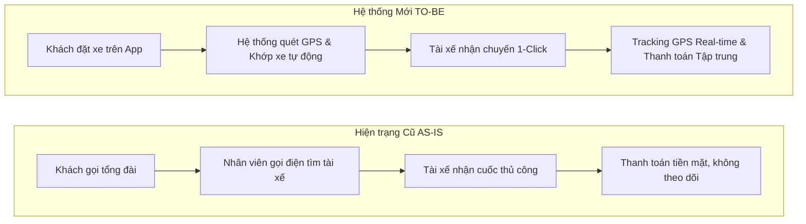
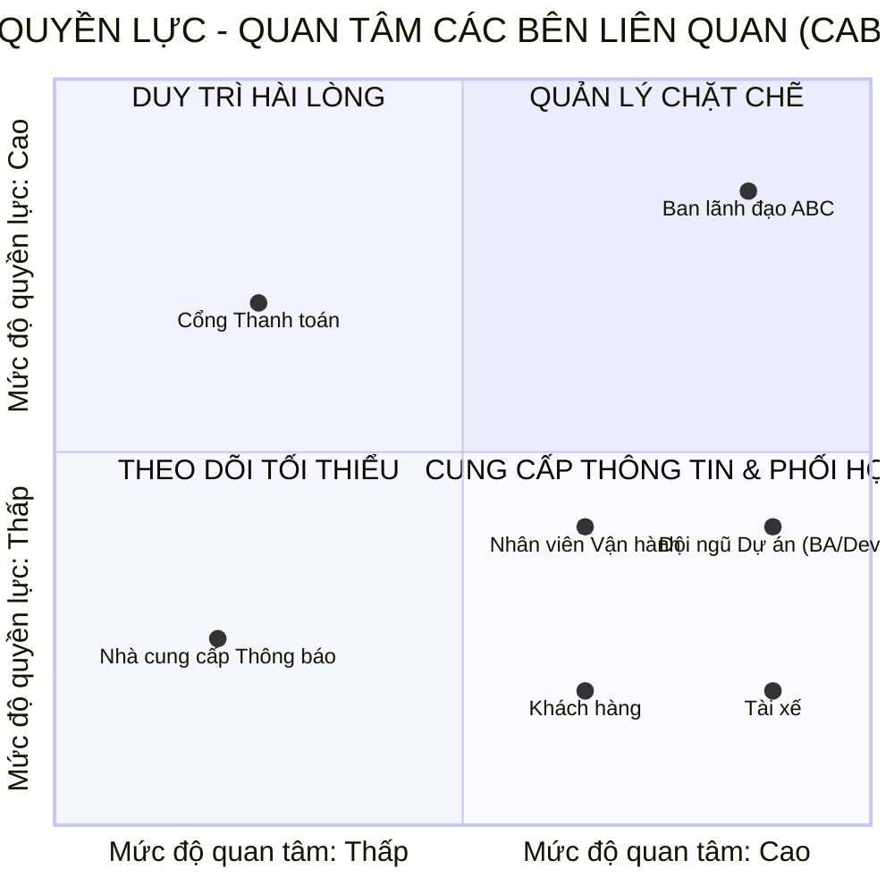
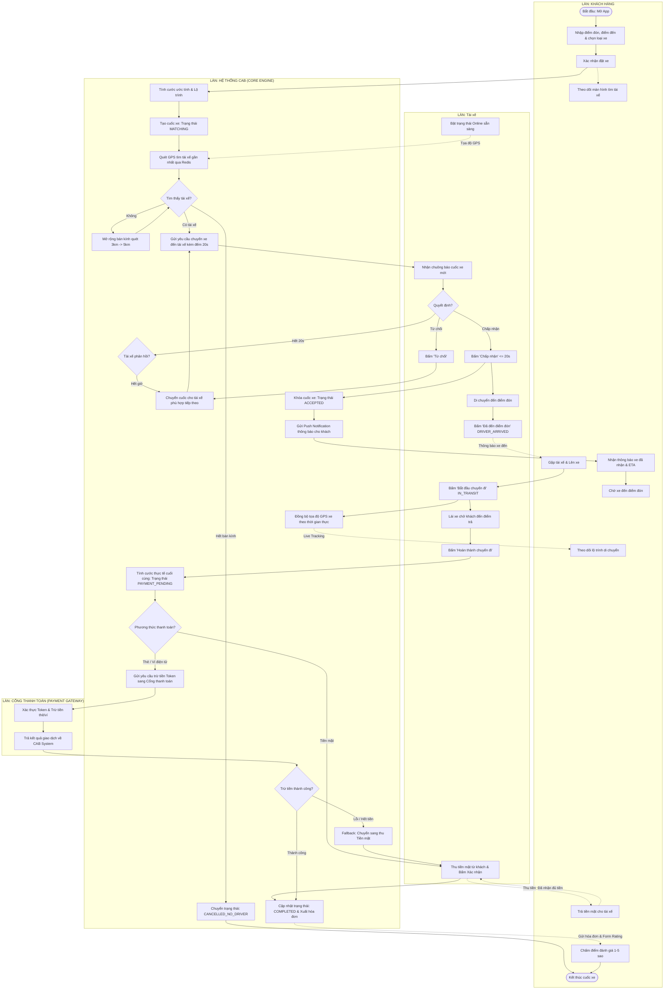
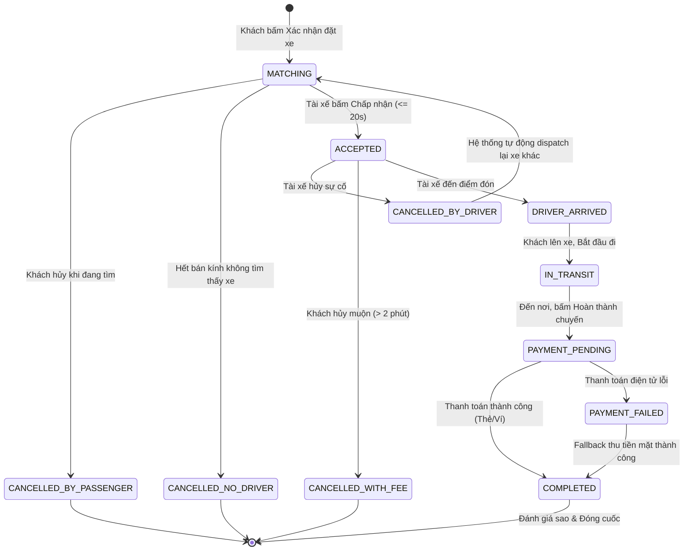

# TÀI LIỆU ĐẶC TẢ YÊU CẦU PHẦN MỀM (SRS) & PHÂN TÍCH HỆ THỐNG - CAB SYSTEM

- **Họ tên**: Nguyễn Hữu Lộc

- **MSSV**: 23635401

- **Đề tài**: Nền tảng Đặt xe Trực tuyến & Điều phối Thông minh (CAB System)

- **Khung thời gian triển khai**: 7 tuần (Giai đoạn MVP)

---

## 1. BỐI CẢNH & PHÂN TÍCH HIỆN TRẠNG (INTRODUCTION & CURRENT SYSTEM ANALYSIS)

### 1.1. Bối cảnh dự án (Project Context)

Công ty Cổ phần Vận tải ABC là đơn vị kinh doanh dịch vụ vận tải hành khách đô thị. Hiện nay, ABC tiếp nhận chuyến thông qua tổng đài thoại thủ công kết hợp ứng dụng đặt xe sơ khai. Mô hình này bộc lộ các điểm nghẽn nghiêm trọng: điều phối thủ công chậm trễ, khó theo dõi trạng thái lộ trình, thanh toán phân tán và rủi ro sập toàn hệ thống khi mở rộng dịch vụ. 

Dự án **CAB System** được xây dựng nhằm tự động hóa quy trình phân công chuyến xe, giám sát hành trình thời gian thực, quản lý thanh toán tập trung và thiết lập nền tảng kiến trúc Microservices có khả năng mở rộng độc lập trong vòng 7 tuần.

### 1.2. Phân loại yêu cầu và quy ước tài liệu

* **Khách hàng Requirement**: Yêu cầu nghiệp vụ bắt buộc từ đề tài của Công ty ABC.

* **BA Interpretation**: Phân rã logic của Business Analyst để mô hình hóa Use Case, State Machine và kiến trúc hệ thống.

* **MVP Assumption (Giả định đề xuất)**: Các tham số vận hành chuẩn ngành (công thức cước, bán kính quét, timeout) dùng để triển khai prototype kỹ thuật trong 7 tuần, có cấu hình động (Configurable) để cập nhật ngay khi khách hàng chốt phương án.

* **Open Questions**: Danh sách câu hỏi nghiệp vụ cần BA phỏng vấn và chốt chính thức với ban lãnh đạo.

### 1.3. Bảng đối chiếu hiện trạng: AS-IS vs. TO-BE (Gap Analysis)

| STT | Tiêu chí so sánh | Hệ thống Cũ (AS-IS) | Hệ thống Mới (TO-BE - CAB System) | Giá trị gia tăng |
| :--- | :--- | :--- | :--- | :--- |
| **1** | **Điều phối & Ghép xe** | Khách gọi tổng đài / App sơ khai; điều phối viên gọi điện thoại/nhắn tin thủ công cho tài xế (3–5 phút/cuốc). | Điều phối tự động: Thuật toán quét tọa độ GPS và ghép tài xế gần nhất qua Redis Geospatial trong < 5 giây. | Giảm thời gian chờ xe; loại bỏ chi phí vận hành điều phối trung gian. |
| **2** | **Giám sát Chuyến đi** | Khách không nắm được vị trí xe; không có thời gian dự kiến đón (ETA). | Real-time Tracking: Đồng bộ vị trí xe di chuyển liên tục qua WebSocket; cập nhật trạng thái và ETA tức thì. | Tăng độ minh bạch, giảm tỷ lệ khách hủy cuốc do sốt ruột. |
| **3** | **Quản lý Thanh toán** | Thu tiền mặt phân tán, tài xế tự thu, khó đối soát doanh thu cuối ngày. | Thanh toán tập trung: Hỗ trợ tiền mặt và tích hợp Cổng thanh toán số ngoài qua Tokenization (Tuyệt đối không lưu thẻ nhạy cảm). | Tuân thủ PCI-DSS; kiểm soát dòng tiền tự động, chống thất thoát. |
| **4** | **Kiến trúc Kỹ thuật** | Monolith nguyên khối, lỗi module phụ (thanh toán/thông báo) dễ kéo sập toàn bộ hệ sinh thái đặt xe. | Microservices & Event-Driven: Phân tách 5 service độc lập; các service giao tiếp qua Message Queue (bất đồng bộ). | Khả năng chịu lỗi cao (Fault-tolerant); dễ mở rộng quy mô độc lập. |
| **5** | **Báo cáo & Vận hành** | Dữ liệu phân tán; tổng hợp báo cáo thủ công trễ từ 1 đến 2 ngày. | Quản trị viên Portal & Live Monitor: Giám sát cuốc xe trực tiếp trên bản đồ số; báo cáo KPI doanh thu/hiệu suất tức thời. | Ra quyết định kinh doanh dựa trên dữ liệu thời gian thực (Data-driven). |

---

## 2. PHÂN TÍCH CÁC BÊN LIÊN QUAN (STAKEHOLDERS)

### 2.1. Danh sách và vai trò 7 Bên liên quan

| STT | Bên liên quan | Phân loại | Quyền hạn & Trách nhiệm chính | Mức độ tác động |
| :--- | :--- | :--- | :--- | :--- |
| **1** | Ban lãnh đạo ABC | Chủ sở hữu | Định hướng chiến lược, phê duyệt biểu phí cước, xem báo cáo KPI doanh thu và tỷ lệ hoàn thành cuốc. | Quyết định cao nhất. |
| **2** | Khách hàng | Người dùng cuối | Đăng ký, đăng nhập, đặt xe, theo dõi vị trí tài xế, thanh toán chuyến đi và đánh giá chất lượng. | Trực tiếp tạo doanh thu. |
| **3** | Tài xế đối tác | Người dùng cuối | Cập nhật hồ sơ/phương tiện, bật trạng thái Online, tiếp nhận/từ chối chuyến, cập nhật tiến trình di chuyển. | Trực tiếp cung cấp dịch vụ. |
| **4** | Nhân viên Vận hành | Người dùng nội bộ | Giám sát cuốc xe trực tiếp, duyệt hồ sơ tài xế mới, can thiệp xử lý các cuốc xe phát sinh sự cố. | Đảm bảo vận hành liên tục. |
| **5** | Đội ngũ Dự án (BA/Dev/QA) | Bên triển khai | Phân tích yêu cầu, thiết kế kiến trúc, lập trình Microservices và kiểm thử hệ thống trong 7 tuần. | Thực thi kỹ thuật. |
| **6** | Cổng Thanh toán | Đối tác bên ngoài | Xử lý giao dịch trừ tiền trực tuyến bảo mật qua cơ chế Tokenization. | Phụ thuộc dịch vụ ngoài. |
| **7** | Nhà cung cấp Thông báo | Đối tác bên ngoài | Cung cấp hạ tầng gửi tin nhắn SMS OTP và đẩy thông báo Push thời gian thực. | Phụ thuộc dịch vụ ngoài. |

### 2.2. Ma trận Quyền lực & Quan tâm

---

### 2.3. Cơ sở Đánh giá & Chiến lược Quản lý các Bên liên quan

| Nhóm Chiến lược | Bên liên quan | Đánh giá Quyền lực | Đánh giá Quan tâm | Chiến lược Quản lý & Tương tác |
| :--- | :--- | :--- | :--- | :--- |
| **Quản lý chặt chẽ** | **Ban lãnh đạo ABC** | **Rất cao:** Nắm ngân sách, duyệt phạm vi dự án, biểu phí và nghiệm thu sản phẩm. | **Rất cao:** Trực tiếp giám sát hiệu quả kinh doanh, doanh thu và các chỉ số KPI vận hành. | Tham vấn định kỳ, báo cáo tiến độ tuần và trình phê duyệt các thay đổi phạm vi nghiệp vụ cốt lõi. |
| **Duy trì hài lòng** | **Cổng Thanh toán** | **Cao:** Áp đặt các tiêu chuẩn kỹ thuật bảo mật bắt buộc (Tokenization, PCI-DSS) và có quyền ngắt kết nối API. | **Thấp:** Cung cấp dịch vụ B2B diện rộng, chỉ quan tâm đến tính hợp lệ của gói tin giao dịch gửi sang. | Tuân thủ tuyệt đối các chuẩn bảo mật API, không can thiệp vào quy trình tài chính nội bộ của đối tác. |
| **Theo dõi tối thiểu** | **Nhà cung cấp Thông báo** | **Thấp:** Đóng vai trò dịch vụ tiện ích hạ tầng, không can thiệp vào logic nghiệp vụ. | **Thấp:** Vận hành theo cơ chế tính phí theo lưu lượng truyền dẫn tin nhắn/thông báo. | Giám sát chất lượng kết nối mạng, hạn mức API (Quota) và thời gian phản hồi định kỳ. |
| **Cung cấp thông tin & Phối hợp** | **Khách hàng** | **Thấp:** Không có quyền quyết định thay đổi cấu trúc hay tính năng của hệ thống. | **Cao:** Trực tiếp trải nghiệm đặt xe, theo dõi vị trí và chịu tác động trực tiếp bởi cước phí dịch vụ. | Thu thập phản hồi qua đánh giá sao/review để cải tiến giao diện và tối ưu trải nghiệm người dùng. |
| | **Tài xế** | **Thấp:** Phải tuân thủ các quy tắc điều phối và chính sách phạt hủy do doanh nghiệp ban hành. | **Rất cao:** Chịu ảnh hưởng trực tiếp đến thu nhập, tỷ lệ nhận cuốc và công cụ điều hướng hàng ngày. | Cung cấp ứng dụng trực quan, thông báo rõ ràng về quyền lợi và hướng dẫn sử dụng chi tiết. |
| | **Nhân viên Vận hành** | **Trung bình:** Có quyền can thiệp vào cuốc xe lỗi nhưng trong giới hạn phân quyền quản trị. | **Cao:** Sử dụng trang Trang quản trị Web hàng ngày để giám sát, duyệt hồ sơ và xử lý sự cố vận hành. | Đào tạo quy trình thao tác trang quản trị và tiếp nhận góp ý để tối ưu hóa công cụ xử lý sự cố. |
| | **Đội ngũ Dự án (BA/Dev/QA)** | **Trung bình:** Là bên thực thi kỹ thuật, không có quyền quyết định chính sách nghiệp vụ. | **Rất cao:** Trực tiếp phân tích, viết mã nguồn, kiểm thử và chịu trách nhiệm bàn giao hệ thống trong 7 tuần. | Họp điều phối kỹ thuật hàng ngày (Daily Standup), bám sát yêu cầu từ BA và cập nhật tiến độ theo Sprint. |

---

## 3. MỤC TIÊU KINH DOANH (BUSINESS GOALS)

| Mã | Mục tiêu nghiệp vụ (Business Goals) | Mô tả chi tiết |
| :--- | :--- | :--- |
| **BG01** | Tự động hóa điều phối | Giảm thiểu can thiệp thủ công bằng cơ chế tự động ghép cuốc xe dựa trên vị trí GPS và trạng thái tài xế. |
| **BG02** | Nâng cao trải nghiệm số | Cung cấp ứng dụng trực quan cho phép khách đặt xe dễ dàng, theo dõi vị trí xe di chuyển và nhận ETA chính xác. |
| **BG03** | Quản lý vận hành tập trung | Hợp nhất quản lý khách hàng, tài xế, phương tiện và giám sát vòng đời chuyến đi trên một trang quản trị. |
| **BG04** | Chuẩn hóa thanh toán & Chống thất thoát | Tự động hóa tính cước; hỗ trợ song song tiền mặt và cổng thanh toán số; bảo vệ an toàn dữ liệu tài chính. |
| **BG05** | Hỗ trợ quyết định qua dữ liệu | Cung cấp báo cáo trực quan về doanh thu, tỷ lệ hoàn thành cuốc, tỷ lệ hủy và hiệu suất làm việc của đối tác tài xế. |
| **BG06** | Kiến trúc bền vững & Chịu tải | Xây dựng hệ thống theo mô hình Microservices, đảm bảo mở rộng tải độc lập và chịu lỗi cục bộ cho từng dịch vụ. |
| **BG07** | Khả năng mở rộng trong tương lai | Cấu trúc module hóa linh hoạt cho phép tích hợp thêm dịch vụ mới (Food, Express) hoặc đổi đối tác mà không cần viết lại mã nguồn. |

---

## 4. PHẠM VI DỰ ÁN MVP 7 TUẦN (PROJECT SCOPE & MICROSERVICES MAPPING)

### 4.1. Bảng 5 Phân hệ Nghiệp vụ Cốt lõi (In-Scope Subsystems)

| STT | Phân hệ Nghiệp vụ (Khối chức năng) | Phạm vi Nghiệp vụ Chi tiết | Đối tượng Thụ hưởng |
| :--- | :--- | :--- | :--- |
| **1** | Quản lý Tài khoản & Người dùng | Đăng ký, đăng nhập xác thực (JWT/OTP), quản lý hồ sơ cá nhân của khách hàng và hồ sơ phương tiện của tài xế. | Khách hàng, Tài xế, Quản trị viên |
| **2** | Điều phối & Quản lý Chuyến đi | Tạo yêu cầu đặt xe, tự động ghép cuốc xe gần nhất, cập nhật vòng đời chuyến đi và tracking vị trí GPS thời gian thực. | Khách hàng, Tài xế, Quản trị viên |
| **3** | Tính cước & Thanh toán | Tính cước tự động (ước tính và chốt thực tế), xử lý thanh toán tiền mặt và tích hợp Cổng thanh toán điện tử (Sandbox). | Khách hàng, Tài xế |
| **4** | Quản lý Thông báo | Tiếp nhận sự kiện nghiệp vụ bất đồng bộ để gửi mã xác thực SMS OTP và thông báo đẩy (Push Notifications). | Khách hàng, Tài xế |
| **5** | Quản trị, Đánh giá & Báo cáo | Quản lý người dùng, duyệt hồ sơ tài xế, can thiệp sự cố cuốc xe, quản lý đánh giá sao và xuất báo cáo KPI thống kê. | Nhân viên Vận hành, Ban lãnh đạo |

### 4.2. Bảng Phân định Ranh giới Loại trừ (Out-of-Scope Table)

| Hạng mục Loại trừ | Mô tả chi tiết | Lý do kỹ thuật & Quản trị dự án trong 7 tuần |
| :--- | :--- | :--- |
| **Dịch vụ mở rộng** | Giao đồ ăn (Food Delivery), Giao bưu kiện (Express), Đặt xe liên tỉnh. | Tập trung hoàn thiện 100% dịch vụ gọi xe chở khách đô thị cốt lõi. |
| **Đặt xe hẹn giờ** | Đặt xe theo lịch hẹn trước nhiều ngày (Scheduled Rides), Đi chung xe (Carpooling). | Độ phức tạp cao trong thuật toán điều phối; chưa cần thiết cho giai đoạn MVP. |
| **Ví điện tử nội bộ** | Xây dựng hệ thống Ví lưu ký giữ tiền (In-app Closed-loop Wallet). | Đòi hỏi thủ tục cấp phép ngân hàng phức tạp; thay thế bằng kết nối Cổng thanh toán ngoài. |
| **Thuật toán Giá AI** | Tính giá động thời gian thực bằng Machine Learning dựa trên thời tiết/nhu cầu. | Thay thế bằng bảng cấu hình hệ số khung giờ cao điểm do Quản trị viên thiết lập sẵn. |

### 4.3. Bảng Ánh xạ Nghiệp vụ sang 5 Microservices (Bounded Contexts)

| Phân hệ Nghiệp vụ (BA Subsystem) | Bounded Context (Microservice) | Cơ sở dữ liệu & Công nghệ đề xuất | Trách nhiệm kỹ thuật chính khi lập trình |
| :--- | :--- | :--- | :--- |
| **1. Quản lý Tài khoản & Người dùng** | Auth & User Service | PostgreSQL / MongoDB (UserDB) | Xác thực JWT, cấp Refresh Token, phân quyền RBAC, quản lý hồ sơ và xe. |
| **2. Điều phối & Quản lý Chuyến đi** | Ride & Dispatch Service (Core Engine) | PostgreSQL (RideDB) + Redis Geospatial | Quản lý trạng thái cuốc, tìm xe gần nhất (GEORADIUS), WebSocket realtime tracking. |
| **3. Tính cước & Thanh toán** | Fare & Payment Service | PostgreSQL (PaymentDB) | Module tính cước, kết nối cổng thanh toán qua Webhook/Tokenization, đối soát. |
| **4. Quản lý Thông báo** | Notification Service | Không có DB riêng / Log DB | Worker chạy ngầm tiêu thụ message từ Redis Pub/Sub hoặc RabbitMQ để gửi Push/SMS. |
| **5. Quản trị, Đánh giá & Báo cáo** | Quản trị viên & Analytics Service | PostgreSQL Read-Replica (AdminDB) | Xử lý truy vấn tổng hợp (Aggregated queries), API quản trị, duyệt hồ sơ và review. |

### 4.4. Kế hoạch triển khai MVP trong 7 tuần (7-Week Sprint Plan)

* **Tuần 1 (Analysis & Setup)**: Chốt tài liệu SRS, thiết kế Database Schemas, quy chuẩn REST API/WebSocket Contracts, dựng khung hạ tầng Docker Compose & API Gateway.

* **Tuần 2 (Auth & User Service)**: Lập trình Auth & User Service (Đăng ký, Đăng nhập, cấp phát JWT Token, phân quyền, quản lý phương tiện).

* **Tuần 3 (Ride Engine & Realtime Matching)**: Xây dựng Ride & Dispatch Service, tích hợp Redis Geospatial để quét tài xế và WebSocket xử lý nhận/từ chối cuốc.

* **Tuần 4 (Trip Lifecycle & GPS Tracking)**: Hoàn thiện máy trạng thái chuyến đi (`DRIVER_ARRIVED` $\rightarrow$ `IN_TRANSIT` $\rightarrow$ `COMPLETED`) và đồng bộ lộ trình xe theo thời gian thực.

* **Tuần 5 (Fare, Payment & Notifications)**: Lập trình Fare & Payment Service (tính cước, kết nối Sandbox cổng thanh toán) và dựng Notification Service lắng nghe Message Queue.

* **Tuần 6 (Quản trị viên Portal & Incident Management)**: Xây dựng giao diện Quản trị Trang quản trị Web (Live monitor theo dõi chuyến xe, duyệt tài xế, xem báo cáo KPI doanh thu).

* **Tuần 7 (E2E Integration, Fault Testing & Demo)**: Kiểm thử tích hợp toàn bộ luồng nghiệp vụ từ đầu đến cuối; kiểm thử cô lập lỗi (tắt thử payment/notification); đóng gói và demo nghiệm thu.

---

## 5. YÊU CẦU NGHIỆP VỤ CỐT LÕI (BUSINESS REQUIREMENTS)

| Mã | Tên yêu cầu nghiệp vụ | Nội dung mô tả nghiệp vụ |
| :--- | :--- | :--- |
| **BR01** | Tự động hóa điều phối | Doanh nghiệp cần cơ chế tự động tìm kiếm, lựa chọn và phân công chuyến xe cho tài xế phù hợp gần nhất mà không cần tổng đài can thiệp. |
| **BR02** | Trải nghiệm khách hàng số | Cung cấp công cụ cho phép khách hàng đặt xe thuận tiện, theo dõi trạng thái di chuyển trực quan và nhận thông báo cập nhật liên tục. |
| **BR03** | Quản trị vận hành tập trung | Xây dựng cổng thông tin quản trị duy nhất để quản lý thông tin khách hàng, tài xế, phương tiện và giải quyết sự cố phát sinh. |
| **BR04** | Kiểm soát tính cước & Thanh toán | Hệ thống phải tự động tính toán chi phí minh bạch, hỗ trợ đa dạng hình thức thanh toán và bảo vệ an toàn thông tin thẻ của người dùng. |
| **BR05** | Giám sát hiệu quả kinh doanh | Cung cấp các chỉ số đo lường hiệu quả hoạt động: doanh thu, tổng số cuốc, tỷ lệ hủy, tỷ lệ hoàn thành và thời gian hoạt động của tài xế. |
| **BR06** | Khả năng chịu tải & Ổn định | Hệ thống phải vận hành ổn định trong các khung giờ cao điểm; lỗi tại một thành phần phụ không được làm sập luồng đặt xe chính. |
| **BR07** | Kiến trúc module linh hoạt | Cho phép bổ sung loại hình dịch vụ mới, cổng thanh toán hoặc đối tác thông báo trong tương lai mà không cần tái cấu trúc toàn bộ ứng dụng. |
| **BR08** | An toàn thông tin & Kiểm toán | Bắt buộc xác thực người dùng, bảo vệ dữ liệu PII và lưu vết nhật ký toàn bộ các thao tác can thiệp quản trị quan trọng. |

---

## 6. YÊU CẦU CHỨC NĂNG PHÂN RÃ (FUNCTIONAL REQUIREMENTS)

| Phân hệ | ID | Chi tiết Yêu cầu chức năng |
| :--- | :--- | :--- |
| **1. Quản lý Tài khoản & Người dùng** | FR01 | Cho phép Khách hàng đăng ký tài khoản mới bằng Số điện thoại và mã xác thực SMS OTP. |
| | FR02 | Xác thực đăng nhập cho Khách hàng, Tài xế, Nhân viên vận hành và Ban lãnh đạo qua JWT Token. |
| | FR03 | Phân quyền truy cập tài nguyên hệ thống theo vai trò: Khách hàng, Tài xế, Nhân viên Vận hành, Quản trị viên. |
| | FR04 | Cho phép người dùng xem và chỉnh sửa thông tin hồ sơ cá nhân, đổi mật khẩu. |
| | FR05 | Cho phép Đối tác Tài xế khai báo thông tin cá nhân, giấy phép lái xe, loại xe và biển số phương tiện. |
| **2. Điều phối & Quản lý Chuyến đi** | FR06 | Cho phép Khách hàng nhập Điểm đón, Điểm đến và lựa chọn loại dịch vụ phương tiện. |
| | FR07 | Tự động tính toán và hiển thị cước phí ước tính (Estimate Fare) cùng lộ trình dự kiến trước khi đặt xe. |
| | FR08 | Cho phép Tài xế chuyển đổi trạng thái làm việc giữa Sẵn sàng nhận chuyến (Online) và Ngừng hoạt động (Offline). |
| | FR09 | Tiếp nhận tọa độ định vị GPS định kỳ từ thiết bị tài xế và cập nhật tức thì vào bộ nhớ đệm cache Redis. |
| | FR10 | Tự động quét và xếp hạng danh sách tài xế Online trong bán kính phù hợp gần điểm đón nhất. |
| | FR11 | Gửi tín hiệu mời nhận chuyến đến tài xế ưu tiên với bộ đếm ngược thời gian phản hồi (Timeout). |
| | FR12 | Cho phép Tài xế bấm Chấp nhận hoặc Từ chối yêu cầu chuyến đi được gửi đến. |
| | FR13 | Tự động chuyển tiếp yêu cầu sang tài xế phù hợp tiếp theo nếu tài xế trước đó từ chối hoặc hết thời gian timeout. |
| | FR14 | Thông báo rõ ràng cho Khách hàng khi đã quét hết phạm vi mà không tìm thấy tài xế nhận chuyến. |
| | FR15 | Cho phép Khách hàng hủy yêu cầu đặt xe (hủy miễn phí hoặc áp dụng phí phạt theo điều kiện trạng thái). |
| | FR16 | Cho phép Tài xế cập nhật trạng thái di chuyển: Đã đến điểm đón $\rightarrow$ Bắt đầu chuyến đi $\rightarrow$ Hoàn thành chuyến đi. |
| | FR17 | Truyền tải tọa độ GPS di chuyển của tài xế lên giao diện bản đồ của khách hàng theo thời gian thực (WebSocket). |
| | FR18 | Lưu trữ và cho phép người dùng tra cứu danh sách lịch sử các chuyến đi đã thực hiện hoặc đã hủy. |
| **3. Tính cước & Thanh toán** | FR19 | Tự động chốt số tiền cước thực tế (Final Fare) dựa trên cự ly GPS và thời gian di chuyển sau khi chuyến xe hoàn tất. |
| | FR20 | Hỗ trợ phương thức thanh toán tiền mặt trực tiếp giữa khách hàng và tài xế. |
| | FR21 | Tích hợp cổng thanh toán số ngoài để tự động trừ tiền qua Tokenization (không lưu trữ số thẻ nhạy cảm). |
| | FR22 | Ghi nhận kết quả giao dịch; tự động kích hoạt cơ chế Fallback (chuyển sang tiền mặt) khi thanh toán điện tử thất bại. |
| **4. Quản lý Thông báo** | FR23 | Gửi mã xác thực OTP qua tin nhắn SMS khi người dùng đăng ký hoặc khôi phục mật khẩu. |
| | FR24 | Tự động gửi thông báo đẩy (Push Notification) thông báo các sự kiện: tìm thấy xe, tài xế đến nơi, cuốc hoàn thành, thanh toán xong. |
| **5. Quản trị, Đánh giá & Báo cáo** | FR25 | Cho phép Khách hàng chấm điểm sao (1-5★) và gửi đánh giá nhận xét chất lượng phục vụ của tài xế. |
| | FR26 | Cho phép Nhân viên vận hành xem danh sách, tra cứu và kích hoạt/khóa tài khoản người dùng. |
| | FR27 | Cho phép Nhân viên vận hành kiểm tra thông tin và phê duyệt hồ sơ đối tác tài xế mới đăng ký. |
| | FR28 | Cho phép Nhân viên vận hành giám sát các cuốc xe đang hoạt động trực tiếp trên bản đồ số (Live Monitor). |
| | FR29 | Cho phép Nhân viên vận hành can thiệp xử lý các cuốc xe bị treo trạng thái hoặc phát sinh sự cố khẩn cấp. |
| | FR30 | Tự động ghi vết nhật ký kiểm toán (Audit Log) cho toàn bộ các thao tác can thiệp hệ thống của nhân viên quản trị. |
| | FR31 | Cung cấp báo cáo thống kê trực quan về tổng doanh thu, số lượng chuyến, tỷ lệ hoàn thành và tỷ lệ hủy chuyến. |
| | FR32 | Cung cấp báo cáo đo lường hiệu suất làm việc và điểm đánh giá trung bình của từng tài xế. |

---

## 7. MÔ HÌNH CA SỬ DỤNG CHUẨN HÓA (USE CASE MODEL)

### 7.1. Danh sách Actors hệ thống

| Actor | Phân loại | Mô tả vai trò và trách nhiệm |
| :--- | :--- | :--- |
| **Khách hàng** | Primary Actor | Người trực tiếp đặt chuyến xe, theo dõi lộ trình di chuyển, thực hiện thanh toán và đánh giá tài xế. |
| **Tài xế** | Primary Actor | Đối tác vận chuyển, đăng ký xe, bật trạng thái sẵn sàng, tiếp nhận/từ chối cuốc và cập nhật tiến trình di chuyển. |
| **Nhân viên Vận hành** | Primary Actor | Đội ngũ quản lý, duyệt hồ sơ tài xế, giám sát cuốc xe trực tiếp và can thiệp xử lý sự cố phát sinh. |
| **Ban lãnh đạo** | Primary Actor | Người sử dụng hệ thống để theo dõi các chỉ số KPI báo cáo tài chính và hiệu quả vận hành doanh nghiệp. |
| **Nhà cung cấp Thanh toán** | Secondary Actor | Hệ thống đối tác tài chính bên ngoài tiếp nhận yêu cầu thanh toán và phản hồi kết quả trừ tiền. |
| **Nhà cung cấp Thông báo** | Secondary Actor | Hạ tầng đám mây bên ngoài (FCM/SMS) hỗ trợ truyền dẫn thông điệp thông báo đẩy và tin nhắn OTP. |

### 7.2. Bảng Phân bổ 17 Use Cases Độc lập

| Phân hệ Nghiệp vụ | Mã UC | Tên Use Case Nghiệp vụ | Actor chính | Functional Requirements |
| :--- | :--- | :--- | :--- | :--- |
| **1. Quản lý Tài khoản** | UC01 | Đăng ký tài khoản | Khách hàng | FR01, FR23 |
| | UC02 | Đăng nhập hệ thống | Khách hàng, Tài xế, Vận hành, Lãnh đạo | FR02, FR03 |
| | UC03 | Cập nhật thông tin cá nhân | Khách hàng, Tài xế, Vận hành, Lãnh đạo | FR04 |
| | UC10 | Đăng ký hồ sơ & phương tiện | Tài xế | FR05 |
| **2. Điều phối & Chuyến đi** | UC04 | Đặt xe | Khách hàng | FR06, FR07, FR10, FR11, FR14, FR24 |
| | UC05 | Hủy yêu cầu đặt xe | Khách hàng | FR15 |
| | UC06 | Theo dõi chuyến đi | Khách hàng | FR17 |
| | UC09 | Xem lịch sử chuyến đi | Khách hàng, Tài xế | FR18 |
| | UC11 | Bật / Tắt trạng thái hoạt động | Tài xế | FR08, FR09 |
| | UC12 | Tiếp nhận chuyến xe | Tài xế | FR12, FR24 |
| | UC13 | Từ chối chuyến xe | Tài xế | FR12, FR13 |
| | UC14 | Cập nhật tiến trình chuyến đi | Tài xế | FR16, FR19, FR24 |
| **3. Tính cước & Thanh toán** | UC07 | Thanh toán chuyến đi | Khách hàng, Tài xế, Nhà cung cấp Thanh toán | FR20, FR21, FR22, FR24 |
| **4. Quản trị & Báo cáo** | UC08 | Đánh giá tài xế | Khách hàng | FR25 |
| | UC15 | Quản lý người dùng & Duyệt tài xế | Nhân viên Vận hành | FR26, FR27 |
| | UC16 | Giám sát & Can thiệp sự cố | Nhân viên Vận hành | FR28, FR29, FR30 |
| | UC17 | Xem báo cáo thống kê | Ban lãnh đạo | FR31, FR32 |

### 7.3. Sơ đồ Use Case Tổng thể (Use Case Diagram)

```mermaid

flowchart LR

    %% ==========================================

    %% 1. ACTORS BÊN TRÁI (USERS DI ĐỘNG)

    %% ==========================================

    KH[" Khách hàng"]

    TX[" Tài xế"]

    %% ==========================================

    %% 2. SYSTEM BOUNDARY

    %% ==========================================

    subgraph SYSTEM ["HỆ THỐNG ĐẶT XE TRỰC TUYẾN - CAB SYSTEM"]

        %% Tâm hệ thống

        DN((Đăng nhập))

        %% Use Cases phía Khách hàng (Bên trái)

        UC_DK_KH((Đăng ký tài khoản))

        UC_QLTT((Cập nhật thông tin cá nhân))

        UC_DATXE((Đặt xe))

        UC_HUYXE((Hủy yêu cầu đặt xe))

        UC_TRACK((Theo dõi chuyến đi))

        UC_LS((Xem lịch sử chuyến đi))

        UC_RATE((Đánh giá tài xế))

        %% Use Cases phía Tài xế (Bên trái & Dưới trái)

        UC_DK_TX((Đăng ký hồ sơ & xe))

        UC_ONLINE((Bật/Tắt trạng thái hoạt động))

        UC_NHAN((Tiếp nhận chuyến xe))

        UC_TUCHOI((Từ chối chuyến xe))

        UC_TIENDO((Cập nhật tiến trình chuyến))

        %% Use Cases Thanh toán & Quản trị (Bên phải)

        UC_PAY((Thanh toán chuyến đi))

        UC_QL_USER((Quản lý người dùng & Duyệt tài xế))

        UC_GS_CUOC((Giám sát & Xử lý sự cố))

        UC_BAOCAO((Xem báo cáo thống kê / KPI))

        %% Use Case Đăng xuất ở đáy

        DX((Đăng xuất<br/><i>extension points: Logout</i>))

    end

    %% ==========================================

    %% 3. ACTORS BÊN PHẢI (QUẢN TRỊ VIÊN & ĐỐI TÁC NGOÀI)

    %% ==========================================

    NV[" Nhân viên vận hành"]

    BL[" Ban lãnh đạo"]

    PP[" Cổng thanh toán"]

    %% ==========================================

    %% 4. TƯƠNG TÁC ACTOR -> USE CASE (NÉT LIỀN)

    %% ==========================================

    

    %% Khách hàng

    KH --- UC_DK_KH

    KH --- UC_QLTT

    KH --- UC_DATXE

    KH --- UC_HUYXE

    KH --- UC_TRACK

    KH --- UC_PAY

    KH --- UC_RATE

    KH --- UC_LS

    %% Tài xế

    TX --- UC_DK_TX

    TX --- UC_QLTT

    TX --- UC_ONLINE

    TX --- UC_NHAN

    TX --- UC_TUCHOI

    TX --- UC_TIENDO

    TX --- UC_PAY

    TX --- UC_LS

    %% Nhân viên vận hành

    NV --- UC_QLTT

    NV --- UC_QL_USER

    NV --- UC_GS_CUOC

    %% Ban lãnh đạo

    BL --- UC_QLTT

    BL --- UC_BAOCAO

    %% Cổng thanh toán (Secondary Actor)

    PP --- UC_PAY

    %% ==========================================

    %% 5. QUAN HỆ <<INCLUDE>> VÀO TÂM ĐĂNG NHẬP (NÉT ĐỨT)

    %% ==========================================

    UC_QLTT -.->|<<include>>| DN

    UC_DATXE -.->|<<include>>| DN

    UC_HUYXE -.->|<<include>>| DN

    UC_TRACK -.->|<<include>>| DN

    UC_LS -.->|<<include>>| DN

    UC_RATE -.->|<<include>>| DN

    UC_ONLINE -.->|<<include>>| DN

    UC_NHAN -.->|<<include>>| DN

    UC_TUCHOI -.->|<<include>>| DN

    UC_TIENDO -.->|<<include>>| DN

    UC_PAY -.->|<<include>>| DN

    UC_QL_USER -.->|<<include>>| DN

    UC_GS_CUOC -.->|<<include>>| DN

    UC_BAOCAO -.->|<<include>>| DN

    %% Quan hệ <<extend>> Đăng xuất

    DX -.->|<<extend>>| DN

```

---

## 8. ĐẶC TẢ CHI TIẾT USE CASE (USE CASE SPECIFICATIONS)

### 8.1. UC01 - ĐĂNG KÝ TÀI KHOẢN

| Đặc tả Use Case |
| :--- |
| **Tên use case:** UC01 - Đăng ký tài khoản |
| **Mô tả sơ lược:** Cho phép người dùng mới (Khách hàng) đăng ký tài khoản mới trên CAB System bằng Số điện thoại và mật khẩu cá nhân kèm xác thực OTP. |
| **Actor chính:** Khách hàng |
| **Actor phụ:** Nhà cung cấp Thông báo (Cổng SMS) |
| **Tiền điều kiện (Pre-condition):** Khách hàng chưa có tài khoản trên hệ thống và thiết bị có kết nối Internet. |
| **Hậu điều kiện (Post-condition):** Bản ghi tài khoản Khách hàng mới được tạo trong CSDL ở trạng thái hoạt động (ACTIVE). |

| **Actor** | **System** |
| :--- | :--- |
| **Luồng sự kiện chính (main flow):** |  |
| 1. Khách hàng tải ứng dụng, mở màn hình chào mừng và nhấn chọn nút "Đăng ký". |  |
|  | 2. Hệ thống hiển thị biểu mẫu đăng ký bao gồm các trường thông tin: Họ tên, Số điện thoại, Email (tùy chọn), Mật khẩu, và Xác nhận mật khẩu. |
| 3. Khách hàng nhập đầy đủ các thông tin theo yêu cầu và nhấn nút "Đăng ký". |  |
|  | 4. Hệ thống thực hiện kiểm tra tính hợp lệ của dữ liệu (Số điện thoại đúng định dạng, mật khẩu khớp và có độ dài tối thiểu từ 8 ký tự trở lên). |
|  | 5. Hệ thống gọi API gửi mã xác thực SMS OTP (6 chữ số) đến số điện thoại đăng ký của Khách hàng thông qua Nhà cung cấp Thông báo. |
|  | 6. Hệ thống hiển thị màn hình nhập mã xác thực OTP kèm bộ đếm ngược thời gian hiệu lực (120 giây). |
| 7. Khách hàng nhập mã OTP nhận được từ tin nhắn SMS và nhấn nút "Xác nhận". |  |
|  | 8. Hệ thống kiểm tra tính chính xác và thời hạn hiệu lực của mã OTP nhập vào. |
|  | 9. Hệ thống lưu tài khoản mới vào cơ sở dữ liệu với mật khẩu đã được mã hóa, tự động đăng nhập người dùng và hiển thị màn hình trang chủ. Kết thúc usecase. |
| **Luồng sự kiện thay thế (alternate flow):** |  |
|  | 4.1. Hệ thống phát hiện Số điện thoại đã được đăng ký cho một tài khoản khác trong cơ sở dữ liệu. |
|  | 4.2. Hệ thống hiển thị thông báo lỗi: "Số điện thoại này đã được sử dụng. Vui lòng đăng nhập hoặc sử dụng số khác." |
| 4.3. Khách hàng quay lại bước 3 để nhập số điện thoại khác hoặc bấm chuyển sang Đăng nhập. |  |
|  | 8.1. Hệ thống kiểm tra phát hiện mã OTP nhập vào không chính xác hoặc đã hết thời gian hiệu lực 120 giây. |
|  | 8.2. Hệ thống hiển thị cảnh báo lỗi: "Mã xác thực không chính xác hoặc đã hết hạn. Vui lòng kiểm tra lại." |
| 8.3. Khách hàng nhấn nút "Gửi lại OTP" nếu chưa nhận được mã. |  |
|  | 8.4. Hệ thống tự động thực hiện lại bước 5 để tạo và gửi mã xác thực mới. |
| **Luồng sự kiện ngoại lệ (exception flow):** |  |
| 3.1. Khách hàng nhấn nút "Hủy" tại bất kỳ màn hình nào trong quá trình nhập liệu. |  |
|  | 3.2. Hệ thống xóa toàn bộ dữ liệu tạm thời, đóng biểu mẫu đăng ký và đưa người dùng trở lại màn hình chào mừng ban đầu. Kết thúc usecase. |
|  | 5.1. Hệ thống không kết nối được với Cổng SMS của Nhà cung cấp Thông báo để gửi mã OTP. |
|  | 5.2. Hệ thống hiển thị cảnh báo lỗi: "Dịch vụ gửi tin nhắn xác thực đang gặp sự cố. Vui lòng thử lại sau." và giữ nguyên thông tin biểu mẫu để Khách hàng không phải điền lại. Kết thúc usecase. |

---

### 8.2. UC02 - ĐĂNG NHẬP HỆ THỐNG

| Đặc tả Use Case |
| :--- |
| **Tên use case:** UC02 - Đăng nhập hệ thống |
| **Mô tả sơ lược:** Cho phép các tác nhân đăng nhập vào hệ thống bằng Số điện thoại và Mật khẩu để xác thực quyền truy cập và phân quyền giao diện. |
| **Actor chính:** Khách hàng, Tài xế, Nhân viên Vận hành, Ban lãnh đạo |
| **Actor phụ:** Không có |
| **Tiền điều kiện (Pre-condition):** Tài khoản của người dùng đã tồn tại trong cơ sở dữ liệu của hệ thống. |
| **Hậu điều kiện (Post-condition):** Hệ thống cấp mã JWT Token xác thực phiên làm việc, lưu log đăng nhập và điều hướng người dùng đến đúng màn hình chức năng theo vai trò. |

| **Actor** | **System** |
| :--- | :--- |
| **Luồng sự kiện chính (main flow):** |  |
| 1. Người dùng mở ứng dụng di động hoặc trang web quản trị và chọn nút "Đăng nhập". |  |
|  | 2. Hệ thống hiển thị biểu mẫu đăng nhập yêu cầu nhập Số điện thoại và Mật khẩu. |
| 3. Người dùng nhập Số điện thoại và Mật khẩu của tài khoản vào biểu mẫu. |  |
| 4. Người dùng bấm nút "Đăng nhập". |  |
|  | 5. Hệ thống truy vấn cơ sở dữ liệu để kiểm tra sự tồn tại của số điện thoại và đối chiếu mật khẩu đã mã hóa. |
|  | 6. Hệ thống xác thực thông tin thành công, tạo Token JWT chứa thông tin định danh và vai trò (Role). |
|  | 7. Hệ thống chuyển hướng người dùng đến giao diện tương ứng: Khách hàng/Tài xế vào trang chủ ứng dụng; Nhân viên/Lãnh đạo vào Trang quản trị Dashboard Web. Kết thúc usecase. |
| **Luồng sự kiện thay thế (alternate flow):** |  |
| 3.1. Người dùng quên mật khẩu và nhấn vào link "Quên mật khẩu" trên màn hình. |  |
|  | 3.2. Hệ thống hiển thị màn hình yêu cầu nhập số điện thoại để khôi phục mật khẩu. |
| 3.3. Người dùng nhập số điện thoại và bấm "Gửi yêu cầu". |  |
|  | 3.4. Hệ thống gửi mã OTP xác thực qua SMS và hướng dẫn người dùng thiết lập lại mật khẩu mới. |
|  | 5.1. Hệ thống kiểm tra phát hiện Số điện thoại không tồn tại hoặc mật khẩu không khớp. |
|  | 5.2. Hệ thống hiển thị thông báo lỗi: "Số điện thoại hoặc mật khẩu không đúng. Vui lòng kiểm tra lại." |
| 5.3. Người dùng thực hiện lại bước 3 để nhập lại thông tin đăng nhập. |  |
| **Luồng sự kiện ngoại lệ (exception flow):** |  |
|  | 5.3. Hệ thống phát hiện tài khoản của người dùng hiện đang ở trạng thái bị khóa (LOCKED). |
|  | 5.4. Hệ thống từ chối đăng nhập và hiển thị thông báo: "Tài khoản của bạn đã bị khóa do vi phạm chính sách. Vui lòng liên hệ bộ phận hỗ trợ." Kết thúc usecase. |

---

### 8.3. UC03 - CẬP NHẬT THÔNG TIN CÁ NHÂN

| Đặc tả Use Case |
| :--- |
| **Tên use case:** UC03 - Cập nhật thông tin cá nhân |
| **Mô tả sơ lược:** Cho phép người dùng chỉnh sửa thông tin cá nhân cơ bản như Họ và tên, Email, Ảnh đại diện trên hệ thống. |
| **Actor chính:** Khách hàng, Tài xế, Nhân viên Vận hành, Ban lãnh đạo |
| **Actor phụ:** Không có |
| **Tiền điều kiện (Pre-condition):** Người dùng đã đăng nhập thành công vào hệ thống CAB System. |
| **Hậu điều kiện (Post-condition):** Thông tin cá nhân mới được cập nhật vào cơ sở dữ liệu và đồng bộ hiển thị trên giao diện. |

| **Actor** | **System** |
| :--- | :--- |
| **Luồng sự kiện chính (main flow):** |  |
| 1. Người dùng truy cập vào mục "Tài khoản" và chọn "Chỉnh sửa hồ sơ". |  |
|  | 2. Hệ thống truy vấn thông tin hiện tại trong cơ sở dữ liệu và hiển thị lên biểu mẫu chỉnh sửa. |
| 3. Người dùng thực hiện thay đổi Họ tên, Email hoặc upload ảnh đại diện mới. |  |
| 4. Người dùng nhấn nút "Lưu thay đổi". |  |
|  | 5. Hệ thống thực hiện kiểm tra tính hợp lệ của dữ liệu đầu vào (Ví dụ: Định dạng Email đúng quy chuẩn, họ tên không chứa ký tự đặc biệt). |
|  | 6. Hệ thống thực hiện cập nhật các trường thông tin thay đổi vào cơ sở dữ liệu. |
|  | 7. Hệ thống hiển thị thông báo "Cập nhật thông tin thành công" và tải lại giao diện với dữ liệu mới. Kết thúc usecase. |
| **Luồng sự kiện thay thế (alternate flow):** |  |
|  | 5.1. Hệ thống phát hiện định dạng Email nhập vào không đúng quy chuẩn (thiếu ký tự @ hoặc đuôi tên miền). |
|  | 5.2. Hệ thống hiển thị thông báo lỗi cụ thể tại trường Email: "Định dạng Email không hợp lệ. Vui lòng nhập lại." |
| 5.3. Người dùng tiến hành chỉnh sửa lại Email cho đúng định dạng và quay lại bước 4. |  |
|  | 5.4. Hệ thống kiểm tra phát hiện Email thay đổi đã được sử dụng bởi một tài khoản khác trong cơ sở dữ liệu. |
|  | 5.5. Hệ thống hiển thị thông báo lỗi: "Email này đã tồn tại trên hệ thống. Vui lòng sử dụng email khác." |
| 5.6. Người dùng quay lại nhập email khác hoặc giữ nguyên email cũ và bấm Lưu. |  |
| **Luồng sự kiện ngoại lệ (exception flow):** |  |
| 4.1. Người dùng nhấn nút "Hủy" hoặc phím "Quay lại" khi đang chỉnh sửa. |  |
|  | 4.2. Hệ thống hủy bỏ toàn bộ các thay đổi tạm thời, không lưu vào cơ sở dữ liệu và đóng biểu mẫu chỉnh sửa hồ sơ. Kết thúc usecase. |

---

### 8.4. UC04 - ĐẶT XE

| Đặc tả Use Case |
| :--- |
| **Tên use case:** UC04 - Đặt xe |
| **Mô tả sơ lược:** Cho phép Khách hàng thiết lập lộ trình di chuyển, xem báo giá ước tính theo thời gian thực và xác nhận gửi yêu cầu đặt xe lên hệ thống. |
| **Actor chính:** Khách hàng |
| **Actor phụ:** Dịch vụ Bản đồ (Map API) |
| **Tiền điều kiện (Pre-condition):** Khách hàng đã đăng nhập tài khoản hợp lệ, thiết bị đã bật kết nối mạng Internet và cấp quyền định vị GPS. |
| **Hậu điều kiện (Post-condition):** Yêu cầu chuyến xe được tạo lập thành công trong CSDL ở trạng thái "Đang tìm tài xế" (MATCHING) và bắt đầu kích hoạt thuật toán điều phối. |

| **Actor** | **System** |
| :--- | :--- |
| **Luồng sự kiện chính (main flow):** |  |
| 1. Khách hàng mở ứng dụng, chọn chức năng "Đặt xe". |  |
|  | 2. Hệ thống tự động lấy tọa độ GPS hiện tại của thiết bị để điền vào trường "Điểm đón" và hiển thị bản đồ trực quan. |
| 3. Khách hàng nhập vị trí "Điểm đến" vào ô tìm kiếm. |  |
|  | 4. Hệ thống gọi Map API để định vị tọa độ hai điểm, tính toán khoảng cách lộ trình tối ưu và vẽ đường di chuyển gợi ý trên bản đồ. |
|  | 5. Hệ thống áp dụng quy tắc tính cước để hiển thị giá tiền dự kiến tương ứng với từng loại dịch vụ xe (Xe máy, Xe ô tô 4 chỗ, Xe ô tô 7 chỗ) và các phương thức thanh toán. |
| 6. Khách hàng lựa chọn loại dịch vụ xe mong muốn, chọn phương thức thanh toán và nhấn nút "Đặt xe". |  |
|  | 7. Hệ thống ghi nhận yêu cầu, tạo bản ghi chuyến đi (Trip) trong cơ sở dữ liệu với trạng thái MATCHING, đồng thời hiển thị màn hình chờ kèm hiệu ứng quét tìm tài xế. Kết thúc usecase. |
| **Luồng sự kiện thay thế (alternate flow):** |  |
| 3.1. Khách hàng không muốn đón tại vị trí GPS hiện tại và thực hiện thay đổi "Điểm đón" bằng tay. |  |
|  | 3.2. Hệ thống cập nhật điểm đón mới, gọi lại Map API để tính toán lại lộ trình và chuyển tiếp sang bước 4. |
| **Luồng sự kiện ngoại lệ (exception flow):** |  |
|  | 4.1. Hệ thống không kết nối được với Map API hoặc không tìm thấy lộ trình di chuyển phù hợp giữa hai điểm. |
|  | 4.2. Hệ thống hiển thị thông báo lỗi: "Không thể xác định lộ trình. Vui lòng kiểm tra lại địa chỉ hoặc kết nối mạng." và đưa khách hàng quay lại biểu mẫu nhập liệu. Kết thúc usecase. |
| 6.1. Khách hàng nhấn nút "Hủy đặt xe" ngay tại màn hình chờ quét tìm tài xế. |  |
|  | 6.2. Hệ thống thu hồi yêu cầu tìm xe, cập nhật trạng thái chuyến đi thành "Đã hủy" (CANCELLED) trong CSDL và đưa khách hàng về màn hình bản đồ ban đầu. Kết thúc usecase. |

---

### 8.5. UC05 - HỦY YÊU CẦU ĐẶT XE

| Đặc tả Use Case |
| :--- |
| **Tên use case:** UC05 - Hủy yêu cầu đặt xe |
| **Mô tả sơ lược:** Cho phép Khách hàng chủ động hủy yêu cầu đặt xe đang tìm kiếm hoặc hủy chuyến xe đã được tài xế tiếp nhận dựa trên chính sách hủy chuyến của công ty. |
| **Actor chính:** Khách hàng |
| **Actor phụ:** Tài xế (nếu chuyến đã được nhận) |
| **Tiền điều kiện (Pre-condition):** Khách hàng đã tạo một yêu cầu chuyến xe đang ở trạng thái MATCHING hoặc ACCEPTED. |
| **Hậu điều kiện (Post-condition):** Chuyến xe được chuyển sang trạng thái đã hủy (CANCELLED) trong cơ sở dữ liệu, tài xế được giải phóng trạng thái hoạt động rảnh. |

| **Actor** | **System** |
| :--- | :--- |
| **Luồng sự kiện chính (main flow):** |  |
| 1. Khách hàng nhấn nút "Hủy chuyến đi" trên màn hình ứng dụng đặt xe. |  |
|  | 2. Hệ thống truy vấn trạng thái hiện tại của chuyến xe và kiểm tra thời gian đã trôi qua kể từ khi tài xế nhận chuyến (nếu có). |
|  | 3. Hệ thống xác nhận thời gian hủy chuyến hợp lệ (Trong vòng 3 phút kể từ khi tài xế nhận chuyến hoặc cuốc xe vẫn đang tìm tài xế). |
|  | 4. Hệ thống cập nhật trạng thái của chuyến xe thành "Đã hủy" (CANCELLED) trong cơ sở dữ liệu. |
|  | 5. Hệ thống gửi thông báo giải phóng cuốc xe đến Ứng dụng Tài xế của tài xế (nếu chuyến đã có tài xế nhận) để đưa tài xế về trạng thái ONLINE rảnh. |
|  | 6. Hệ thống hiển thị thông báo hủy chuyến thành công không tính phí lên màn hình Khách hàng. Kết thúc usecase. |
| **Luồng sự kiện thay thế (alternate flow):** |  |
|  | 3.1. Hệ thống kiểm tra phát hiện thời gian hủy chuyến đã vượt quá 3 phút kể từ khi tài xế bấm nhận chuyến. |
|  | 3.2. Hệ thống hiển thị hộp thoại cảnh báo: "Hủy chuyến sau 3 phút sẽ bị tính phí phạt 10,000đ áp dụng vào chuyến đi tiếp theo theo chính sách. Bạn có chắc chắn muốn hủy?" kèm hai nút chọn "Đồng ý" và "Quay lại". |
| 3.3. Khách hàng nhấn chọn "Đồng ý" để tiếp tục hủy chuyến. |  |
|  | 3.4. Hệ thống ghi nhận phí phạt hủy chuyến vào tài khoản khách hàng, cập nhật trạng thái chuyến xe sang CANCELLED và thực hiện tiếp bước 5. |
| **Luồng sự kiện ngoại lệ (exception flow):** |  |
| 3.1.1. Khách hàng nhấn chọn "Quay lại" tại hộp thoại cảnh báo phí phạt ở bước 3.2. |  |
|  | 3.1.2. Hệ thống đóng hộp thoại cảnh báo, giữ nguyên tiến trình chuyến xe hiện tại và tiếp tục hiển thị màn hình theo dõi di chuyển của tài xế. Kết thúc usecase. |

---

### 8.6. UC06 - THEO DÕI CHUYẾN ĐI

| Đặc tả Use Case |
| :--- |
| **Tên use case:** UC06 - Theo dõi chuyến đi |
| **Mô tả sơ lược:** Cho phép Khách hàng theo dõi vị trí GPS di chuyển thời gian thực của tài xế và lộ trình chuyến đi trực quan trên bản đồ ứng dụng. |
| **Actor chính:** Khách hàng |
| **Actor phụ:** Tài xế |
| **Tiền điều kiện (Pre-condition):** Chuyến xe đã được tài xế tiếp nhận thành công (ACCEPTED) hoặc đang trong tiến trình di chuyển (IN_TRANSIT). |
| **Hậu điều kiện (Post-condition):** Tọa độ di chuyển thực tế của tài xế được đồng bộ liên tục đến màn hình bản đồ của khách hàng cho đến khi hoàn thành chuyến đi. |

| **Actor** | **System** |
| :--- | :--- |
| **Luồng sự kiện chính (main flow):** |  |
| 1. Khách hàng mở màn hình chi tiết chuyến đi hiện tại trên ứng dụng di động. |  |
|  | 2. Hệ thống thiết lập kết nối luồng truyền dữ liệu thời gian thực (Websocket) giữa thiết bị Khách hàng và máy chủ. |
| 3. Tài xế bật định vị GPS, Ứng dụng Tài xế tự động gửi tọa độ vị trí di chuyển định kỳ (mỗi 5 giây) về máy chủ. |  |
|  | 4. Hệ thống tiếp nhận tọa độ GPS từ Ứng dụng Tài xế và đẩy dữ liệu tức thời qua kênh Websocket đến thiết bị của Khách hàng. |
|  | 5. Hệ thống cập nhật biểu tượng di chuyển của tài xế và lộ trình vẽ trên bản đồ thời gian thực hiển thị cho Khách hàng. Kết thúc usecase. |
| **Luồng sự kiện thay thế (alternate flow):** |  |
|  | 4.1. Hệ thống phát hiện mất kết nối Websocket tạm thời do thiết bị của Khách hàng di chuyển qua vùng sóng yếu. |
|  | 4.2. Hệ thống hiển thị thông báo trạng thái: "Mất kết nối định vị. Đang kết nối lại..." và lưu trữ vị trí GPS cuối cùng được ghi nhận. |
|  | 4.3. Hệ thống tự động thực hiện gửi lại yêu cầu kết nối lại Websocket khi sóng mạng phục hồi và tiếp tục bước 5. |
| **Luồng sự kiện ngoại lệ (exception flow):** |  |
|  | 3.1. Ứng dụng của Tài xế đột ngột bị tắt nguồn hoặc mất kết nối mạng hoàn toàn khiến dữ liệu GPS không được gửi lên máy chủ quá 30 giây. |
|  | 3.2. Hệ thống hiển thị cảnh báo lỗi định vị cho khách hàng: "Tạm thời mất tín hiệu GPS của tài xế. Lộ trình hiển thị có thể bị chậm." và giữ nguyên vị trí cũ. Kết thúc usecase. |

---

### 8.7. UC07 - THANH TOÁN CHUYẾN ĐI

| Đặc tả Use Case |
| :--- |
| **Tên use case:** UC07 - Thanh toán chuyến đi |
| **Mô tả sơ lược:** Xử lý khấu trừ cước phí tự động từ thẻ liên kết của khách hàng thông qua cổng thanh toán trực tuyến hoặc xác nhận hoàn tất thanh toán bằng tiền mặt. |
| **Actor chính:** Khách hàng, Tài xế |
| **Actor phụ:** Cổng thanh toán (Nhà cung cấp Thanh toán) |
| **Tiền điều kiện (Pre-condition):** Chuyến đi đã được tài xế cập nhật trạng thái "Hoàn thành" (COMPLETED_TRIP) và hệ thống đã chốt giá cước thực tế. |
| **Hậu điều kiện (Post-condition):** Giao dịch thanh toán được ghi nhận thành công trong CSDL, hệ thống cộng tiền vào tài khoản tài xế và đóng chuyến đi (COMPLETED). |

| **Actor** | **System** |
| :--- | :--- |
| **Luồng sự kiện chính (main flow):** |  |
| 1. Tài xế nhấn nút "Hoàn thành chuyến đi" trên Ứng dụng Tài xế tại điểm đến. |  |
|  | 2. Hệ thống tự động tính toán tổng cước phí thực tế dựa trên khoảng cách di chuyển thực tế ghi nhận qua GPS. |
|  | 3. Hệ thống kiểm tra phương thức thanh toán Khách hàng đã chọn ban đầu là Thẻ trực tuyến liên kết (Ví dụ: Momo/VNPay). |
|  | 4. Hệ thống gửi yêu cầu trừ tiền (Charge Request) qua Token bảo mật an toàn giao dịch đến API của Nhà cung cấp Thanh toán. |
|  | 5. Nhà cung cấp Thanh toán xử lý giao dịch trừ tiền trên tài khoản khách hàng thành công và phản hồi mã giao dịch xác nhận (ACK). |
|  | 6. Hệ thống cập nhật trạng thái chuyến xe thành "Đã hoàn thành và thanh toán" (COMPLETED), tự động cộng doanh thu sau khi trừ chiết khấu vào ví tích lũy của Tài xế. |
|  | 7. Hệ thống hiển thị màn hình thông báo thanh toán thành công, gửi hóa đơn điện tử cho Khách hàng và bật màn hình đánh giá sao. Kết thúc usecase. |
| **Luồng sự kiện thay thế (alternate flow):** |  |
|  | 3.1. Hệ thống kiểm tra phương thức thanh toán Khách hàng chọn là "Tiền mặt" (CASH). |
|  | 3.2. Hệ thống hiển thị số tiền chính xác cần thu lên màn hình Ứng dụng Tài xế và gửi thông báo hiển thị số tiền cần trả lên app Khách hàng. |
| 3.3. Khách hàng đưa tiền mặt trực tiếp cho Tài xế. |  |
| 3.4. Tài xế nhận đủ tiền mặt và bấm nút "Xác nhận đã nhận đủ tiền mặt" trên ứng dụng. |  |
|  | 3.5. Hệ thống ghi nhận giao dịch thanh toán tiền mặt thành công, cập nhật trạng thái chuyến xe thành COMPLETED và tiếp tục thực hiện bước 7. |
| **Luồng sự kiện ngoại lệ (exception flow):** |  |
|  | 5.1. Nhà cung cấp Thanh toán phản hồi lỗi thanh toán trực tuyến thất bại (Ví dụ: Tài khoản khách hàng hết số dư, thẻ bị khóa, lỗi đường truyền cổng). |
|  | 5.2. Hệ thống hiển thị thông báo lỗi thanh toán thẻ lên màn hình của Khách hàng, đồng thời **tự động chuyển đổi phương thức thanh toán của cuốc xe sang Tiền mặt**. |
|  | 5.3. Hệ thống gửi cảnh báo khẩn cấp lên thiết bị của Tài xế: "Thanh toán thẻ lỗi. Vui lòng thu tiền mặt trực tiếp từ khách hàng: [Số tiền] VNĐ" để tài xế kịp thời thu tiền trước khi khách xuống xe. Kết thúc usecase. |

---

### 8.8. UC08 - ĐÁNH GIÁ TÀI XẾ

| Đặc tả Use Case |
| :--- |
| **Tên use case:** UC08 - Đánh giá tài xế |
| **Mô tả sơ lược:** Cho phép Khách hàng đánh giá mức độ hài lòng về chất lượng phục vụ của tài xế và phương tiện bằng số sao (1-5★) cùng ý kiến phản hồi sau khi hoàn thành chuyến đi. |
| **Actor chính:** Khách hàng |
| **Actor phụ:** Không có |
| **Tiền điều kiện (Pre-condition):** Chuyến đi đã được hoàn thành thành công và thanh toán cước phí đầy đủ (Trạng thái COMPLETED). |
| **Hậu điều kiện (Post-condition):** Đánh giá được lưu trữ vào cơ sở dữ liệu, hệ thống tự động tính toán lại điểm đánh giá trung bình của tài xế. |

| **Actor** | **System** |
| :--- | :--- |
| **Luồng sự kiện chính (main flow):** |  |
| 1. Khách hàng hoàn tất thanh toán, hệ thống tự động hiển thị màn hình "Đánh giá chuyến đi". |  |
|  | 2. Hệ thống hiển thị giao diện chấm điểm bằng số sao (1 đến 5 sao) kèm biểu tượng và một ô văn bản để nhập ý kiến nhận xét (tùy chọn). |
| 3. Khách hàng lựa chọn số sao (Ví dụ: 5 sao) đại diện cho mức độ hài lòng và viết nhận xét nếu muốn. |  |
| 4. Khách hàng bấm nút "Gửi đánh giá". |  |
|  | 5. Hệ thống tiếp nhận thông tin đánh giá, lưu bản ghi đánh giá chi tiết gắn liền với ID chuyến đi và ID tài xế vào cơ sở dữ liệu. |
|  | 6. Hệ thống chạy thuật toán cập nhật lại điểm số đánh giá trung bình (Average Rating) của tài xế trong hồ sơ cá nhân. |
|  | 7. Hệ thống hiển thị thông báo "Cảm ơn bạn đã đóng góp ý kiến" và tự động đóng màn hình đánh giá để đưa khách hàng về giao diện trang chủ. Kết thúc usecase. |
| **Luồng sự kiện thay thế (alternate flow):** |  |
| 3.1. Khách hàng không có nhu cầu đánh giá và bấm chọn nút "Bỏ qua" trên góc màn hình. |  |
|  | 3.2. Hệ thống bỏ qua ghi nhận đánh giá, đóng giao diện đánh giá chuyến đi và đưa khách hàng quay lại màn hình trang chủ. Kết thúc usecase. |
| **Luồng sự kiện ngoại lệ (exception flow):** |  |
|  | 5.1. Khách hàng chấm điểm đánh giá thấp dưới 3 sao (1 hoặc 2 sao). |
|  | 5.2. Hệ thống tự động hiển thị thêm một danh sách các lý do lỗi gợi ý (Ví dụ: Tài xế đi ẩu, xe không sạch sẽ, thái độ thiếu thân thiện, đi sai lộ trình...) để khách hàng tích chọn nhanh. |
| 5.3. Khách hàng tích chọn các lý do phù hợp và nhấn "Gửi đánh giá". |  |
|  | 5.4. Hệ thống lưu đánh giá, đồng thời **gắn cờ cảnh báo chất lượng (Flagged for Review)** cho bộ phận quản lý vận hành tự động xem xét xử lý tài xế vi phạm. Kết thúc usecase. |

---

### 8.9. UC09 - XEM LỊCH SỬ CHUYẾN ĐI

| Đặc tả Use Case |
| :--- |
| **Tên use case:** UC09 - Xem lịch sử chuyến đi |
| **Mô tả sơ lược:** Cho phép Khách hàng hoặc Đối tác Tài xế xem lại danh sách tất cả các chuyến đi đã thực hiện hoặc đã hủy kèm thông tin chi tiết của từng chuyến đi. |
| **Actor chính:** Khách hàng, Tài xế |
| **Actor phụ:** Không có |
| **Tiền điều kiện (Pre-condition):** Người dùng đã đăng nhập thành công vào hệ thống. |
| **Hậu điều kiện (Post-condition):** Hệ thống truy vấn và hiển thị danh sách các chuyến đi chính xác theo đúng lịch sử tài khoản của người dùng. |

| **Actor** | **System** |
| :--- | :--- |
| **Luồng sự kiện chính (main flow):** |  |
| 1. Người dùng vào mục "Cá nhân" và chọn chức năng "Lịch sử chuyến đi". |  |
|  | 2. Hệ thống truy vấn cơ sở dữ liệu lấy danh sách các chuyến xe đã thực hiện gắn liền với ID người dùng, sắp xếp theo thứ tự thời gian mới nhất lên đầu. |
|  | 3. Hệ thống hiển thị danh sách tóm tắt các chuyến đi, thông tin bao gồm: Thời gian, Điểm đi, Điểm đến, Giá cước, Loại xe, và Trạng thái chuyến đi. |
| 4. Người dùng nhấn chọn vào một chuyến đi cụ thể trong danh sách để xem chi tiết. |  |
|  | 5. Hệ thống hiển thị màn hình chi tiết chuyến đi bao gồm: Bản đồ vẽ lộ trình thực tế di chuyển, Tên tài xế/khách hàng, Biển số xe, Chi tiết thanh toán (Giá cước, khuyến mãi, phương thức thanh toán), và đánh giá sao (nếu có). Kết thúc usecase. |
| **Luồng sự kiện thay thế (alternate flow):** |  |
| 3.1. Người dùng chọn tính năng Lọc chuyến đi theo thời gian (ví dụ: "Tháng này", "Tháng trước") hoặc theo trạng thái (ví dụ: "Đã hoàn thành", "Đã hủy"). |  |
|  | 3.2. Hệ thống tiếp nhận tiêu chí lọc, thực hiện lọc dữ liệu trong cơ sở dữ liệu và hiển thị danh sách kết quả phù hợp. Người dùng quay lại bước 4. |
| **Luồng sự kiện ngoại lệ (exception flow):** |  |
|  | 2.1. Hệ thống truy vấn cơ sở dữ liệu và ghi nhận người dùng này chưa thực hiện bất kỳ chuyến xe nào trong lịch sử. |
|  | 2.2. Hệ thống hiển thị màn hình trống kèm thông báo thân thiện: "Bạn chưa thực hiện chuyến đi nào cùng CAB System. Hãy đặt chuyến xe đầu tiên ngay nhé!" Kết thúc usecase. |

---

### 8.10. UC10 - ĐĂNG KÝ HỒ SƠ & PHƯƠNG TIỆN

| Đặc tả Use Case |
| :--- |
| **Tên use case:** UC10 - Đăng ký hồ sơ & phương tiện |
| **Mô tả sơ lược:** Cho phép các tài xế mới đăng ký thông tin hồ sơ cá nhân và thông tin phương tiện di chuyển (biển số, loại xe, chứng từ bảo hiểm) lên hệ thống để chờ phê duyệt hoạt động. |
| **Actor chính:** Tài xế |
| **Actor phụ:** Không có |
| **Tiền điều kiện (Pre-condition):** Tài xế đã đăng ký tài khoản thành công nhưng tài khoản chưa được kích hoạt cho phép nhận chuyến. |
| **Hậu điều kiện (Post-condition):** Hồ sơ đăng ký của tài xế được tạo lập thành công trong CSDL ở trạng thái "Chờ phê duyệt" (PENDING_APPROVAL). |

| **Actor** | **System** |
| :--- | :--- |
| **Luồng sự kiện chính (main flow):** |  |
| 1. Tài xế đăng nhập vào ứng dụng dành cho tài xế và chọn nút "Đăng ký hồ sơ đối tác". |  |
|  | 2. Hệ thống hiển thị biểu mẫu đăng ký hồ sơ gồm các phần: Thông tin cá nhân (Giấy phép lái xe, CCCD), Thông tin xe (Hãng xe, Biển số xe, Màu xe, Số khung), và lựa chọn loại hình dịch vụ hoạt động (CAB_BIKE hoặc CAB_CAR). |
| 3. Tài xế điền đầy đủ thông tin vào các trường nhập liệu, chụp và tải lên ảnh chân dung, ảnh chụp Giấy phép lái xe và Đăng ký xe. |  |
| 4. Tài xế nhấn nút "Gửi hồ sơ". |  |
|  | 5. Hệ thống kiểm tra tính đầy đủ của các tệp ảnh tài liệu đính kèm và kiểm tra tính hợp lệ của định dạng văn bản nhập vào. |
|  | 6. Hệ thống lưu trữ hồ sơ tài xế và phương tiện vào cơ sở dữ liệu, đặt trạng thái tài khoản là PENDING_APPROVAL. |
|  | 7. Hệ thống hiển thị màn hình thông báo: "Hồ sơ của bạn đã được gửi thành công và đang được xét duyệt trong vòng 24 giờ làm việc." Kết thúc usecase. |
| **Luồng sự kiện thay thế (alternate flow):** |  |
|  | 5.1. Hệ thống kiểm tra phát hiện thông tin nhập vào bị trống ở các trường bắt buộc hoặc ảnh tải lên không đúng định dạng cho phép (PNG/JPG). |
|  | 5.2. Hệ thống đánh dấu đỏ các trường bị thiếu/lỗi và hiển thị cảnh báo: "Vui lòng cung cấp đầy đủ thông tin và hình ảnh chứng từ hợp lệ." |
| 5.3. Tài xế bổ sung các thông tin còn thiếu và quay lại bước 4. |  |
| **Luồng sự kiện ngoại lệ (exception flow):** |  |
|  | 5.4. Hệ thống kiểm tra phát hiện Biển số xe nhập vào trùng khớp với một phương tiện khác đang hoạt động tích cực trên hệ thống. |
|  | 5.5. Hệ thống từ chối đăng ký và hiển thị cảnh báo lỗi: "Biển số xe này đã được đăng ký bởi một đối tác tài xế khác. Vui lòng kiểm tra lại hoặc liên hệ hotline." Kết thúc usecase. |

---

### 8.11. UC11 - BẬT / TĂNG TRẠNG THÁI HOẠT ĐỘNG

| Đặc tả Use Case |
| :--- |
| **Tên use case:** UC11 - Bật / Tắt trạng thái hoạt động |
| **Mô tả sơ lược:** Cho phép đối tác tài xế gạt nút chuyển đổi trạng thái làm việc sang ONLINE (Trực tuyến để nhận cuốc xe) hoặc OFFLINE (Ngoại tuyến để nghỉ ngơi). |
| **Actor chính:** Tài xế |
| **Actor phụ:** Không có |
| **Tiền điều kiện (Pre-condition):** Tài xế đã đăng nhập thành công vào Ứng dụng Tài xế và tài khoản đã được phê duyệt ở trạng thái hoạt động (ACTIVE). |
| **Hậu điều kiện (Post-condition):** Trạng thái hoạt động của tài xế được cập nhật trên máy chủ điều phối để bắt đầu/dừng nhận yêu cầu cuốc xe mới. |

| **Actor** | **System** |
| :--- | :--- |
| **Luồng sự kiện chính (main flow):** |  |
| 1. Tài xế gạt nút công tắc trên giao diện chính sang trạng thái "ONLINE" (Trực tuyến). |  |
|  | 2. Hệ thống kiểm tra quyền hạn hoạt động của tài khoản tài xế (kiểm tra trạng thái phê duyệt hồ sơ và số dư tài khoản tối thiểu). |
|  | 3. Hệ thống cập nhật trạng thái hoạt động của tài xế sang ONLINE trong bộ nhớ đệm điều phối thời gian thực (In-Memory Dispatcher Cache). |
|  | 4. Hệ thống thiết lập kết nối truyền dữ liệu tọa độ GPS liên tục từ thiết bị tài xế lên máy chủ. |
|  | 5. Hệ thống hiển thị màn hình bản đồ trực tuyến và thông báo bằng giọng nói: "Bạn đang trực tuyến, chúc bạn có những chuyến đi an toàn." Kết thúc usecase. |
| **Luồng sự kiện thay thế (alternate flow):** |  |
| 1.1. Tài xế đang ở trạng thái trực tuyến và gạt nút công tắc về vị trí "OFFLINE" (Ngoại tuyến). |  |
|  | 1.2. Hệ thống thực hiện ngắt kết nối theo dõi vị trí GPS, loại bỏ tài xế khỏi danh sách quét tìm xe của thuật toán điều phối. |
|  | 1.3. Hệ thống cập nhật trạng thái tài xế sang OFFLINE trong cơ sở dữ liệu và hiển thị thông báo: "Bạn đang ngoại tuyến. Hệ thống sẽ ngừng phát cuốc xe." Kết thúc usecase. |
| **Luồng sự kiện ngoại lệ (exception flow):** |  |
|  | 2.1. Hệ thống phát hiện tài khoản tài xế đang bị khóa (LOCKED) hoặc số dư tài khoản ký quỹ hiện dưới mức tối thiểu quy định. |
|  | 2.2. Hệ thống từ chối cho phép bật trực tuyến, hiển thị thông báo lỗi cụ thể: "Tài khoản không đủ điều kiện trực tuyến. Vui lòng nạp tiền vào ví hoặc liên hệ tổng đài." Kết thúc usecase. |

---

### 8.12. UC12 - TIẾP NHẬN CHUYẾN XE

| Đặc tả Use Case |
| :--- |
| **Tên use case:** UC12 - Tiếp nhận chuyến xe |
| **Mô tả sơ lược:** Cho phép đối tác tài xế nhấn đồng ý tiếp nhận cuốc xe do hệ thống tự động phân phối gửi đến thiết bị trong thời gian đếm ngược quy định. |
| **Actor chính:** Tài xế |
| **Actor phụ:** Khách hàng |
| **Tiền điều kiện (Pre-condition):** Tài xế đang trực tuyến (ONLINE), hệ thống quét tìm và gửi yêu cầu cuốc xe mới đến thiết bị tài xế. |
| **Hậu điều kiện (Post-condition):** Chuyến xe được cập nhật trạng thái sang ACCEPTED, tài xế được khóa vào cuốc xe này và chuyển sang luồng di chuyển đến đón khách. |

| **Actor** | **System** |
| :--- | :--- |
| **Luồng sự kiện chính (main flow):** |  |
|  | 1. Hệ thống phát ra âm thanh cảnh báo đặc trưng và hiển thị màn hình yêu cầu cuốc xe mới trên thiết bị của Tài xế, bao gồm thông tin: Điểm đón, Điểm trả, Giá cước, Lộ trình dự kiến và bộ đếm ngược 30 giây. |
| 2. Tài xế xem thông tin chuyến đi và nhấn nút "Chấp nhận" trước khi bộ đếm ngược kết thúc. |  |
|  | 3. Hệ thống ghi nhận phản hồi, khóa cuốc xe này với tài xế hiện tại để tránh phân phối trùng. |
|  | 4. Hệ thống cập nhật trạng thái chuyến đi thành "Đã nhận chuyến" (ACCEPTED) trong cơ sở dữ liệu. |
|  | 5. Hệ thống gửi thông báo đẩy đến Khách hàng: "Tài xế [Tên tài xế] đã nhận chuyến và đang di chuyển đến đón bạn" kèm thông tin liên lạc và biển số xe của tài xế. |
|  | 6. Hệ thống hiển thị bản đồ dẫn đường thời gian thực chỉ dẫn tài xế di chuyển từ vị trí hiện tại đến điểm đón khách hàng. Kết thúc usecase. |
| **Luồng sự kiện thay thế (alternate flow):** |  |
|  | 2.1. Bộ đếm ngược 30 giây kết thúc mà tài xế không nhấn nút phản hồi hoặc tài xế chủ động bấm nút "Bỏ qua" chuyến xe. |
|  | 2.2. Hệ thống tự động thu hồi cuốc xe trên thiết bị của tài xế này, ghi nhận một lượt từ chối để cập nhật hiệu suất nhận chuyến (Accept Rate) của tài xế. |
|  | 2.3. Hệ thống gọi tiếp UC13 để tự động điều chuyển cuốc xe đến tài xế ưu tiên tiếp theo. Kết thúc usecase. |
| **Luồng sự kiện ngoại lệ (exception flow):** |  |
|  | 2.1.1. Khách hàng thực hiện hủy chuyến đi ngay trong khoảng thời gian đếm ngược trước khi tài xế bấm nút Chấp nhận. |
| 2.1.2. Tài xế bấm nút "Chấp nhận" ngay sau khi chuyến đi vừa bị hủy. |  |
|  | 2.1.3. Hệ thống hiển thị thông báo cảnh báo lỗi trên thiết bị tài xế: "Rất tiếc, Khách hàng đã hủy yêu cầu đặt xe này." và đóng màn hình nhận chuyến để đưa tài xế về màn hình trực tuyến rảnh. Kết thúc usecase. |

---

### 8.13. UC13 - TỪ CHỐI CHUYẾN XE

| Đặc tả Use Case |
| :--- |
| **Tên use case:** UC13 - Từ chối chuyến xe |
| **Mô tả sơ lược:** Cho phép đối tác tài xế chủ động nhấn từ chối tiếp nhận cuốc xe không phù hợp; hệ thống sẽ tự động chuyển giao yêu cầu cho đối tác tài xế khác. |
| **Actor chính:** Tài xế |
| **Actor phụ:** Không có |
| **Tiền điều kiện (Pre-condition):** Yêu cầu cuốc xe mới đang được hiển thị đếm ngược trên Ứng dụng Tài xế của tài xế. |
| **Hậu điều kiện (Post-condition):** Tài xế bị loại khỏi lượt điều phối hiện tại của cuốc xe đó; cuốc xe tiếp tục được đẩy sang ứng viên rảnh phù hợp kế tiếp. |

| **Actor** | **System** |
| :--- | :--- |
| **Luồng sự kiện chính (main flow):** |  |
| 1. Tài xế nhận được tín hiệu cuốc xe mới và nhấn chọn nút "Từ chối" (REJECT) trên giao diện. |  |
|  | 2. Hệ thống lập tức thu hồi màn hình yêu cầu cuốc xe trên thiết bị của tài xế này. |
|  | 3. Hệ thống lưu vết sự kiện tài xế từ chối cuốc xe để phục vụ tính chỉ số hiệu suất nhận chuyến cuối ngày. |
|  | 4. Hệ thống chạy thuật toán điều phối để quét, lựa chọn và gửi yêu cầu cuốc xe này đến tài xế ưu tiên tiếp theo trong danh sách ứng viên rảnh gần khách hàng nhất. Kết thúc usecase. |
| **Luồng sự kiện thay thế (alternate flow):** |  |
|  | 4.1. Hệ thống thực hiện quét tìm các tài xế rảnh khác trong bán kính cơ bản (2km) nhưng không còn tài xế nào khả dụng. |
|  | 4.2. Hệ thống tự động mở rộng bán kính tìm kiếm lên 5km và thực hiện gửi tín hiệu cuốc xe đến các tài xế trong vùng mở rộng. |
| **Luồng sự kiện ngoại lệ (exception flow):** |  |
|  | 4.1.1. Sau khi quét hết bán kính mở rộng tối đa và hết thời gian chờ của cuốc xe mà không tìm được bất kỳ tài xế nào tiếp nhận. |
|  | 4.1.2. Hệ thống tự động hủy cuốc xe, cập nhật trạng thái thành CANCELLED_NO_DRIVER và gửi thông báo lỗi xin lỗi khách hàng. Kết thúc usecase. |

---

### 8.14. UC14 - CẬP NHẬT TIẾN TRÌNH CHUYẾN ĐI

| Đặc tả Use Case |
| :--- |
| **Tên use case:** UC14 - Cập nhật tiến trình chuyến đi |
| **Mô tả sơ lược:** Cho phép đối tác tài xế cập nhật tuần tự các mốc trạng thái vận hành thực tế của chuyến xe từ lúc đến điểm đón, bắt đầu di chuyển cho đến khi trả khách an toàn. |
| **Actor chính:** Tài xế |
| **Actor phụ:** Khách hàng |
| **Tiền điều kiện (Pre-condition):** Chuyến xe đang ở trạng thái "Đã nhận chuyến" (ACCEPTED). |
| **Hậu điều kiện (Post-condition):** Trạng thái cuốc xe cập nhật tuần tự và dừng ở PAYMENT_PENDING để thực hiện tính toán cước phí và thanh toán. |

| **Actor** | **System** |
| :--- | :--- |
| **Luồng sự kiện chính (main flow):** |  |
| 1. Tài xế di chuyển đến vị trí đón, nhấn chọn nút "Đã đến điểm đón" trên ứng dụng. |  |
|  | 2. Hệ thống cập nhật trạng thái chuyến đi thành DRIVER_ARRIVED và gửi thông báo đẩy đến Khách hàng: "Tài xế đã đến điểm đón. Vui lòng chuẩn bị di chuyển ra xe." |
| 3. Khách hàng lên phương tiện di chuyển, tài xế nhấn chọn nút "Bắt đầu chuyến đi". |  |
|  | 4. Hệ thống cập nhật trạng thái chuyến đi sang IN_TRANSIT, bật cơ chế đồng bộ GPS liên tục và hiển thị bản đồ dẫn đường dẫn đến "Điểm đến". |
| 5. Tài xế đưa khách hàng đến đúng vị trí điểm trả khách, nhấn chọn nút "Hoàn thành chuyến đi". |  |
|  | 6. Hệ thống chốt tọa độ GPS điểm kết thúc, gọi phân hệ tính cước (Fare Engine) chốt số tiền cước thực tế cuối cùng dựa trên lộ trình di chuyển thực tế. |
|  | 7. Hệ thống cập nhật trạng thái chuyến đi sang "Chờ thanh toán" (PAYMENT_PENDING) và tự động kích hoạt luồng xử lý thanh toán (UC07). Kết thúc usecase. |
| **Luồng sự kiện thay thế (alternate flow):** |  |
| 3.1. Khách hàng không xuất hiện tại điểm đón quá 10 phút kể từ khi tài xế bấm "Đã đến điểm đón". |  |
| 3.2. Tài xế thực hiện nhấn nút "Hủy chuyến - Khách không đến". |  |
|  | 3.3. Hệ thống kiểm tra thời gian chờ thực tế, hủy cuốc xe với trạng thái CANCELLED_NO_SHOW, giải phóng tài xế về ONLINE và tự động áp dụng phí phạt chờ xe lên tài khoản khách hàng. Kết thúc usecase. |
| **Luồng sự kiện ngoại lệ (exception flow):** |  |
| 1.1. Điện thoại của tài xế đột ngột mất kết nối mạng di động hoàn toàn (mất 4G) khi đang di chuyển trên lộ trình. |  |
|  | 1.2. Hệ thống ghi nhận gián đoạn tín hiệu Websocket trên máy chủ, Ứng dụng Tài xế tự động chuyển sang chế độ **Lưu dữ liệu offline local**. |
| 1.3. Ứng dụng Tài xế sử dụng cảm biến phần cứng của thiết bị để tiếp tục ghi nhận lưu tọa độ GPS các mốc đi qua lưu trữ tạm thời trong bộ nhớ đệm điện thoại. |  |
| 1.4. Thiết bị phục hồi sóng mạng di động, Ứng dụng Tài xế tự động đồng bộ gửi toàn bộ chuỗi dữ liệu tọa độ offline lên máy chủ. |  |
|  | 1.5. Hệ thống tiếp nhận dữ liệu đồng bộ, tính toán chính xác quãng đường di chuyển thực tế và cập nhật lại lộ trình chính xác trên máy chủ. Kết thúc usecase. |

---

### 8.15. UC15 - QUẢN LÝ NGƯỜI DÙNG & DUYỆT TÀI XẾ

| Đặc tả Use Case |
| :--- |
| **Tên use case:** UC15 - Quản lý người dùng & Duyệt tài xế |
| **Mô tả sơ lược:** Cho phép Nhân viên Vận hành phê duyệt hồ sơ đăng ký của tài xế mới hoặc thực hiện khóa/mở khóa tài khoản khách hàng/tài xế vi phạm thông qua trang quản trị Trang quản trị Web. |
| **Actor chính:** Nhân viên Vận hành |
| **Actor phụ:** Tài xế (người được duyệt/khóa) |
| **Tiền điều kiện (Pre-condition):** Nhân viên Vận hành đã đăng nhập thành công vào hệ thống Trang quản trị Web với quyền quản trị phù hợp. |
| **Hậu điều kiện (Post-condition):** Trạng thái tài khoản người dùng được cập nhật thành công trong CSDL (Ví dụ: ACTIVE, LOCKED). |

| **Actor** | **System** |
| :--- | :--- |
| **Luồng sự kiện chính (main flow):** |  |
| 1. Nhân viên Vận hành truy cập mục "Phê duyệt đối tác tài xế" trên trang quản trị Trang quản trị Web. |  |
|  | 2. Hệ thống hiển thị danh sách các hồ sơ tài xế mới đang chờ duyệt ở trạng thái PENDING_APPROVAL. |
| 3. Nhân viên Vận hành nhấn chọn một hồ sơ cụ thể để xem chi tiết thông tin và hình ảnh chứng từ đính kèm. |  |
|  | 4. Hệ thống hiển thị đầy đủ thông tin cá nhân, ảnh CCCD, ảnh Giấy phép lái xe và ảnh đăng ký phương tiện của tài xế đó. |
| 5. Nhân viên Vận hành đối chiếu thông tin hợp lệ, hợp chuẩn và nhấn nút "Phê duyệt". |  |
|  | 6. Hệ thống thực hiện cập nhật trạng thái tài khoản tài xế thành hoạt động (ACTIVE) trong cơ sở dữ liệu. |
|  | 7. Hệ thống tự động gửi thông báo đẩy và email kích hoạt tài khoản thành công đến thiết bị của Tài xế. Kết thúc usecase. |
| **Luồng sự kiện thay thế (alternate flow):** |  |
| 5.1. Nhân viên Vận hành phát hiện hồ sơ tài xế bị thiếu chứng từ hoặc thông tin mờ không rõ ràng, nhấn chọn nút "Từ chối duyệt". |  |
|  | 5.2. Hệ thống hiển thị biểu mẫu yêu cầu nhập lý do từ chối phê duyệt. |
| 5.3. Nhân viên Vận hành nhập lý do chi tiết (Ví dụ: "Ảnh Giấy phép lái xe bị mờ, vui lòng chụp lại rõ nét") và bấm nút "Xác nhận từ chối". |  |
|  | 5.4. Hệ thống cập nhật trạng thái hồ sơ tài xế thành REJECTED và gửi tin nhắn thông báo lý do chi tiết đến SĐT tài xế để đối tác chỉnh sửa và gửi lại. Kết thúc usecase. |
| **Luồng sự kiện ngoại lệ (exception flow):** |  |
| 5.1.1. Nhân viên Vận hành phát hiện tài khoản người dùng hoạt động có hành vi gian lận hoặc vi phạm chính sách nghiêm trọng, nhấn nút "Khóa tài khoản". |  |
|  | 5.1.2. Hệ thống hiển thị thông báo xác nhận và yêu cầu nhập lý do khóa tài khoản. |
| 5.1.3. Nhân viên Vận hành nhập lý do khóa và xác nhận đồng ý. |  |
|  | 5.1.4. Hệ thống cập nhật trạng thái tài khoản thành LOCKED, ngắt toàn bộ phiên làm việc (JWT) hiện tại của tài khoản đó để đăng xuất người dùng lập tức. Kết thúc usecase. |

---

### 8.16. UC16 - GIÁM SÁT & CAN THIỆP SỰ CỐ

| Đặc tả Use Case |
| :--- |
| **Tên use case:** UC16 - Giám sát & Can thiệp sự cố |
| **Mô tả sơ lược:** Cho phép Nhân viên Vận hành theo dõi trực quan các chuyến đi đang hoạt động và thực hiện can thiệp khẩn cấp (Hủy chuyến, đổi tài xế) khi có sự cố phát sinh. |
| **Actor chính:** Nhân viên Vận hành |
| **Actor phụ:** Khách hàng, Tài xế |
| **Tiền điều kiện (Pre-condition):** Nhân viên Vận hành đã đăng nhập thành công vào trang quản trị Trang quản trị Web. |
| **Hậu điều kiện (Post-condition):** Chuyến xe gặp sự cố được can thiệp trạng thái an toàn trong CSDL, thông báo được gửi đến các bên liên quan. |

| **Actor** | **System** |
| :--- | :--- |
| **Luồng sự kiện chính (main flow):** |  |
| 1. Nhân viên Vận hành truy cập chức năng "Bản đồ giám sát chuyến đi" trên Trang quản trị Web. |  |
|  | 2. Hệ thống hiển thị bản đồ trực quan với các biểu tượng chuyến đi đang di chuyển thời gian thực; các chuyến xe có cảnh báo bất thường (Dừng lâu, lệch lộ trình, hoặc bấm nút khẩn cấp SOS) được tô màu đỏ nổi bật. |
| 3. Nhân viên Vận hành nhấn chọn vào một chuyến xe có cảnh báo màu đỏ để xem thông tin chi tiết. |  |
|  | 4. Hệ thống hiển thị hộp thoại thông tin gồm: Họ tên SĐT khách hàng/tài xế, loại xe, lộ trình di chuyển, và vị trí GPS hiện tại. |
| 5. Nhân viên Vận hành thực hiện cuộc gọi liên hệ khẩn cấp xác minh tình hình thực tế với tài xế và khách hàng. |  |
| 6. Nhân viên Vận hành xác nhận sự cố nghiêm trọng không thể tiếp tục hành trình và nhấn nút "Hủy chuyến khẩn cấp". |  |
|  | 7. Hệ thống thực hiện cập nhật trạng thái chuyến đi thành CANCELLED_BY_ADMIN, ghi nhận sự cố, giải phóng tài xế về ONLINE và hoàn trả tiền giao dịch thẻ (nếu có) cho khách hàng. Kết thúc usecase. |
| **Luồng sự kiện thay thế (alternate flow):** |  |
| 6.1. Chuyến xe bị hỏng hóc dọc đường nhưng hành khách vẫn muốn tiếp tục di chuyển, Nhân viên Vận hành nhấn nút "Điều phối lại tài xế". |  |
|  | 6.2. Hệ thống hiển thị danh sách các tài xế rảnh gần vị trí sự cố nhất. |
| 6.3. Nhân viên Vận hành chọn một tài xế mới từ danh sách và nhấn "Xác nhận đổi tài xế". |  |
|  | 6.4. Hệ thống thu hồi chuyến đi cũ, gán ID tài xế mới vào chuyến đi, cập nhật trạng thái về ACCEPTED và gửi định vị dẫn đường tài xế mới đến đón khách. Kết thúc usecase. |
| **Luồng sự kiện ngoại lệ (exception flow):** |  |
|  | 7.1. Hệ thống kiểm tra thấy chuyến xe đã hoàn thành (Trạng thái COMPLETED) ngay trước khi Nhân viên Vận hành bấm nút can thiệp khẩn cấp. |
|  | 7.2. Hệ thống hiển thị thông báo từ chối: "Chuyến đi đã kết thúc thành công. Không thể thực hiện can thiệp hành chính." Kết thúc usecase. |

---

### 8.17. UC17 - XEM BÁO CÁO THỐNG KÊ

| Đặc tả Use Case |
| :--- |
| **Tên use case:** UC17 - Xem báo cáo thống kê |
| **Mô tả sơ lược:** Cho phép Ban lãnh đạo truy cập dashboard Trang quản trị Web để theo dõi các chỉ số KPI vận hành, doanh thu kinh doanh và xuất các báo cáo thống kê định dạng file Excel. |
| **Actor chính:** Ban lãnh đạo |
| **Actor phụ:** Không có |
| **Tiền điều kiện (Pre-condition):** Ban lãnh đạo đã đăng nhập thành công vào Trang quản trị Web với đặc quyền quản trị cấp cao. |
| **Hậu điều kiện (Post-condition):** Hệ thống hiển thị trực quan các số liệu KPI báo cáo và cho phép tải xuống file Excel chứa số liệu chi tiết. |

| **Actor** | **System** |
| :--- | :--- |
| **Luồng sự kiện chính (main flow):** |  |
| 1. Ban lãnh đạo chọn mục "Báo cáo thống kê" trên thanh điều hướng Trang quản trị Web. |  |
|  | 2. Hệ thống tải trang và hiển thị các bảng đồ thị biểu diễn chỉ số vận hành cốt lõi: Tổng doanh thu, Tổng số chuyến xe, Tỷ lệ hoàn thành, Tỷ lệ hủy, và Hiệu suất trung bình của tài xế. |
| 3. Ban lãnh đạo lựa chọn khoảng thời gian cần thống kê (Ví dụ: Từ ngày 01/08/2026 đến ngày 15/08/2026) và chọn bộ lọc theo loại dịch vụ. |  |
|  | 4. Hệ thống thực hiện tổng hợp dữ liệu, chạy các hàm tính toán thống kê và cập nhật các biểu đồ trực quan tương ứng với thời gian đã lọc. |
| 5. Ban lãnh đạo nhấn nút "Xuất báo cáo Excel". |  |
|  | 6. Hệ thống thực hiện xuất các bảng số liệu chi tiết thành một tệp tin định dạng Excel (.xlsx) chuẩn bảo mật. |
|  | 7. Hệ thống tự động kích hoạt tiến trình tải xuống tệp tin báo cáo Excel về thiết bị của người dùng. Kết thúc usecase. |
| **Luồng sự kiện thay thế (alternate flow): Không có** |  |
| **Luồng sự kiện ngoại lệ (exception flow):** |  |
|  | 4.1. Hệ thống kiểm tra thấy khoảng thời gian Ban lãnh đạo chọn lọc dữ liệu quá rộng (Ví dụ: Trên 1 năm) gây nguy cơ treo luồng xử lý hoặc quá tải truy vấn CSDL. |
|  | 4.2. Hệ thống hiển thị hộp thoại cảnh báo: "Thời gian truy vấn quá lớn. Vui lòng chọn khoảng thời gian dưới 3 tháng hoặc thực hiện xuất báo cáo định kỳ." và đưa khoảng lọc về mặc định. Kết thúc usecase. |

---

## 9. BUSINESS PROCESS & STATE MACHINE (Quy trình & Sơ đồ trạng thái)

### 9.1. Bảng Ma trận Chuyển đổi Trạng thái Cuốc xe (State Transition Matrix)

| Trạng thái Hiện tại | Sự kiện Kích hoạt (Trigger) | Điều kiện Kiểm tra (Condition) | Trạng thái Tiếp theo | Xử lý kèm theo của Hệ thống |
| :--- | :--- | :--- | :--- | :--- |
| `[None]` | Khách bấm "Xác nhận đặt xe" | Nhập đủ Điểm đón và Điểm đến hợp lệ | `MATCHING` | Tạo cuốc xe; quét tài xế gần nhất qua Redis. |
| `MATCHING` | Tài xế bấm "Chấp nhận" | Trong thời gian đếm ngược $\le$ 20 giây | `ACCEPTED` | Khóa tài xế; gửi thông báo Push cho khách. |
| `MATCHING` | Khách bấm "Hủy tìm xe" | Chưa có tài xế nào nhận cuốc | `CANCELLED_BY_PASSENGER` | Hủy tìm kiếm; giải phóng yêu cầu đặt xe. |
| `MATCHING` | Quá bán kính 5 km không có xe | Toàn bộ tài xế từ chối hoặc bận | `CANCELLED_NO_DRIVER` | Báo hết xe cho khách; kết thúc cuốc. |
| `ACCEPTED` | Tài xế bấm "Đã đến nơi" | GPS tài xế cách điểm đón $\le$ 50 mét | `DRIVER_ARRIVED` | Gửi thông báo Push báo tài xế đã đến. |
| `ACCEPTED` | Khách bấm hủy sau khi có xe | Hủy sau thời gian cho phép (> 2 phút) | `CANCELLED_WITH_FEE` | Áp dụng mức phí phạt hủy 10.000 VNĐ. |
| `ACCEPTED` | Tài xế hủy do xe hỏng/sự cố | Tài xế gửi lý do hủy sự cố hợp lệ | `CANCELLED_BY_DRIVER` $\rightarrow$ `MATCHING` | Tự động quét tìm tài xế mới cho khách. |
| `DRIVER_ARRIVED` | Tài xế bấm "Bắt đầu đi" | Khách đã lên xe an toàn | `IN_TRANSIT` | Bắt đầu tính cước thời gian; stream GPS. |
| `IN_TRANSIT` | Tài xế bấm "Hoàn thành" | Xe đã đến tọa độ điểm trả | `PAYMENT_PENDING` | Khóa tọa độ; tính cước thực tế cuối cùng. |
| `PAYMENT_PENDING` | Trừ tiền cổng ngoài thành công | Nhận phản hồi SUCCESS từ Gateway | `COMPLETED` | Xuất hóa đơn; mở form đánh giá sao. |
| `PAYMENT_PENDING` | Cổng trừ tiền báo lỗi | Thẻ hết tiền / Lỗi kết nối | `PAYMENT_FAILED` $\rightarrow$ `COMPLETED` | Chuyển sang thu tiền mặt; cập nhật xong. |

### Sơ đồ Quy trình Nghiệp vụ Đặt xe & Vận hành Tổng thể

### 9.2. Sơ đồ Máy trạng thái Chuyến xe (Ride State Machine Diagram)

---

## 10. PHÂN TÍCH BUSINESS RULES & EXCEPTIONS

Trong quá trình phân tích, các nội dung được phân loại thành:
* **Confirmed Requirement:** Yêu cầu đã được xác định trực tiếp trong tài liệu đề tài.
* **BA Interpretation:** Quy tắc được BA diễn giải logic từ nghiệp vụ và yêu cầu.
* **MVP Assumption:** Giả định đề xuất có cơ sở thực tế nhằm phục vụ triển khai Prototype trong 7 tuần.
* **Open Question:** Nội dung chưa được chốt chính thức và cần BA phỏng vấn Stakeholder.

---

### 10.1. Phân tích các Business Rules chính

| Mã Rule | Tên Quy tắc & Nghiệp vụ | Điều kiện Kích hoạt | Quy tắc & Kết quả Xử lý | Phân loại & FR liên quan |
| :--- | :--- | :--- | :--- | :--- |
| **RULE-01** | **Ràng buộc tạo yêu cầu đặt xe** _Nghiệp vụ:_ Đặt xe | • Tài khoản Khách hàng ở trạng thái `ACTIVE`. • Cung cấp Điểm đón và Điểm trả hợp lệ. • Chọn loại phương tiện (CabBike, CabCar 4/7 chỗ). | Hệ thống chỉ cho phép khởi tạo yêu cầu đặt xe khi các thông tin bắt buộc đã đầy đủ và tài khoản khách hàng không bị khóa. $\rightarrow$ **Kết quả:** Tạo bản ghi chuyến xe ở trạng thái `MATCHING` và bắt đầu tìm kiếm tài xế. | • **BA Interpretation** • FR01, FR06, FR07 |
| **RULE-02** | **Tiêu chí điều phối Tài xế** _Nghiệp vụ:_ Tìm kiếm & Phân công tài xế | • Tài xế ở trạng thái `ONLINE`. • GPS cập nhật $\le 30$ giây gần nhất. • Loại xe khớp loại dịch vụ khách chọn. | Hệ thống chỉ đưa tài xế đủ điều kiện vào danh sách điều phối và ưu tiên tài xế có khoảng cách GPS gần điểm đón nhất. $\rightarrow$ **Kết quả:** Gửi tín hiệu mời nhận chuyến đến tài xế ưu tiên số 1 kèm bộ đếm thời gian phản hồi. | • **BA Interpretation + MVP Assumption** • FR08, FR09, FR10, FR11 |
| **RULE-03** | **Xử lý Tài xế từ chối hoặc Timeout** _Nghiệp vụ:_ Phân công tài xế | Tài xế được chỉ định từ chối hoặc không phản hồi sau khi hết Timeout. | Hệ thống tự động loại tài xế khỏi lượt phân công hiện tại và chuyển tiếp ngay sang tài xế phù hợp kế tiếp trong danh sách quét. $\rightarrow$ **Kết quả:** Quy trình phân công tuần tự đến khi có tài xế nhận cuốc hoặc quét hết bán kính tối đa mà không có xe. | • **Confirmed Req / BA Interpretation** • FR11, FR12, FR13, FR14 |
| **RULE-04** | **Phân định tính cước thành hai giai đoạn** _Nghiệp vụ:_ Tính cước chuyến đi | Có yêu cầu đặt xe (trước chuyến) và khi hoàn thành chuyến đi (sau chuyến). | 1. **Cước ước tính (Estimate Fare):** Trước đặt xe = Khoảng cách Map API $\times$ Biểu phí. 2. **Cước thực tế (Final Fare):** Sau chuyến = Quãng đường GPS thực tế $\times$ Biểu phí. Cước ước tính chỉ mang tính tham khảo; số tiền thanh toán bắt buộc căn cứ theo cước thực tế. | • **Confirmed Req / BA Interpretation** • FR07, FR19 |
| **RULE-05** | **Bảo mật dữ liệu thanh toán** _Nghiệp vụ:_ Thanh toán điện tử | Mọi giao dịch thanh toán trực tuyến/điện tử. | Tuyệt đối không lưu trữ thông tin thẻ nhạy cảm (Số thẻ, CVV) trên hệ thống. Bắt buộc thanh toán qua cổng ngoài theo cơ chế Tokenization (tuân thủ PCI-DSS). $\rightarrow$ **Kết quả:** Chỉ lưu trữ mã Token đại diện và mã giao dịch tham chiếu (`transaction_id`). | • **Confirmed Requirement** • FR21 |
| **RULE-06** | **Xử lý Fallback khi thanh toán trực tuyến lỗi** _Nghiệp vụ:_ Thanh toán chuyến đi | Cổng thanh toán phản hồi giao dịch thất bại (thẻ hết hạn, không đủ số dư) hoặc mất kết nối. | Hệ thống tự động kích hoạt cơ chế Fallback: chuyển đổi phương thức thanh toán sang **"Tiền mặt"** và gửi thông báo tài xế thu tiền trực tiếp. Chuyến xe không được phép đóng trạng thái `COMPLETED` nếu tài xế chưa xác nhận đã thu tiền. $\rightarrow$ **Kết quả:** Ghi nhận lỗi và cập nhật trạng thái thanh toán tiền mặt. | • **Confirmed Req / BA Interpretation** • FR20, FR21, FR22 |
| **RULE-07** | **Lưu vết kiểm toán khi quản trị can thiệp** _Nghiệp vụ:_ Quản trị vận hành | Nhân viên vận hành hoặc Quản trị viên thực hiện can thiệp dữ liệu (khóa tài khoản, can thiệp hủy cuốc lỗi, duyệt hồ sơ). | Bắt buộc nhập lý do can thiệp; tự động ghi nhật ký kiểm toán gồm: `AdminID`, `Timestamp`, `Action`, `IP_Address`, `Reason`. Nhật ký ở chế độ chỉ đọc (Read-only) và không thể sửa/xóa. $\rightarrow$ **Kết quả:** Lưu trữ vết kiểm toán vào bảng `audit_logs`. | • **Confirmed Requirement** • FR29, FR30 |

---

### 10.2. Phân tích các Exception chính

| Mã EX | Nghiệp vụ | Điều kiện kích hoạt ngoại lệ | Giải pháp xử lý của Hệ thống |
| :--- | :--- | :--- | :--- |
| **EX01** | Đặt xe | Thông tin nhập không đầy đủ hoặc tài khoản khách bị khóa (`SUSPENDED`). | Hệ thống từ chối tạo chuyến, hiển thị thông báo lỗi cụ thể để khách hàng kiểm tra lại. |
| **EX02** | Phân công | Tài xế chủ động bấm nút "Từ chối". | Hệ thống thu hồi cuốc và tự động chuyển tiếp ngay sang tài xế phù hợp tiếp theo. |
| **EX03** | Phân công | Tài xế không phản hồi trong thời gian quy định ($\le 20$s). | Hệ thống ghi nhận Timeout, loại tài xế khỏi lượt này và chuyển tiếp cho tài xế kế tiếp. |
| **EX04** | Phân công | Đã quét hết bán kính mở rộng (5 km) nhưng không có tài xế nhận cuốc. | Hệ thống cập nhật trạng thái `CANCELLED_NO_DRIVER` và gửi thông báo xin lỗi khách hàng. |
| **EX05** | Thanh toán | Cổng thanh toán phản hồi lỗi trừ tiền điện tử. | Kích hoạt cơ chế Fallback: chuyển đổi sang phương thức thu Tiền mặt trực tiếp. |
| **EX06** | Thanh toán | Cổng thanh toán bị sập mạng hoặc không phản hồi sau 30 giây. | Hệ thống ghi nhận timeout giao dịch và điều hướng sang thu tiền mặt dự phòng. |
| **EX07** | Quản lý vị trí | Mất tín hiệu mạng 4G/GPS trên thiết bị của tài xế khi đang chở khách. | Ứng dụng Tài xế lưu tạm tọa độ vào SQLite cục bộ; tự động gửi bù (Batch sync) khi có mạng. |
| **EX08** | Vận hành | Cuốc xe bị kẹt trạng thái hoặc tài xế/khách hàng báo sự cố khẩn cấp. | Nhân viên vận hành can thiệp cưỡng chế trạng thái; hệ thống tự động lưu vết Audit Log. |

---

### 10.3. Các MVP Assumptions phục vụ Triển khai 7 tuần

Các thông số dưới đây được thiết lập dưới dạng **Tham số cấu hình hệ thống (System Configurations)** phục vụ vận hành Prototype trong 7 tuần. Các giá trị này được lưu trong cơ sở dữ liệu (`system_configurations`) để dễ dàng cập nhật ngay khi khách hàng chốt phương án chính thức:

| Mã | MVP Assumption | Giá trị thiết lập cụ thể cho MVP 7 tuần | Rationale & Cơ sở thực tế |
| :--- | :--- | :--- | :--- |
| **ASM-01** | **Công thức & Biểu phí Tính cước** | • **CabBike:** 12.000đ (2km đầu) \| 4.500đ/km \| 300đ/phút. • **CabCar 4 chỗ:** 20.000đ (2km đầu) \| 10.000đ/km \| 600đ/phút. • **CabCar 7 chỗ:** 25.000đ (2km đầu) \| 12.500đ/km \| 800đ/phút. • *Hệ số cao điểm:* Mặc định 1.0 (Giờ cao điểm: 1.2). | Chuẩn hóa theo biểu phí thực tế của các nền tảng gọi xe đô thị hiện hành. |
| **ASM-02** | **Bán kính Quét tìm xe** | Quét mặc định **3 km**; tự động mở rộng lên **5 km** nếu chưa tìm thấy xe. | Đảm bảo thời gian đón khách dưới 7 phút, hạn chế tỷ lệ tài xế từ chối. |
| **ASM-03** | **Thời gian Timeout phản hồi** | **20 giây** đếm ngược cho mỗi lượt gửi yêu cầu đến tài xế. | Đủ để tài xế quan sát thông tin cuốc mà không làm khách hàng đợi lâu. |
| **ASM-04** | **Chính sách Phạt Hủy chuyến** | Hủy khi đang tìm xe hoặc trong $\le 2$ phút sau khi có xe: **Miễn phí**. Hủy sau 2 phút: Phạt **10.000 VNĐ**. | Cân bằng quyền lợi trải nghiệm của khách và bảo vệ chi phí xăng xe của tài xế. |
| **ASM-05** | **Cơ chế Fallback Thanh toán** | Cho phép chuyển đổi tự động sang Tiền mặt khi giao dịch điện tử thất bại. | Chống thất thoát doanh thu và không làm gián đoạn việc hoàn tất cuốc xe. |
| **ASM-06** | **Xử lý Ngoại tuyến (Offline Buffer)** | Lưu đệm tối đa **50 điểm tọa độ GPS** trên máy tài xế khi mất mạng. | Đảm bảo không bị thất thoát dữ liệu quãng đường khi đi qua hầm/vùng sóng yếu. |
| **ASM-07** | **Thời hạn Lưu trữ Dữ liệu (Retention)** | Lưu trữ cuốc xe và hóa đơn **tối thiểu 1 năm**; lưu vết GPS chi tiết **30 ngày**. | Tối ưu hóa dung lượng cơ sở dữ liệu và chi phí máy chủ. |

---

### 10.4. Các Open Questions cần Xác nhận với Stakeholder

| Mã OQ | Vấn đề nghiệp vụ cần làm rõ | Câu hỏi phỏng vấn chi tiết dành cho Ban lãnh đạo ABC |
| :--- | :--- | :--- |
| **OQ01** | **Tiêu chí ưu tiên điều phối** | Ngoài tiêu chí cự ly GPS gần nhất, hệ thống có cần ưu tiên tài xế có điểm đánh giá sao cao hơn hoặc tỷ lệ nhận chuyến cao hơn không? |
| **OQ02** | **Bán kính tìm xe tối đa** | ABC muốn cố định bán kính tìm xe tối đa trong nội thành là bao nhiêu km để tránh cuốc quá xa? |
| **OQ03** | **Thời gian tài xế phản hồi** | Thời gian đếm ngược nhận cuốc chuẩn của doanh nghiệp là bao nhiêu giây (15s, 20s hay 30s)? |
| **OQ04** | **Xử lý khi không có xe** | Sau khi quét hết phạm vi tối đa, hệ thống thông báo hủy cuốc hay tự động tăng giá cước (Surge) để mời gọi thêm tài xế? |
| **OQ05** | **Biểu phí và tỷ lệ chiết khấu** | Biểu phí cước chính thức áp dụng là bao nhiêu? Tỷ lệ phần trăm chia sẻ doanh thu hoa hồng với đối tác tài xế là bao nhiêu %? |
| **OQ06** | **Chính sách phí hủy chuyến** | Thời gian hủy miễn phí sau khi nhận xe là bao nhiêu phút và mức phạt hủy áp dụng cụ thể là bao nhiêu tiền? |
| **OQ07** | **Chính sách xử lý sự cố cổng thanh toán** | Khi cổng thanh toán gặp sự cố kéo dài, hệ thống tạm khóa chức năng trả qua thẻ hay tự động chuyển toàn bộ sang tiền mặt? |
| **OQ08** | **Thời hạn lưu trữ vết kiểm toán** | Doanh nghiệp yêu cầu lưu vết lịch sử GPS chi tiết và nhật ký thao tác quản trị trong thời hạn bao lâu phục vụ thanh tra? |

---

### 10.5. Tổng hợp Logic Vận hành Business Rules

Luồng xử lý nghiệp vụ xuyên suốt của hệ thống CAB được chuẩn hóa theo chuỗi liên kết sau:

$$\text{Khách hàng hợp lệ (RULE-01)} \longrightarrow \text{Tạo yêu cầu đặt xe (FR06)} \longrightarrow \text{Quét tài xế phù hợp (RULE-02)}$$

$$\longrightarrow \text{Tài xế tiếp nhận cuốc (RULE-03 / UC12)} \longrightarrow \text{Cập nhật hành trình thời gian thực (UC14)}$$

$$\longrightarrow \text{Hoàn thành \& Chốt Final Fare (RULE-04)} \longrightarrow \text{Xử lý Thanh toán \& Fallback (RULE-05, RULE-06)}$$

$$\longrightarrow \text{Đánh giá chất lượng \& Lưu vết Kiểm toán (RULE-07, FR30)}$$

* **Business Rules (10.1):** Đóng vai trò là các điều kiện tiên quyết và ràng buộc kiểm tra tại từng mắt xích.
* **Exceptions (10.2):** Xác định kịch bản chuyển nhánh an toàn khi điều kiện bình thường không được đáp ứng.
* **MVP Assumptions (10.3):** Cung cấp bộ tham số số liệu chuẩn xác để đưa vào mã nguồn và cơ sở dữ liệu phục vụ vận hành sản phẩm.
* **Open Questions (10.4):** Định hình các câu hỏi nghiệp vụ giúp hoàn thiện tài liệu khi khách hàng ban hành quy định chính thức.

