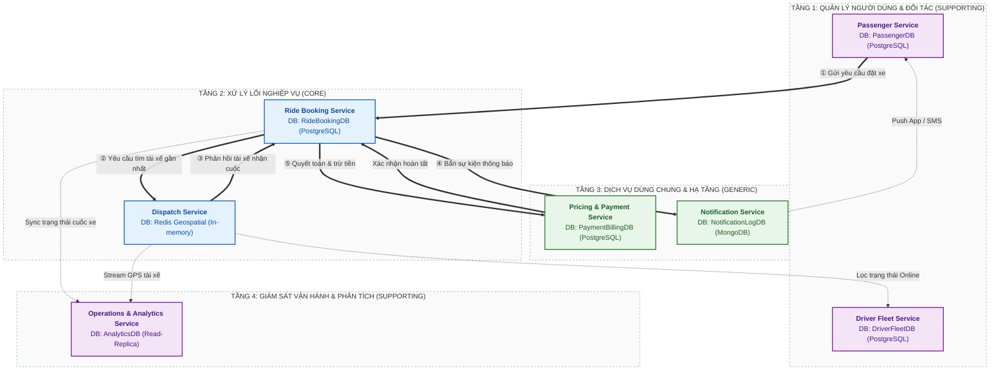
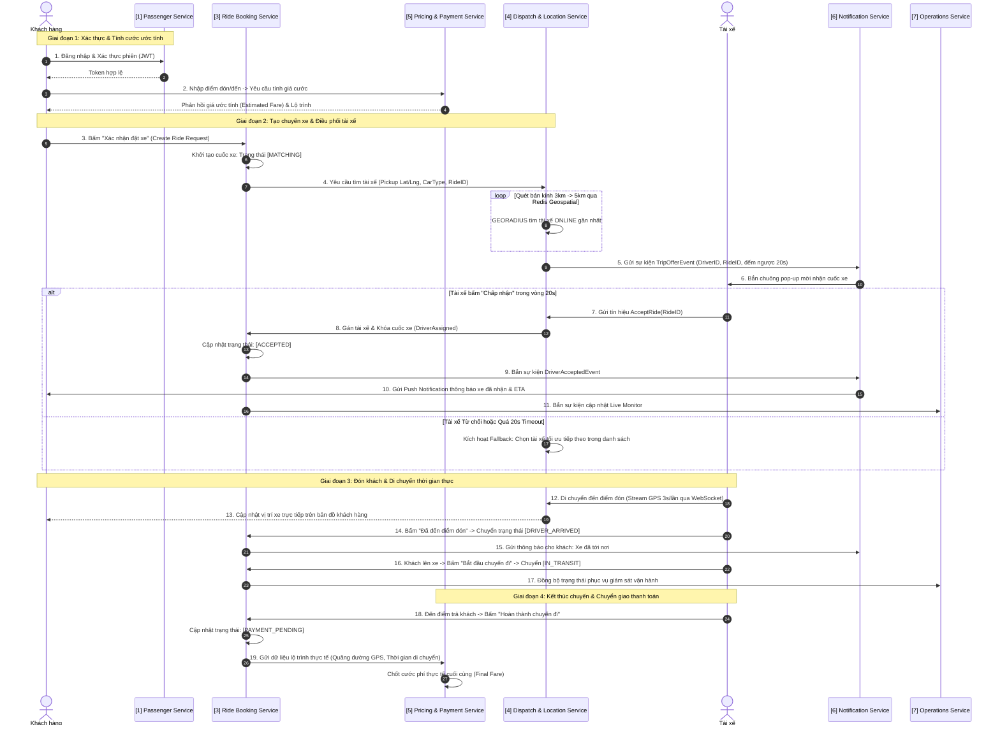
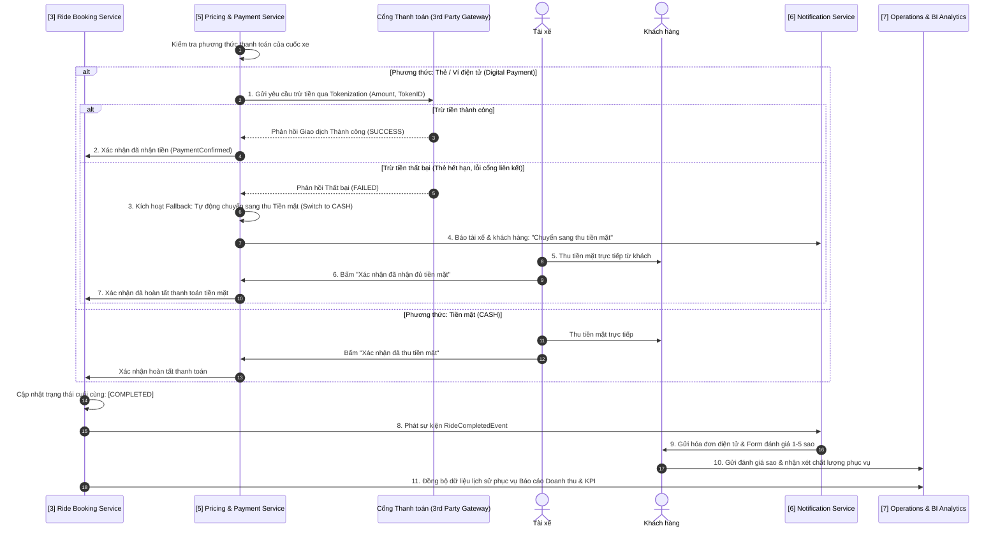
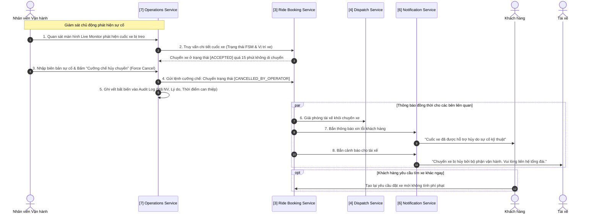

# BÁO CÁO KIẾN TRÚC VI DỊCH VỤ: PHÂN RÃ SUB-DOMAIN THEO DDD & MÔ HÌNH HÓA QUY TRÌNH

---

## 1. DANH SÁCH & ĐẶC TẢ CHI TIẾT 7 SUB-DOMAINS

```
+-----------------------------------------------------------------------------+
|                                CAB SYSTEM DOMAIN                            |
+-----------------------------------------------------------------------------+
   |-- 1. [Supporting] Passenger Identity & Account Domain (Khách hàng)
   |-- 2. [Supporting] Driver & Fleet Management Domain (Tài xế & Đội xe)
   |-- 3. [Core]       Ride Lifecycle & Booking Domain (Đặt xe & Vòng đời cuốc)
   |-- 4. [Core]       Dispatch & Real-time Location Domain (Ghép xe & GPS Realtime)
   |-- 5. [Generic]    Pricing, Fare & Billing Domain (Tính cước & Thanh toán)
   |-- 6. [Generic]    Omnichannel Notification Domain (Hạ tầng Thông báo Đa kênh)
   |-- 7. [Supporting] Operations, Live Monitor & BI Analytics Domain (Vận hành & Báo cáo)
```

---

### SUB-DOMAIN 1: PASSENGER IDENTITY & ACCOUNT
- **Phân loại DDD:** `Supporting Domain`
- **Ranh giới nghiệp vụ (Bounded Context):** Quản lý hồ sơ định danh, thông tin cá nhân và cơ chế xác thực bảo mật cho người dùng hành khách.
- **Trách nhiệm chính:**
  - Đăng ký tài khoản qua số điện thoại, quản lý hồ sơ cá nhân và địa chỉ thường dùng.
  - Xác thực đăng nhập, phát hành và thu hồi JWT Token cho phiên người dùng.
- **Cơ sở dữ liệu riêng (Database-per-service):** `PassengerDB` (PostgreSQL - Lưu trữ quan hệ đảm bảo toàn vẹn dữ liệu người dùng).
- **Ranh giới cô lập:** Tách biệt khỏi dữ liệu đối tác tài xế; chu kỳ truy cập chủ yếu là đọc hồ sơ và xác thực phiên.
- **Truy vết SRS:** `BR02`, `BR08` | `FR01` - `FR04` | `UC01`, `UC02`, `UC03`.

---

### SUB-DOMAIN 2: DRIVER & FLEET MANAGEMENT
- **Phân loại DDD:** `Supporting Domain`
- **Ranh giới nghiệp vụ (Bounded Context):** Quản lý thông tin pháp lý đối tác tài xế, kiểm định phương tiện và trạng thái trực ca làm việc.
- **Trách nhiệm chính:**
  - Tiếp nhận và lưu trữ hồ sơ tài xế (bằng lái, CCCD, phân hạng xe 4 chỗ / 7 chỗ).
  - Quản lý trạng thái ca làm việc: `ONLINE` (Sẵn sàng nhận cuốc) và `OFFLINE` (Nghỉ ca).
  - Cung cấp dữ liệu hồ sơ phục vụ quy trình phê duyệt hoặc khóa tài khoản vi phạm.
- **Cơ sở dữ liệu riêng (Database-per-service):** `DriverFleetDB` (PostgreSQL - Lưu trữ hồ sơ đối tác và thông tin kiểm định xe).
- **Ranh giới cô lập:** Tách riêng quy trình kiểm duyệt hồ sơ đối tác vận tải khỏi luồng người dùng đại trà.
- **Truy vết SRS:** `BR03`, `BR08` | `FR05`, `FR08`, `FR27` | `UC04`, `UC13`.

---

### SUB-DOMAIN 3: RIDE LIFECYCLE & BOOKING
- **Phân loại DDD:** `Core Domain` (Trung tâm xử lý giao dịch cốt lõi)
- **Ranh giới nghiệp vụ (Bounded Context):** Quản lý toàn bộ vòng đời chuyến đi theo máy trạng thái hữu hạn (Finite State Machine - FSM) từ lúc tạo yêu cầu đến khi hoàn tất hoặc hủy bỏ.
- **Trách nhiệm chính:**
  - Tiếp nhận yêu cầu đặt chuyến (Điểm đón, điểm đến, loại xe, mã khách hàng).
  - Quản trị chuyển dịch trạng thái cuốc xe: `MATCHING` $\rightarrow$ `ACCEPTED` $\rightarrow$ `DRIVER_ARRIVED` $\rightarrow$ `IN_TRANSIT` $\rightarrow$ `PAYMENT_PENDING` $\rightarrow$ `COMPLETED`.
  - Kiểm soát các điều kiện hủy cuốc hợp lệ: Khách hủy, không tìm thấy tài xế (`NO_DRIVER`), hoặc hủy cưỡng chế từ vận hành.
  - Lưu trữ lịch sử hành trình phục vụ tra cứu cuốc xe.
- **Cơ sở dữ liệu riêng (Database-per-service):** `RideBookingDB` (PostgreSQL - Đảm bảo tính nhất quán giao dịch ACID, phân vùng theo thời gian).
- **Ranh giới cô lập:** Độc lập hoàn toàn với thuật toán quét GPS; chỉ lưu trữ trạng thái chuyến xe và ID liên kết.
- **Truy vết SRS:** `BR01`, `BR02`, `BR06` | `FR06`, `FR15`, `FR16`, `FR18` | `UC05`, `UC06`, `UC08`, `UC10`.

---

### SUB-DOMAIN 4: DISPATCH & REAL-TIME LOCATION
- **Phân loại DDD:** `Core Domain` (Định vị thời gian thực & Thuật toán ghép xe)
- **Ranh giới nghiệp vụ (Bounded Context):** Xử lý luồng tọa độ GPS tức thời của tài xế, thực thi thuật toán quét bán kính tìm tài xế tối ưu và truyền phát vị trí di chuyển qua WebSocket.
- **Trách nhiệm chính:**
  - Tiếp nhận tọa độ GPS liên tục (chu kỳ 3 giây/lần) từ thiết bị tài xế.
  - Quét danh sách tài xế `ONLINE` trong bán kính 3 km - 5 km bằng chỉ mục không gian (Geospatial Index).
  - Phát lời mời chuyến xe (Trip Offer) tới tài xế ưu tiên kèm bộ đếm ngược 20 giây; tự động chuyển tiếp (Timeout Fallback) nếu bị từ chối hoặc hết giờ.
  - Truyền phát (Stream) luồng di chuyển của phương tiện lên bản đồ ứng dụng khách hàng.
- **Cơ sở dữ liệu riêng (Database-per-service):** `DispatchLocationDB` (Redis Geospatial Cluster - In-memory I/O cực cao) kết hợp WebSocket Gateway.
- **Ranh giới cô lập:** Chuyên biệt hóa cho bài toán Heavy-Write I/O; không dùng CSDL quan hệ để tránh gây nghẽn hệ thống.
- **Truy vết SRS:** `BR01`, `BR06` | `FR09` - `FR14`, `FR17` | `UC07`, `UC09`.

---

### SUB-DOMAIN 5: PRICING, FARE & BILLING
- **Phân loại DDD:** `Generic Domain` (Nghiệp vụ tính cước & Thanh toán tiêu chuẩn)
- **Ranh giới nghiệp vụ (Bounded Context):** Tính toán cước phí (ước tính và thực tế chốt sau chuyến) và xử lý giao dịch thanh toán qua cổng điện tử hoặc tiền mặt.
- **Trách nhiệm chính:**
  - Tính cước ước tính (Estimated Fare) theo cự ly dự kiến và khung giờ.
  - Tính cước chốt cuối (Final Fare) theo dữ liệu GPS thực tế và thời gian hành trình.
  - Xử lý trừ tiền qua Cổng thanh toán (Tokenization - không lưu trữ dữ liệu thẻ nhạy cảm).
  - Tự động kích hoạt cơ chế dự phòng (Fallback sang thu tiền mặt `CASH` nếu thanh toán điện tử lỗi).
- **Cơ sở dữ liệu riêng (Database-per-service):** `PaymentBillingDB` (PostgreSQL - Cấu hình mức cô lập Serializable đảm bảo an toàn giao dịch tài chính).
- **Ranh giới cô lập:** Độc lập với luồng chuyển trạng thái chuyến xe; chỉ tiếp nhận lệnh quyết toán và trả về kết quả thành công/thất bại.
- **Truy vết SRS:** `BR04`, `BR08` | `FR07`, `FR19` - `FR22` | `UC11`.

---

### SUB-DOMAIN 6: OMNICHANNEL NOTIFICATION
- **Phân loại DDD:** `Generic Domain` (Hạ tầng truyền dẫn thông điệp dùng chung)
- **Ranh giới nghiệp vụ (Bounded Context):** Hạ tầng xử lý thông báo tập trung theo kiến trúc hướng sự kiện (Event-Driven) tới các kênh: Push Notification di động, SMS OTP và Email.
- **Trách nhiệm chính:**
  - Gửi mã xác thực OTP qua SMS trong quy trình đăng ký/đổi mật khẩu.
  - Bắn thông báo đẩy tức thì cho khách hàng (Xe đã nhận, xe đã tới, hóa đơn chuyến đi).
  - Bắn chuông pop-up mời nhận cuốc xe kèm âm thanh cho ứng dụng tài xế.
- **Cơ sở dữ liệu riêng (Database-per-service):** `NotificationLogDB` (MongoDB / Document DB - Lưu trữ nhật ký thông điệp phi cấu trúc).
- **Ranh giới cô lập:** Hoàn toàn bất đồng bộ (Asynchronous); sự cố gián đoạn của nhà mạng SMS hoặc Firebase không ảnh hưởng đến luồng giao dịch đặt xe.
- **Truy vết SRS:** `BR02`, `BR07` | `FR23`, `FR24` | Bổ trợ `UC01`, `UC05`, `UC07`, `UC08`, `UC11`.

---

### SUB-DOMAIN 7: OPERATIONS, LIVE MONITOR & BI ANALYTICS
- **Phân loại DDD:** `Supporting Domain` (Giám sát vận hành & Phân tích nghiệp vụ)
- **Ranh giới nghiệp vụ (Bounded Context):** Cung cấp giao diện điều hành tập trung (Web Portal) cho Nhân viên Vận hành giám sát trực tiếp chuyến xe, can thiệp xử lý sự cố, duyệt đối tác và tổng hợp báo cáo kinh doanh.
- **Trách nhiệm chính:**
  - Giám sát vị trí toàn bộ phương tiện và trạng thái cuốc xe trên bản đồ số trực tiếp (**Live Monitor**).
  - Xử lý sự cố bất thường: Cưỡng chế hủy chuyến (`CANCELLED_BY_OPERATOR`), điều phối xe thay thế, ghi vết Audit Log bất biến.
  - Duyệt hồ sơ tài xế mới; kích hoạt hoặc khóa tài khoản đối tác vi phạm.
  - Thu thập đánh giá sao (1-5 sao) và phản hồi từ khách hàng.
  - Xuất báo cáo thống kê KPI: Doanh thu, tỷ lệ hoàn thành, tỷ lệ hủy cuốc, hiệu suất tài xế.
- **Cơ sở dữ liệu riêng (Database-per-service):** `OperationsAnalyticsDB` (PostgreSQL Read-Replica kết hợp ClickHouse / TimescaleDB để tối ưu truy vấn phân tích OLAP).
- **Ranh giới cô lập:** Áp dụng mô hình CQRS; tách bạch truy vấn báo cáo nặng khỏi CSDL giao dịch trực tuyến (OLTP).
- **Truy vết SRS:** `BR03`, `BR05`, `BR08` | `FR25`, `FR26`, `FR28` - `FR30` | `UC12`, `UC13`, `UC14`.

---

## 2. BẢNG MA TRẬN TRUY VẾT TỔNG HỢP (TRACEABILITY MATRIX)

| STT | Tên Sub-domain | Loại DDD | CSDL Riêng (Database-per-service) | BR (Mục 5) | FR (Mục 6) | Use Case (Mục 7 & 8) | Vai trò trong Quy trình (Mục 9) |
| :---: | :--- | :---: | :--- | :---: | :---: | :---: | :--- |
| **1** | **Passenger Identity & Account** | Supporting | `PassengerDB` (PostgreSQL) | BR02, BR08 | FR01 - FR04 | UC01, UC02, UC03 | Xác thực định danh khách hàng (`C_Start`) |
| **2** | **Driver & Fleet Management** | Supporting | `DriverFleetDB` (PostgreSQL) | BR03, BR08 | FR05, FR08, FR27 | UC04, UC13 | Quản lý hồ sơ xe & Trực ca (`D_Online`) |
| **3** | **Ride Lifecycle & Booking** | Core | `RideBookingDB` (PostgreSQL) | BR01, BR02, BR06 | FR06, FR15, FR16, FR18 | UC05, UC06, UC08, UC10 | Quản trị FSM chuyến đi (`MATCHING` $\rightarrow$ `COMPLETED`) |
| **4** | **Dispatch & Real-time Location** | Core | `DispatchLocationDB` (Redis Geo + WS) | BR01, BR06 | FR09 - FR14, FR17 | UC07, UC09 | Quét bán kính tìm xe, đếm ngược 20s, stream GPS |
| **5** | **Pricing, Fare & Billing** | Generic | `PaymentBillingDB` (PostgreSQL) | BR04, BR08 | FR07, FR19 - FR22 | UC11 | Tính cước, trừ tiền Tokenization, Fallback tiền mặt |
| **6** | **Omnichannel Notification** | Generic | `NotificationLogDB` (MongoDB) | BR02, BR07 | FR23, FR24 | *(Hạ tầng bổ trợ)* | Bắn chuông mời cuốc, báo xe đến, gửi hóa đơn |
| **7** | **Operations & BI Analytics** | Supporting | `OperationsAnalyticsDB` (Read-Replica) | BR03, BR05, BR08 | FR25, FR26, FR28 - FR30 | UC12, UC14 | Màn hình Live Monitor, can thiệp sự cố, Audit Log |

---

## 3. MÔ HÌNH HÓA QUY TRÌNH NGHIỆP VỤ & SƠ ĐỒ TƯƠNG TÁC DỊCH VỤ

---

### 3.1. SƠ ĐỒ KHỐI KIẾN TRÚC DỊCH VỤ & CÔ LẬP CƠ SỞ DỮ LIỆU



---

### 3.2. QUY TRÌNH CỐT LÕI: ĐẶT XE, ĐIỀU PHỐI GHÉP XE & THỰC HIỆN CHUYẾN ĐI (END-TO-END RIDE FLOW)



---

### 3.3. QUY TRÌNH THANH TOÁN, XỬ LÝ NGOẠI LỆ & ĐÁNH GIÁ (PAYMENT & SETTLEMENT FLOW)



---

### 3.4. QUY TRÌNH VẬN HÀNH & XỬ LÝ SỰ CỐ KHẨN CẤP (INCIDENT & EXCEPTION HANDLING FLOW)



---

## 4. CƠ CHẾ GIAO TIẾP LIÊN DỊCH VỤ (INTER-SERVICE COMMUNICATION)

Nhằm đảm bảo tính **Loose Coupling** và khả năng chịu tải cao, hệ thống kết hợp 2 phương thức giao tiếp:

### 4.1. Giao tiếp Đồng bộ (Synchronous - REST API / gRPC)
Áp dụng cho các truy vấn dữ liệu cần phản hồi tức thì để hoàn tất luồng xử lý:
- `Ride Lifecycle Service` $\rightarrow$ `Pricing Service`: Lấy giá cước ước tính trước khi khách xác nhận đặt xe (REST API / JSON).
- `API Gateway` $\rightarrow$ `Passenger / Driver Service`: Xác thực JWT Token của người dùng với độ trễ thấp (< 2ms qua gRPC).
- `Pricing Service` $\rightarrow$ `Payment Gateway`: Gửi gói tin trừ tiền Tokenization sang cổng thanh toán ngoài (HTTPS / REST API).

### 4.2. Giao tiếp Bất đồng bộ Hướng sự kiện (Asynchronous Event-Driven qua RabbitMQ)
Toàn bộ các luồng thông báo, thay đổi trạng thái và thống kê số liệu được xử lý bất đồng bộ qua Message Broker (RabbitMQ), đảm bảo không gây nghẽn dịch vụ chính:
- **`RideRequestedEvent`:** Phát ra khi khách bấm đặt xe $\rightarrow$ `Dispatch Service` lắng nghe để kích hoạt thuật toán quét tài xế.
- **`DriverMatchedEvent`:** Phát ra khi tài xế nhận cuốc $\rightarrow$ `Notification Service` gửi Push Notification cho khách, `Operations Service` cập nhật Live Monitor.
- **`RideStatusChangedEvent`:** Phát ra ở mỗi bước chuyển trạng thái FSM $\rightarrow$ `Operations Service` cập nhật giám sát thời gian thực.
- **`PaymentCompletedEvent`:** Phát ra khi giao dịch thanh toán thành công $\rightarrow$ `Ride Booking Service` đóng cuốc xe (`COMPLETED`), `Operations & BI Analytics` ghi nhận doanh thu vào kho phân tích.
